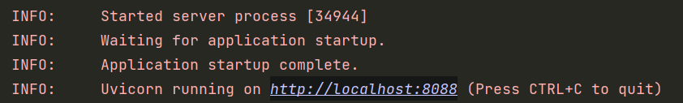

## 概述

前端便是我们之前所作的 HTML 页面，以可视化的形式通过浏览器将图片、数据等呈现给用户，后端便是负责数据的存储、整理和处理，并接收前端发来的请求将所需要的数据返回给前端。

后端开发中，使用较为广泛的是 Java 的 Spring 框架，Python 的 Flask、Django 框架以及 Go 的 Gin 框架等。由于 Python 在网络爬虫、数据分析、人工智能等方面有十分广泛的应用，在语言性能不是系统的瓶颈时，借助于 Python 的高开发效率，Python 的后端开发能带来不错的效果，所以我们以 Python 为基础来进行后端开发的基础。

在学习了 Python 后，业余时间也建议了解一下 Java 的 Spring Boot、Spring Cloud 等框架，他们的编码规范、设计风格能为你的开发提供了好的学习素材。

在 Python 中，以往使用 Flask 和 Django 的居多，但 Flask 对异步的支持较差，Django 体积太大，整体较为死板，而 FastAPI 支持异步、轻量级、开发效率高，所以我们使用 FastAPI 框架来进行学习。

### TASK 1：运行后端服务

在`resource/fastapi-demo`中有一个 FastAPI 的 demo，使用 pip 安装相应的第三库运行里面的 `main.py` 文件，运行成功后可以看到如下输出：

通过浏览器访问`localhost:8088/hello`可以看到“Hello, World!”，如果访问`localhost:8088/hello?name=张三`可以看到“Hello, 张三!”。

### TASK 2：编写一个简单的后端服务

通过 FastAPI 官网学习该框架，读懂 demo 的代码。

[FastAPI 官网](https://fastapi.tiangolo.com/zh/)

**任务描述**：

之前已经能够使用 pymongo 向 MongoDB 中插入了课程数据，现在编写一个服务，在接收请求后查询 mongo 中的课程信息并将其返回出去。

::: tip 思路
demo 中已经有一个服务用来响应`/hello`的请求，你需要模仿他写一个函数来响应`/course`的请求，在该函数中使用 pymongo 查询 mongo 中的课程信息并将它 return 出去。这样，你就可以通过浏览器访问`localhost:8088/course`来得到响应，看到课程信息。
:::

### TASK 3：将同步改为异步

PyMongo 是以同步方式查询 MongoDB，也就是在后端程序等待数据库完成读写前，后端程序不能做其他事情，但改为异步后，在程序向 mongo 发送一个读写IO的请求后，mongo 去查询数据，而后端程序可以转去做别的事情，这样就提高了性能。

FastAPI 是支持异步的。这借助 async/await 关键字来实现，[Motor](https://motor.readthedocs.io/en/stable/)库是一个可以通过异步的方式来读写 mongo，其接口与 pymongo 相似。

**示例**：

在 `resource/async-study/main.py` 中，有两个相同功能的接口，都是发送 Request 请求外部网站的彩票信息，但一个是以同步方式发送，一个是以异步方式发送，对比这个例子，会发现关键差距在于 async/await 的使用，运行该示例，分别请求 `localhost:8080/sync` 和 `localhost:8090/async` 会看到返回数据相同，只是程序的实现方式上不同，异步的方式在请求量大时性能更好。

**任务描述**：

将上一个 TASK 中的 pymongo 库更换为 motor 库，并通过异步的方式来操作 mongo。

::: tip
关于同步、异步的区别，FastAPI 官网上[协程与async/await](https://fastapi.tiangolo.com/async/)有更加详细的介绍。
:::