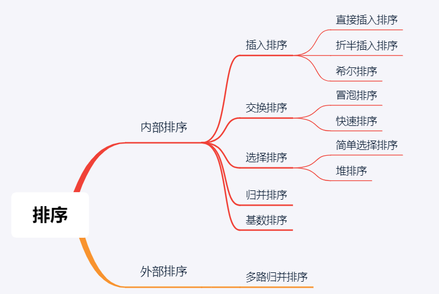
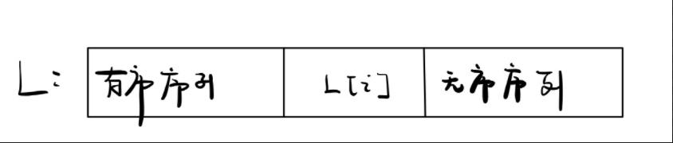

> 参考文章：https://www.pdai.tech/md/algorithm/alg-sort-overview.html

## 一、插入排序

### 1. 直接插入排序（摸牌算法）

**基本思想**

把 n 个待排序的元素看成为一个有序序列和一个无序序列。开始时有序序列中只包含 1 个元素，无序序列中包含有 n-1 个元素，排序过程中每次从无序序列中取出第一个元素，将它插入到有序序列中的适当位置，使之成为新的有序序列，重复 n-1 次可完成排序过程。



**实现**

```java
void insertSort(T A[], int n) {
    for (int i = 1; i < n; i++) {  	// L[0]已经有序，从 L[1] 开始
        if (A[i-1] <= A[i])
            continue;
        T temp = A[i];  // 刚摸到的牌
        int j;
        for (j = i - 1; j >= 0 && A[j] > temp; j--) {  // 从后往前查找首个不大于temp的位置
            A[j + 1] = A[j];  // 向后挪位
        }
        A[j + 1] = temp;  // j 指向所找到的首个小于等于temp的，temp应放在其后
    }
}
```

**空间效率**：O(1)，仅使用了常数个辅助单元。

**时间效率**：O(n2)

**稳定的排序算法**

**适应性**：顺序存储和链式存储的线性表

### 2. 折半插入排序

**基本思想**

对直接插入排序做如下改进：查找有序子表时可以用折半查找来实现。待确定插入位置后，就可以统一地向后移动元素。

**实现**

```java
void insertSort2(T A[], int n) {
    int low, high, mid;
    for (int i = 1; i < n; i++) {
        T temp = A[i];
        // 设置折半查找的范围
        low = 0;
        high = i - 1;
        // 折半查找直到 low > high，此时 low = high + 1
        // 应将 [low, i-1] 的元素全部右移
        // 并将 temp 复制到 low 所指的位置
        while (low <= high) {
            mid = (low + high) / 2;  // 取中间点
            if (A[mid] > temp)
                high = mid - 1;  // 查找左半子表
            else
                low = mid + 1;   // 查找右半子表
        }
        // 统一后挪元素，空出插入位置
        for (int j = i - 1; j >= low; j--)
            A[j + 1] = A[j];
        A[low] = temp;  // 插入操作
    }
}
```

- 当 `A[mid] == A[0]` 时，为了保证算法稳定性，应继续在 mid 所指位置右边寻找插入位置。这与折半查找有一点点区别，在折半查找中若“==”则直接命中。

**时间复杂度**：O(n2) 

**稳定的排序算法**

### 3. 希尔排序

**基本思想**

希尔排序实质上是一种分组插入方法。它的基本思想是：对于n个待排序的数列，取一个小于n的整数gap（gap被称为步长）将待排序元素分成若干个组子序列，所有距离为gap的倍数的记录放在同一个组中；然后，对各组内的元素进行直接插入排序。 这一趟排序完成之后，每一个组的元素都是有序的。然后减小gap的值，并重复执行上述的分组和排序。重复这样的操作，当gap=1时，整个数列就是有序的。

**实现**

```java
void shellSort(T A[], int n) {
    T temp;
    int j;
    for (int gap = n / 2; gap >= 1; gap = gap / 2) {  // 步长变化
        // 每轮循环处理一对元素：i - gap 和 i
        // 因为每个组中首元素都是有序的，所以处理一个组时从第二个元素开始
        // 从 i = gap 开始，即从 A[0] 和 A[gap] 这一对元素开始
        for (int i = gap; i < n; i++) {
            if (A[i - gap] > A[i]) {
                temp = A[i];
                for (j = i - gap; j >= 0 && A[j] > temp; j -= gap)  // 该组中前面的元素后移，同时查找待插入位置
                    A[j + gap] = A[j];  // 一个组中的元素后移
                A[j + gap] = temp;  // j 为首个小于等于temp的元素，在 j 后面的一个位置上插入
            }
        }
    }
}
```

**空间效率**：O(1)	

**时间效率**：依赖于增量序列的函数，难以分析其时间复杂度。当 n 在某个特定范围时，希尔排序的时间复杂度约为 O(n1.3)，最坏情况下为 O(n2)。

**不稳定的排序算法**

**适用性**：仅适用于线性表为顺序存储的情况

## 二、交换排序

### 4. 冒泡排序

**基本思想**

它是一种较简单的排序算法。它会遍历若干次要排序的数列，每次遍历时，它都会从前往后依次的比较相邻两个数的大小；如果前者比后者大，则交换它们的位置。这样，一次遍历之后，最大的元素就在数列的末尾！ 采用相同的方法再次遍历时，第二大的元素就被排列在最大元素之前。重复此操作，直到整个数列都有序为止。

**实现**

```cpp
void bubbleSort(T A[], int n) {
    bool sorted = false;  // 整体排序标志，首先假定尚未排序
    while (!sorted) {   // 在尚未确认已经全局排序之前，逐趟进行扫描交换
        sorted = true;  // 假定已经排序
        for (int i = 1; i < n; i++) {  // 自左向右逐对检查当前范围A[0,n)内的各相邻元素
            if (A[i - 1] > A[i]) {  // 一旦A[i-1]与A[i]逆序，则
                swap (A[i - 1], A[i]);  // 交换之，并
                sorted = false;  // 因整体排序不能保证，需要清除排序标志
            }
        }  // end for
        n--;  // 至此末元素必然就位，故可以缩短待排序序列的有效长度
    }
}
```

**空间效率**：O(1) 	**时间效率**：O(n2)

**稳定的排序算法**

**适用性**：数组、链表

### 5. 快速排序

**基本思想**

选择一个基准数，通过一趟排序将要排序的数据分割成独立的两部分；其中一部分的所有数据都比另外一部分的所有数据都要小。然后，再按此方法对这两部分数据分别进行快速排序，整个排序过程可以递归进行，以此达到整个数据变成有序序列。

**过程**：

1. 从数列中挑出一个基准值。
2. 将所有比基准值小的摆放在基准前面，所有比基准值大的摆在基准的后面(相同的数可以到任一边)；在这个分区退出之后，该基准就处于数列的中间位置。

1. 递归地把"基准值前面的子数列"和"基准值后面的子数列"进行排序。

**实现**

```java
/**
 * 对 A[low, high] 进行快排 
 */
void qsort(T A[], int low, int high) {
    if (low < high) {  // 递归跳出的条件
        int mid = partition(A, low, high);  // 划分得到基准
        // 依次对两个子表进行递归排序 
        qsort(A, low, mid - 1);
        qsort(A, mid + 1, high);
    }
}

/**
 * 一趟划分
 */
int partition(T A[], int low, int high) {
    T pivot = A[low];  // 将当前表中的第一个元素设为枢轴，对表进行划分
    while (low < high) {  // 循环跳出条件
        while (low < high && A[high] >= pivot)
            high--; // 将比枢轴小的元素移动到左端（low左边都是比枢轴小的元素）
        A[low] = A[high];
        while (low < high && A[low] < pivot)
            low++;  // 将比枢轴大的元素移动到有段（high右边都是比枢轴大的元素）
        A[high] = A[low];
    }
    A[low] = pivot; // 枢轴元素放到最终位置
    return low;     // 返回存放枢轴的最终位置
}
```

**空间效率**：由于快排是递归的，需要借助一个递归栈，其容量应与递归调用的最大深度一致。最好情况下  O(log2n)，最坏情况下 O(n)，平均情况下 O(log2n)

**时间效率**：与划分是否对称有关。最坏时 O(n2)，平均 O(n * log2n)。

**不稳定的排序算法**

## 三、选择排序

### 6. 简单选择排序

**基本思想**

首先在未排序的数列中找到最小(or最大)元素，然后将其存放到数列的起始位置；接着，再从剩余未排序的元素中继续寻找最小(or最大)元素，然后放到已排序序列的末尾。以此类推，直到所有元素均排序完毕。

**实现**

```cpp
void selectSort(T A[], int n) {
    for (int i = 0; i < n - 1; i++) {  // 一共进行 n-1 趟
        int min = i;  // 记录最小元素位置
        // 在A[i...n-1]中选择最小的元素
        for (int j = i + 1; j < n; j++) {
            if (A[j] < A[min])
                min = j;
        }
        if (min != i)
            swap(A[i], A[min]);
    }
}
```

- 每一趟排序可以确定一个元素的最终位置。在每一趟中在待排序元素中选取关键字最小的元素加入有序子序列。

**空间效率**：O(1)	**时间效率**：O(n2)

**不稳定的排序算法**

### 7. 堆排序

#### **堆定义**

n 个关键字序列 `L[1...n]` 称为**堆**，当且仅当该序列满足：

① L(i) >= L(2i)  且 L(i) >= L(2i + 1) 或   ——>  大根堆（大顶堆）：根 ≥ 左右

② L(i) <= L(2i)  且 L(i) <= L(2i + 1)	——>  小根堆（小顶堆）：根 ≤ 左右

其中 1 ≤ i ≤ └ n/2 ┘

在第一个元素的索引为 0 的情形中:

- 索引为i的左孩子的索引是 (2i+1);
- 索引为i的右孩子的索引是 (2i+2);

#### **堆排序**

最大堆进行升序排序的基本思想: 

1. **初始化堆**: 将数列a[1...n]构造成大根堆。 
2. **交换数据**: 将a[1]和a[n]交换，使a[n]是a[1...n]中的最大值；然后将a[1...n-1]重新调整为最大堆。 接着，将a[1]和a[n-1]交换，使a[n-1]是a[1...n-1]中的最大值；然后将a[1...n-2]重新调整为最大值。 依次类推，直到整个数列都是有序的。

**实现**

1. 建立大根堆

在堆排序算法中，首先要将待排序的数组转化成二叉堆。n 个结点的完全二叉树，最后一个结点是第 个结点的孩子。对第个结点为根的子树筛选（对于大根堆，若根节点的关键字小于左右孩子中关键字较大者，则交换），使该子树成为堆。之后向前依次对各节点（）为根的子树进行筛选，看各结点值是否大于其左右子结点的值，若不大于，则将左右子结点中的较大者与之交换，交换后可能会破坏下一级的堆，于是继续采用上述方法构造下一级的堆，直到以该结点为根的子树构成堆为止。反复利用上述调整堆的方法建堆，直到根结点。

```cpp
/**
 * 此处数组 A[0] 空出来
 * 首元素从 A[1] 开始，共n个元素， 则为 A[1..n]
 */ 
void buildMaxHeap(T A[], int n) {
    for (int i = n / 2; i > 0; i--) {
        heapAdjust(A, i, n);
    }
}

/**
 * heapAdjust 将元素 k 为根的子树进行调整，使之成为大根堆
 * 调整的过程就是不断下坠直到找到一个位置能够存放原 A[k] 处的 rootVal
 * A[1...len] 为元素
 * len：堆中关键字个数
 */ 
void heapAdjust(T A[], int k, int len) {
    T rootVal = A[k];    // 暂存子树的根节点值
    // 寻找能够存放 rootVal 的位置
    // i 指向 k 的左孩子
    // 每一轮中 i 都是指向 k 的左孩子
    for (i = 2 * k; i <= len; i = k * 2) {
        // 比较左右孩子使 i 指向较大的孩子
        // 先判断 i < len 是为了防止没有右孩子
        if (i < len && A[i] < A[i + 1])
            i++;
        if (rootVal >= A[i])
            break;  // 筛选结束
        else {      // 需要调整
            A[k] = A[i];    // 将 A[i]调整到父节点上
            k = i;          // 修改 k 值使之指向下一级的root，以便继续向下筛选，每轮下沉一次直到找到一个能够存放 rootVal 的位置
        }
    }
    A[k] = rootVal;     // 通过上面的循环让 k 不断下沉，终于找到了一个能够存放 rootVal 的位置
}
```

2. 交换数据

在将数组转换成最大堆之后，接着要进行交换数据，从而使数组成为一个真正的有序数组。

**最终的排序**：

```cpp
void heapSort(T A[], int n) {
    buildMaxHeap(A, n);         // 初始化堆
    // n-1 趟交换和建堆过程
    for (i = n; i > 1; i--) {   // i 指向当前待排序元素序列中的最后一个（堆底元素）
        swap(A[i], A[1]);       // 交换数据（堆顶和堆底交换），一个元素就位
        heapAdjust(A, 1, i - 1);// 调整，把剩余 i-1 个元素整理成堆
    }
}
```

**空间效率**：O(1)

**时间效率**：O(n * log2n)  ：建堆时间 O(n)，之后有 n-1 次向下调整操作，每次调整 O(h)

**不稳定的排序算法**

## 四、归并排序和基数排序

### 8. 归并排序

**基本思想**

基本包括3步:

- 分解 -- 将当前区间一分为二，即求分裂点 `mid = (low + high) / 2`;
- 求解 -- 递归地对两个子区间 a[low...mid] 和 a[mid+1...high] 进行归并排序。递归的终结条件是子区间长度为1。

- 合并 -- 将已排序的两个子区间 a[low...mid] 和 a[mid+1...high]归并为一个有序的区间a[low...high]。

**实现**

```java
T[] aux = new T[MAXSIZE];  // 辅助数组

/**
 * 表 A 的两段 A[low...mid] 和 A[mid+1...high] 各自有序，将它们合并成一个有序表
 */ 
void merge(T A[], int lo, int mid, int hi) {
    // 将 A[lo..hi] 复制到 aux[lo..hi]
    for (int k = lo; k <= hi; k++) {
        aux[k] = A[k];
    }
	
    int i = lo, j = mid + 1;  // i 指左边，j 指右边
    for (int k = lo; k <= hi; k++) {  // 归并回到 A[lo..hi]
        if      (i > mid)           A[k] = aux[j++];	// 左半边用尽（取右半边）
        else if (j > hi)            A[k] = aux[i++];	// 右半边用尽（取左半边）
        else if (aux[i] > aux[j])   A[k] = aux[j++];	// 左 > 右
        else                        A[k] = aux[i++];	// 右 >= 左
    }
}
```

-  该方法先将所有元素复制到 aux[] 中,然后再归并回 a[] 中。方法在归并时(第二个 for 循环)进行了 4 个条件判断: 左半边用尽(取右半边的元素)、右半边用尽(取左半边的元素)、右半边的当前元素小于左半边的当前元素(取右半边的元素)以及右半边的当前元素大于等于左半边的当前元素(取左半边的元素)。  

```cpp
/**
 * 将 A[lo..hi] 排序
 */
void mergeSort(T A[], int lo, int hi) {
    if (lo >= hi) return;
    int mid = lo + (hi - lo) / 2;
    mergeSort(A, lo, mid);      // 将左半边排序
    mergeSort(A, mid + 1, hi);  // 将右半边排序
    merge(A, lo, mid, hi);      // 归并结果
}
```

**空间效率**：O(n)	**时间效率**：O(n * log2n)

**稳定的排序算法**