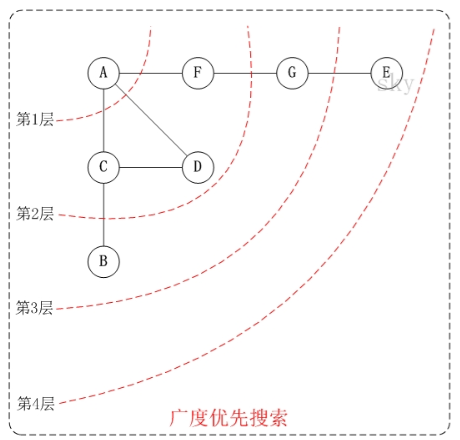

## 1. 图的基本概念


## 2. 图的存储


## 3. 图的遍历

<mark>图的遍历</mark>是指从图中的某一顶点出发，按照某种搜索方法沿着图中的边对图中的所有顶点访问一次**且仅访问一次**。

### 3.1 广度优先搜索（BFS）

#### 3.1.1 算法介绍



BFS 的核心思想应该不难理解的，就是把一些问题抽象成图，从一个点开始，向四周开始扩散。一般来说，我们写 BFS 算法都是用「队列」这种数据结构，每次将一个节点周围的所有节点加入队列。

广度优先搜索的伪代码（用邻接矩阵来实现）：

```cpp
bool visited[MAX_VEXTEX_NUM];

void BFSTraverse(Graph G) {
    Queue Q;
    for (i = 0; i < G.vexNum; i++) {
        visited[i] = false;
    }
    for (i = 0; i < G.vexNum; i++) {
        if (!visited[i])
            BFS(G, i);
    }
}

void BFS(Graph G, int v) {
    visit(v);
    visited[v] = true;
    Q.offer(v);
    
    while (!Q.isEmpty()) {
        v = Q.poll();
        for (int x: v的所有邻居) {
            if (visited[x])
                continue;
            visit(x);
            visited[x] = true;
            Q.offer(x);
        }
    }
}
```

+ 队列 `Q` 存储当前已经访问但还没有访问其邻居的节点，其中记忆的顶点要被用来访问其下一层顶点。
+ `visited` 的主要作用是防止走回头路，大部分时候都是必须的，但是像一般的二叉树结构，没有子节点到父节点的指针，不会走回头路就不需要 `visited`。这里 `visited` 也可以用 `Set` 来实现。

#### 3.1.2 BFS 性能分析

空间复杂度：需要借助队列 Q，n 个顶点均需要入队一次，在最坏的情况下，空间复杂度为 $O(|V|)$。

时间复杂度：

+ 邻接表存储：每个顶点均需要搜索一次（入队一次），复杂度为 $O(|V|)$，在搜索任一顶点的邻接点时，每条边至少访问一次，复杂度为 $O(|E|)$，故算法总的时间复杂度为 $O(|V| + |E|)$。
+ 邻接矩阵存储：查找每个顶点的邻接点所需的时间为 $O(|V|)$，故算法总的时间复杂度为 $O(|V|^2)$。

#### 3.1.3 BFS 求解单源最短路径问题

广度优先搜索总是按照距离由近到远来遍历图中每个顶点，因此 BFS 可以用来求非带权图中某一顶点到其余顶点的最短距离。

BFS 求解单源最短路径问题的算法如下：

```cpp
void BFSMinDistance(Graph G, Node start) {
    Queue Q;
    // 初始化 d 和 path
    for (i = 0; i < G.vexNum; i++) {
        d[i] = ∞;  // d[i]表示从u到i的最短路径
        path[i] = -1;    // path[i]记录i在这个最短路径上的直接前驱
    }
    // 从 start 开始
    visited[start] = true;
    d[start] = 0;
    Q.offer(start);
    int step = 0;
    // 开始逐层对图进行遍历
    while (!Q.isEmpty()) {
        int sz = Q.size();
        for (i = 0; i < sz; i++) {  // 遍历当前这一层的所有节点
            Node cur = Q.poll();
            for (Node x: cur的所有邻居) {
                if (visited[x])
                    continue;
                visited[x] = true;
                d[x] = step;
                Q.offer(x);
            }
        }
        step++;  // 进入下一层，step+1
    }
}
```


### 3.2 深度优先搜索（DFS）