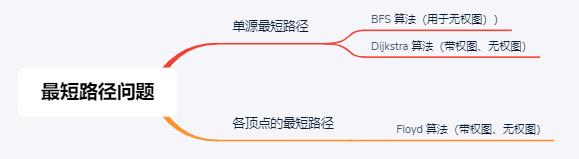

## 1. 图的基本概念


## 2. 图的存储


## 3. 图的遍历

<mark>图的遍历</mark>是指从图中的某一顶点出发，按照某种搜索方法沿着图中的边对图中的所有顶点访问一次**且仅访问一次**。

### 3.1 广度优先搜索（BFS）

#### 3.1.1 算法介绍


BFS 的核心思想应该不难理解的，就是把一些问题抽象成图，从一个点开始，向四周开始扩散。一般来说，我们写 BFS 算法都是用「队列」这种数据结构，每次将一个节点周围的所有节点加入队列。

广度优先搜索的伪代码（用邻接矩阵来实现）：

```cpp
bool visited[MAX_VEXTEX_NUM];

void BFSTraverse(Graph G) {
    Queue Q;
    for (i = 0; i < G.vexNum; i++) {
        visited[i] = false;
    }
    for (i = 0; i < G.vexNum; i++) {
        if (!visited[i])
            BFS(G, i);
    }
}

void BFS(Graph G, int v) {
    visit(v);
    visited[v] = true;
    Q.offer(v);
    
    while (!Q.isEmpty()) {
        v = Q.poll();
        for (int x: v的所有邻居) {
            if (visited[x])
                continue;
            visit(x);
            visited[x] = true;
            Q.offer(x);
        }
    }
}
```

+ 队列 `Q` 存储当前已经访问但还没有访问其邻居的节点，其中记忆的顶点要被用来访问其下一层顶点。
+ `visited` 的主要作用是防止走回头路，大部分时候都是必须的，但是像一般的二叉树结构，没有子节点到父节点的指针，不会走回头路就不需要 `visited`。这里 `visited` 也可以用 `Set` 来实现。

#### 3.1.2 BFS 性能分析

空间复杂度：需要借助队列 Q，n 个顶点均需要入队一次，在最坏的情况下，空间复杂度为 $O(|V|)$。

时间复杂度：

+ 邻接表存储：每个顶点均需要搜索一次（入队一次），复杂度为 $O(|V|)$，在搜索任一顶点的邻接点时，每条边至少访问一次，复杂度为 $O(|E|)$，故算法总的时间复杂度为 $O(|V| + |E|)$。
+ 邻接矩阵存储：查找每个顶点的邻接点所需的时间为 $O(|V|)$，故算法总的时间复杂度为 $O(|V|^2)$。

#### 3.1.3 BFS 求解单源最短路径问题

广度优先搜索总是按照距离由近到远来遍历图中每个顶点，因此 BFS 可以用来求非带权图中某一顶点到其余顶点的最短距离。

BFS 求解单源最短路径问题的算法如下：

```cpp
void BFSMinDistance(Graph G, Node start) {
    Queue Q;
    // 初始化 d 和 path
    for (i = 0; i < G.vexNum; i++) {
        d[i] = ∞;  // d[i]表示从u到i的最短路径
        path[i] = -1;    // path[i]记录i在这个最短路径上的直接前驱
    }
    // 从 start 开始
    visited[start] = true;
    d[start] = 0;
    Q.offer(start);
    int step = 0;
    // 开始逐层对图进行遍历
    while (!Q.isEmpty()) {
        int sz = Q.size();
        for (i = 0; i < sz; i++) {  // 遍历当前这一层的所有节点
            Node cur = Q.poll();
            for (Node x: cur的所有邻居) {
                if (visited[x])
                    continue;
                visited[x] = true;
                d[x] = step;
                Q.offer(x);
            }
        }
        step++;  // 进入下一层，step+1
    }
}
```

#### 3.1.4 广度优先生成树

...

### 3.2 深度优先搜索（DFS）

DFS 类似于树的先序遍历，尽可能“深”地搜索一个图。

#### 递归实现

```cpp
bool visited[MAX_VERTEX_NUM];

/**
 * 对图 G 进行深度优先遍历
**/
void DFSTraverse(Graph G) {
    for (int i = 0; i < G.vexNum; i++)
        visited[i] = false;
    for (int i = 0; i < G.vexNum; i++)
        if (!visited[i])
            DFS(G, i);
}

/**
 * 从顶点 v 出发，深度优先遍历 G
**/
void DFS(Graph G, int v) {
    visit(v);
    visited[v] = true;
    for (int x: v的所有邻居) {
        if (!visited[x]) {
            DFS(G, x);
        }
    }
}
```

+ 图的邻接矩阵表示是唯一的，但对于邻接表来说，若输入的次序不同，生成的邻接表也不同，因此，<u>对于同样一个图，基于邻接矩阵的遍历所得到的 DFS 序列和 BFS 序列是唯一的，基于邻接表的遍历所得到的 DFS 序列和 BFS 序列是不唯一的</u>。

#### 性能分析

空间复杂度：需要借助递归工作栈，故空间复杂度为 $O(|V|)$。

时间复杂度：

+ 邻接表存储：查找所有顶点的邻接点所需的时间为 $O(|E|)$，访问顶点所需的时间为 $O(|V|)$，故算法总的时间复杂度为 $O(|V| + |E|)$。
+ 邻接矩阵存储：查找每个顶点的邻接点所需的时间为 $O(|V|)$，故算法总的时间复杂度为 $O(|V|^2)$。

> 最终的结论是与 BFS 一样的。

### 3.3 图的遍历与图的连通性

图的遍历算法可以用来判断图的连通性。

+ 对于无向图，调用 BFS/DFS 函数的次数等于连通分量；
+ 对于有向图，连通的有向图又分为强连通和非强连通，非强连通分量的一次调用 BFS/DFS 无法访问到该连通分量的所有节点。

## 4. 图的应用

### 4.1 最小生成树（最小支撑树）

连通图的**生成树**是包含图中所有节点的一个极小连通子图（n 个节点，n-1 条边）。

所有生成树中边的权值之和最小的是树是**最小生成树**。

最小生成树性质：

1. 不唯一；
2. 权值之和唯一；
3. $|E| = |V| - 1$；
4. 最小生成树总是会采用联接每一割的最短跨越边。

用来得到最小生成树的算法有两个基于贪心策略的算法： Prim 算法和 Kruskal 算法，<font color=blue>普加点，克连边</font>。

#### Prim 算法


#### Kruskal 算法


+ Prim 算法的时间复杂度为 $O(|V|^2)$，适合<u>边稠密</u>的图；
+ Kruskal 算法的时间复杂度为 $O(|E|\cdot|\log{|E|})$，适合<u>边稀疏而点较多</u>的图。

### 4.2 最短路径算法



#### Dijkstra 算法

口语化表述：<font face="楷体">计算 u 到各顶点之间的最短距离，首先初始化 u 到自己的距离为 0，初始 dist[] 是图中本来的与 u 直观的距离（直接相连则为边的权值，不相连就是无穷）；然后从 dist[] 中选出距离最小的点加入结果集中，再计算其余的点到结果集的最短距离（通过比较原来到 u 的距离和经由新加入的点再到 u 的距离来判断是否更短了，如果更短的话就更新距离并记录该点的路径前驱是新加入的点），从中再选出距离最短的点加入结果集，之后重复上述过程直到所有点都加入了结果集</font>。


+ Dijkstra 也基于贪心策略；
+ Dijkstra 算法不适用带负权值的情况。

#### Floyd 算法

基本思想：通过递推产生一系列的 n 阶距离方阵 $A^{(-1)}、A^{(0)}、...、A^{(n-1)}$，其中 $A^{(k)}[i][j]$ 表示从顶点 $v_i$ 与 $v_j$ 之间的最短路径和最短路径长度。

口语化表述：<font face="楷体">首先初始化 $A^{(-1)}$ 为图中直观的两两顶点距离（相连则为边的权值，不相连则为无穷），然后开始递推：先加入 $v_0$ 作为中间节点，算一下两两节点之间若经由该中间节点是否更短，如果更短则更新，如果没有更短就不变，遍历完后得到 $A^{(0)}$。不断如此直到获得 $A^{(n-1)}$ 作为结果。</font>

Floyd 核心代码（三 for 算法）：

```cpp
// ... 先做初始化工作

for (int k = 0; k < n; k++) {  // 考虑以 v_k 作为中转点
    for (int i = 0; i < n; i++) {  // 两个 for 用 i、j 遍历整个矩阵
        for (int j = 0; j < n; j++) {
            if (A[i][j] > A[i][k] + A[k][j]) {  // 若以v_k为中转点的距离更短
                A[i][j] = A[i][k] + A[k][j];
                path[i][j] = k;  // 记录中转点
            }
         }
    }
}
```

### 4.3 拓扑排序（AOV 网）

**AOV 网**（Activity On Vertex），用顶点表示活动，有向边 $<V_i, V_j>$ 表示活动 $V_i$ 必须先于 $V_j$。

**拓扑排序**：① 每个顶点只出现一次 ② 满足有向边定义的先后顺序。

::: tip

拓扑排序就是找到做事的先后顺序。

:::

一个常用的拓扑排序算法：

1. 从 AOV 网中选一个没有前驱（入度为0）的节点并输出；
2. 从网中删除该节点和所有以它为起点的边；
3. 重复上述过程直至 AOV 网为空或当前网中不存在无前驱的节点，后一种情况说明该有向图存在环。

算法实现：

```cpp
/**
 * 拓扑排序
 **/
bool topologicalSort(Graph G) {
    Stack S;  // 保存入度为 0 的点，用队列也可
    for (int i = 0; i < G.vexNum; i++) {
        if (indegree[i] == 0)
            S.push(i);   // 将所有入度为 0 的顶点入栈
    }
    int count = 0;       // 记录已输出的顶点个数
    while (!S.empty()) {
        int cur = S.pop();
        print(cur);  // 输出该顶点
        count++;
        for(int x: 以cur为起点的边所指向的所有顶点) {
            // 将所有 x 的入度 -1，若减为 0 则入栈
            indegree[x]--;
            if (indegree[x] == 0) {
                S.push(x);
            }
        }
    }//while
    return  true? count < G.vexNum: false;  // 指明是否排序成功，失败说明有环路
}
```

+ `indegree`记录每个顶点的入度；
+ `stack`保存入度为 0 的顶点（也可以用队列实现）

拓扑排序的注意点：

+ 若存在一个顶点有多个直接后继，则拓扑排序结果通常不唯一；
+ 邻接矩阵为三角阵的图，必存在拓扑序列。
+ **复杂度**：由于输出每个顶点时还要删除以它为起点的边，因此时间复杂度为：
  + 邻接表存储：$O(|V| + |E|)$
  + 邻接矩阵存储：$O(|V|^2)$

### 4.4 关键路径（AOE 网）

**AOE 网**（Activity On Edge），用边表示活动，顶点表示事件，边上的权值表示完成该活动的开销。

::: tip AOV网 vs. AOE网

相同点：都是有向无环图；

不同点：AOE 网的边有权值；AOV 网的边无权值，仅表示顶点之间的先后次序。

:::

AOE 网的性质：

1. 只有在某顶点事件发生后，以它为起点的活动才能开始；
2. 只有当某顶点前面的**所有**活动都结束后，该顶点事件才能发生；
3. 活动可以并行进行。

AOE 网中仅有一个入度为0的点，称为**源点**（开始顶点）；仅有一个出度为0的点，称为**汇点**（结束顶点）。

从源点到汇点中，具有最大路径长度的路径称为**关键路径**，该路径上的活动称为**关键活动**。