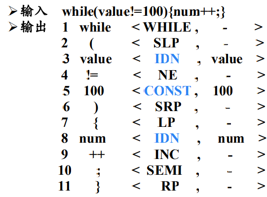

1. **编译**：将高级语言（源语言）翻译成汇编语言或机器语言（目标语言）的过程。

2. 编译系统的结构

3. 词法分析概述

词法分析的主要任务：从左向右逐行扫描源程序的字符，识别出各个单词，确定单词的类型。 将识别出的单词转换成统一的机内表示——**词法单元(token)**形式。

token：<种别码，属性值>

|      | 单词类型 | 种别                                            | 种别码             |
| ---: | :------: | ----------------------------------------------- | ------------------ |
|    1 |  关键字  | while、if、else、then、…                        | 一词一码           |
|    2 |  标识符  | 变量名、数组名、记录名、过程名、…               | 多词一码           |
|    3 |   常量   | 整型、浮点型、字符型、布尔型、…                 | 一型一码           |
|    4 |  运算符  | 算术（+-\*/）关系（> < == !=）逻辑（& \| !）... | 一词一码或一型一码 |
|    5 |  界限符  | ; () = {} ...                                   | 一词一码           |

+ 标识符和常量都是开放型集合，数量无限，因此不能是一词一码。

::: details token序列示例

:::

4. 词法分析概述

