[[toc]]

# I（3.1 - 3.5）汇编基础

## 3.1 历史观点

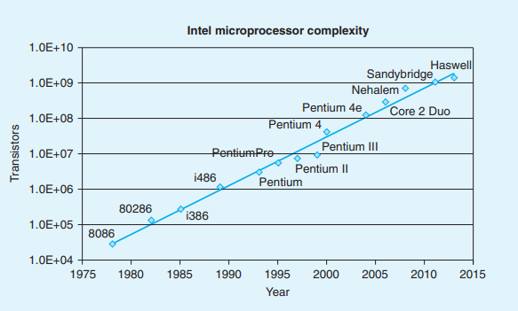

## 3.2 程序编码

假设我们有一个 C 程序，有两个文件 p1.c 和 p2.c，可以用 Unix 命令来编译这些代码：

```bash
linux> gcc -Og -o p p1.c p2.c
```

+ 编译选项 -Og 告诉编译器使用会生成符合原始 C 代码整体结构的机器代码的优化等级

上述 gcc 命令调用了一整套程序来将源代码转换成可执行代码：
1. 首先，**C 预处理器**扩展源代码：插入`#include`，扩展`#define`。
2. 其次，**编译器**产生两个源文件的汇编代码，名字分别为 p1.s、p2.s。
3. 接下来，**汇编器**会将汇编代码转换成二进制**目标代码**文件 p1.o、p2.o。
4. 最后，**链接器**将两个目标代码文件与实现库函数（如 printf）的代码合并，并产生最终的可执行代码文件 p（由命令行指示符`-o p`指定）。

> 目标代码是机器代码的一种形式，它包含所有指令的二进制表示，但是还没有填入全局值的地址。

### 3.2.1 机器级代码

#### （1）计算机系统的抽象

计算机系统采用了多种不同形式的抽象来隐藏实现的细节，对于机器级编程来说，有两种抽象尤为重要：
1. 由**指令及体系结构或指令集架构**（Instruction Set Architecture，ISA）来定义机器级程序的格式和行为。
    
::: details
它定义了处理器状态、指令的格式，以及每条指令对状态的影响。<u>大多数 ISA 将程序的行为描述成好像每条指令都是按顺序执行的</u>，一条指令结束后，下一条再开始。实际上处理器的硬件远比描述的精细复杂，他们**并发**的执行许多指令，但可以采取措施保证整体的行为与 ISA 指定的顺序执行的行为完全一致。
:::

2. 机器级程序使用的内存地址是**虚拟地址**。

::: details
提供的内存模型看上去是一个非常大的字节数组，存储器系统的实际实现是将多个硬件存储器和操作系统软件组合起来。
:::

#### （2）机器代码与 C 的不同

x86-64的机器代码中，一些通常对 C 程序员隐藏的处理器状态都是可见的：
+ **程序计数器**（PC，在 x86-64 中用 %rip 表示）给出将要执行的下一条指令在内存中的地址。
  
> PC 在 CPU 取出指令后接着按照所取指令的长度进行自增，这个过程发生在指令执行前。

+ **整数寄存器文件** 包含16个命名的位置，分别存储64位的值。
+ **条件码寄存器** 保存着最近执行的算术或逻辑指令的状态信息。
+ **一组向量寄存器** 可以存放一个或多个整数或浮点数值。

::: tip

- 汇编代码不区分有符号和无符号数，也不区分指针和整数。
- 程序内存包括：程序可运行机器代码，操作系统所需要的一些信息，用来管理过程调用和返回的运行时栈，以及用户分配的内存块（如 malloc）。
- 程序内存用虚拟地址来寻址，任意时刻只有一部分虚拟地址被认为是合法的。操作系统负责管理虚拟地址空间，将虚拟地址翻译成实际处理器内存中的物理地址。
  
:::

### 3.2.2 代码示例

在命令行编译时使用 `-S` 选项可以看到产生的汇编代码。

要查看机器代码文件的内容，有一类成为**反汇编器**的程序非常有用。在 Linux 中，带 `-d` 命令行标志的程序 OBJDUMP（object dump）可以充当这个角色。

```bash
linux> objdump -d mstore.o
```

有一些关于机器代码和它反汇编表示的特性值得注意：

+ x86-64 的指令长度从 1 - 15 字节不等。
+ 设计指令格式的方式是，从某个给定位置开始，可以将字节唯一的解码成机器指令（如只有 `pushq %rbx` 以字节 53 开头）。
+ 反汇编只是以机器代码文件来确定汇编代码。不需要源代码或汇编代码。其生成的指令命名规则与 GCC 生成的汇编代码有细微差别。

生成实际可执行代码需要一组目标代码文件运行链接器，而这一组目标代码文件中必须含有一个 main 函数。链接器的任务之一就是为函数调用找到匹配的函数的可执行代码的位置。

### 3.2.3 关于格式的注解

mstore.s 的完整内容如下：

```asm
    .file "010-mstore.c"
    .text
    .globl multstore
    .type multstore, @function
multstore:
    pushq %rbx
    movq %rdx, %rbx
    call mult2
    movq %rax, (%rbx)
    popq %rbx
    ret
    .size multstore, .-multstore
    .ident "GCC: (Ubuntu 4.8.1-2ubuntu1~12.04) 4.8.1"
    .section .note.GNU-stack,"",@progbits
```

+ 所有以"."开头的行都是指导汇编器和链接器工作的伪指令，我们通常可以忽略这些行。

#### **C 与汇编混合的方法**：
对于一些应用程序，程序员必须用汇编代码来访问机器的低级特性：
+ 一种方法是用汇编代码编写整个函数，在链接阶段把它们和 C 函数组合起来。
+ 另一种方法是利用 GCC 的支持，直接在 C 程序中嵌入汇编代码（用 asm 伪指令可以在 C 程序中包含汇编代码），但这样失去了跨平台的特性。

#### **ATT 与 Intel 汇编代码格式**：

我们表述的是 ATT（根据 AT&T 命名） 格式的汇编代码，它与 Intel 格式的代码有如下方面不同：

+ Intel 代码省略了指示大小的后缀，如 push 而不是 pushq。
+ Intel 代码省略了寄存器名字前面的 % 符号，如 rbx 而不是 %rbx。
+ Intel 代码用不同的方式描述内存中的位置，如 `QWORD PTR [rbx]` 而不是 `(%rbx)`。
+ 在带有多个操作数的指令情况下，列出操作数的顺序相反。

## 3.3 数据格式

字（Word）- 16位，长字（long words）- 32位，四字（quad words） - 64位。

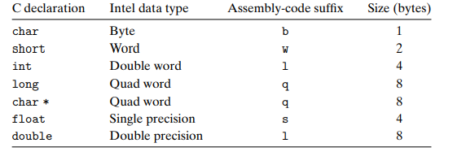

大多数 GCC 生成的汇编代码指令都有一个字符的后缀，表明操作数的大小，如 movb、movw 等。

> 汇编代码用后缀`l`来表示 4 字节整数和 8 字节双精度浮点数。由于浮点数使用的是一组完全不同的指令和寄存器，所以这不会产生歧义。

## 3.4 访问信息

一个 x86-64 的 CPU 包含一组 16 个存储 64 位值的**通用目的寄存器**，这些寄存器用来存储整数和指针。

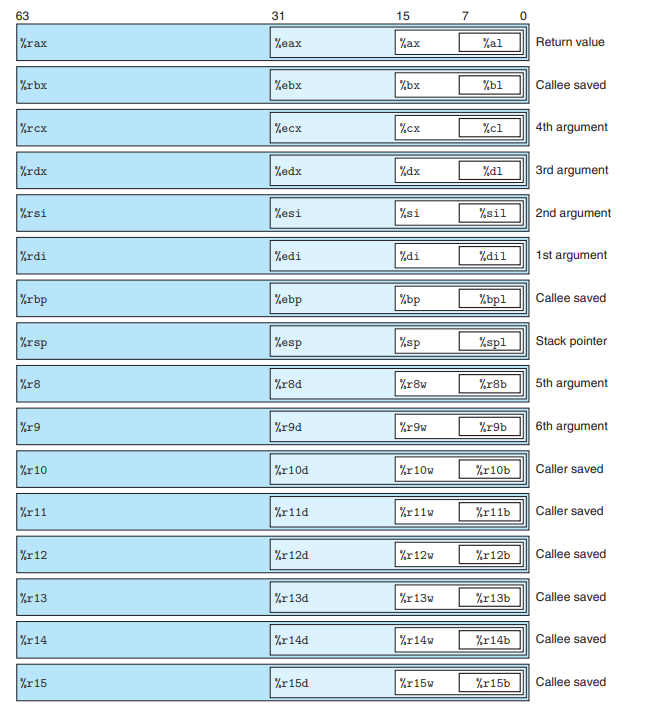

+ 所有 16 个寄存器的低位部分都可以作为字节、字、双字和四字访问。

对于小于 8 字节结果的指令以 reg 作为目标时，reg 中剩下的字节会怎么样，对此有两条规则：

1. 生成 1 字节和 2 字节的指令会保持剩下的字节不变。
2. <Badge text="重要"/><u>生成 4 字节的指令会把高位的 4 个字节置为 0</u>。

### 3.4.1 操作数指示符

各种不同的操作数分成三种类型：
1. **立即数**（immediate），用来表示常数值。书写方式：在`$`后面跟一个用标准 C 表示法表示的整数，如 `$-577`
2. **寄存器**（register），我们用符号 $r_\alpha$ 来表示任意寄存器 $\alpha$，用引用 $R[r_\alpha]$ 来表示它的值，这是将寄存器集合视为一个数组 R，用寄存器标识符作为索引。
3. **内存引用**，根据计算出来的有效地址访问某个内存位置，用符号 $M_b[Addr]$ 表示对存储在内存中 Addr 开始的 b 个字节值的引用，可省去下标 b。

多种不同的**寻址模式**：

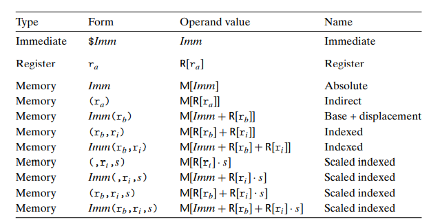

最常用的形式是 $Imm(r_b, r_i, s)$，其包含一下四个部分：
1. 立即数偏移 $Imm$ 
2. 基址寄存器 $r_b$ 
3. 变址寄存器 $r_i$ 
4. 比例因子 $s$，这里 s 必须为 1、2、4 或者 8

其有效地址被计算为 $Imm + R[r_b] + R[r_i] \cdot s$。

### 3.4.2 数据传送指令

#### **简单的数据传送指令**：

最简单的是 MOV 类，由四条指令组成：

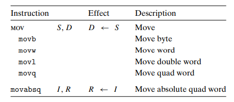

+ 传送指令的两个操作数不能都指向内存位置
+ 不能用 %rsp （系统保留）
+ movl 以寄存器为目的时，它会把寄存器的高位 4 字节置为 0
+ movabsq 传送绝对的四字，用于处理 64 位立即数数据。而常规的 movq 只能以表示为 32 位补码数字的立即数作为源操作数，然后把这个值符号扩展得到 64 位的值，放到目的位置。

For Example：
```asm
movl $0x4050, %eax      Immediate--Register, 4 bytes
movw %bp, %sp           Register--Register, 2 bytes
movb (%rdi, %rcx),%al   Memory--Register, 1 byte
movb $-17, (%esp)       Immediate--Memory, 1 byte
movq %rax, -12(%rbp)    Register--Memory, 8 bytes
```

#### **长度扩展的数据移动指令**：

以下两类数据移动指令在将较小的源复制到较大的目的时使用，每条指令名字的最后两个字符都是大小指示符：第一个指定源的大小，第二个指示目的的大小：

零扩展数据传送指令：
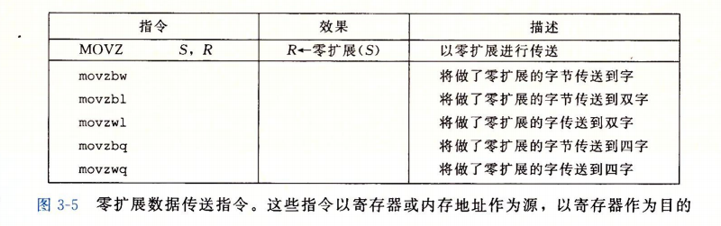

+ 注意并没有一条明确的指令把 4 字节的源值零扩展至 8 字节目的，不过可以用以寄存器为目的的 movl 实现（因为他会把高位清零）。

符号扩展数据传送指令：
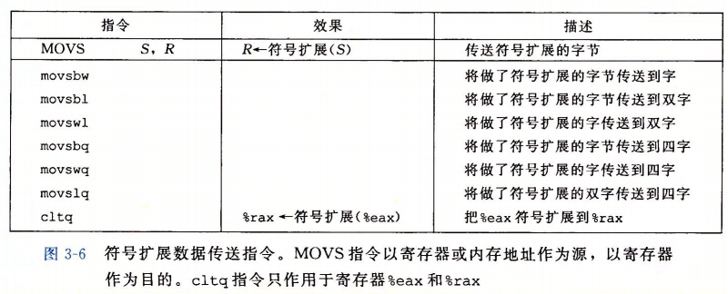

### 3.4.3 数据传送示例

考虑一个数据交换函数，C 与汇编代码如下：

```c
long exchange(long *xp, long y)
{
    long x = *xp;
    *xp = y;
    return x;
}
```

```asm
// long exchange(long *xp, long y)
// xp in %rdi, y in %rsi

exchange:
    movq (%rdi), %rax       Get x at xp. Set as return value.
    movq %rsi, (%rdi)       Store y at xp.
    ret                     Return.
```

这段代码两点值得注意：
1. C 语言的“指针”其实就是地址。间接引用指针就是将该指针放到一个寄存器中，然后在内存引用中使用这个寄存器
2. 像 x 这样的局部变量通常保存在寄存器中，而不是内存中

### 3.4.4 压入和弹出栈数据

这两个数据传送操作可以将数据压入程序栈中，以及从程序栈中弹出数据。栈总是从一端插入或删除数据，这一端被称为“栈顶”。

<Badge text="重要"/>栈向低地址生长，栈顶是低地址。

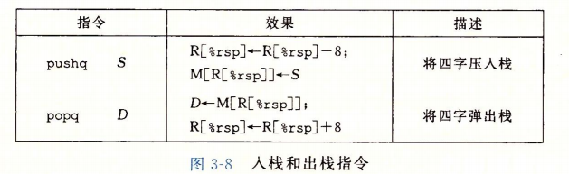

+ 将一个四字值压入栈中，首先要将栈指针减 8，然后将值写到新的栈顶地址，因此`pushq %rbp`等价于`subq $8, %rsp; movq %rbp, (%rsp)`。

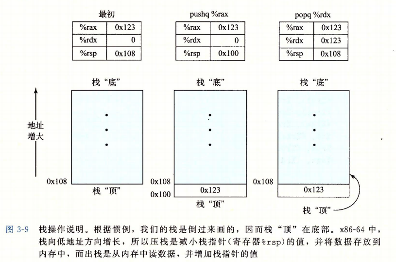

+ pop 后原数据只是逻辑删除
+ 无论如何，%rsp 总是指向栈顶
+ 程序可以用标准的内存寻址方法访问栈中的任意位置

## 3.5 算术和逻辑操作

大多数操作都分成了指令类，这些指令类都有各种不同大小操作数的变种（只有 leaq 没有其他大小的变种）。

事实上，给出的每个指令类都有对这四种不同大小数据的指令。这些操作被分为四组：加载有效地址、一元操作、二元操作和移位：

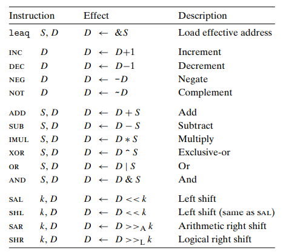

+ 我们分别用 $>>_A$ 和 $>>_L$ 表示算术右移和逻辑右移。
+ <Badge text="重要"/>ATT 格式的汇编代码中操作数的顺序与一般的直觉相反（尤其是减法、移位）。

### 3.5.1 加载有效地址

加载有效地址(Load Effective Address，lea)指令 leaq 实际上是 movq 的变形。
<u>它将 S 所指示的内存引用取其地址然后将地址值赋给 D 指示的寄存器</u>。

#### **示例：**

```c
long scale(long x, long y, long z) {
    long t = x + 4 * y + 12 * z;
    return t;
}
```

```asm
// long scale(long x, long y, long z)
// x in %rdi, y in %rsi, z in %rdx

scale:
    leaq (%rdi, %rsi, 4), %rax        x + 4*y
    leaq (%rdx, %rdx, 2), %rdx        z + 2*z = 3*z
    leaq (%rax, %rdx, 4), %rax        (x+4*y) + 4*(3*z) = x + 4*y + 12*z
    ret
```

### 3.5.2 一元和二元操作

**一元操作**只有一个操作数，既是源又是目的，可以是一个 reg，也可以是一个内存位置。

**二元操作**的第二个操作数既是源又是目的。例如，`subq %rax, %rbx`使寄存器 %rbx 的值减去 %rax 的值，结果存入 %rbx 中。

### 3.5.3 移位操作

**移位操作**先给出移位量，然后第二项给出的是要移位的数。

+ 移位量可以是一个立即数，<u>或者放在单字节寄存器 %cl 中</u>（这些指令很特别，因为只允许以这个特定的寄存器作为操作数）。
+ x86-64 中，移位操作对 w 位长的数据量进行操作，移位量是由 %cl 的低 m 位决定的，这里 $2^m = w$，<u>高位会被忽略</u>。


#### **左移/右移指令**：

左移指令有两个名字：SAL 和 SHL，效果一样。右移指令中，SAR 算术右移，SHR 逻辑右移。

::: tip
可以看到，大多数指令既可以用于无符号运算，也可以用于补码运算。只有右移操作要求区分有符号数和无符号数。这个特性使得补码运算成为实现有符号数整数运算的一种比较好的方法的原因之一。
:::

#### 可以实现将 %rdx 清零的操作：

+ movq $0, %rdx
+ movl $0, %edx
+ xorl %edx, %edx （最短）

### 3.5.5 特殊的算术操作

Intel 将 16 字节的数成为**八字**（oct word），如下是支持产生两个 64 为数字的全 128 位乘积以及整数除法指令：

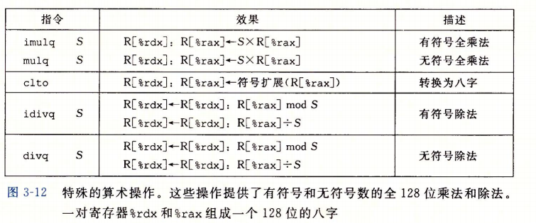

imulq 指令有两种不同的形式：
1. “双操作数”乘法指令形式，是 IMUL 指令类中的一种，如上图所示。
2. “单操作数”乘法指令形似，一个是无符号数乘法（mulq），另一个是补码乘法（imulq）。这两个都要求一个参数在 %rax 中，另一个作为指令的源操作数给出，乘积结果放在 %rdx（高64位）和 %rax（低64位）中。

#### **有符号除法指令 idivl**：

将 %rdx（高64位）和 %rax（低64位）中的 128 位数作为被除数，而除数作为指令的操作数给出，然后指令将商存储在 %rax 中，将余数存储在 %rdx 中。

::: details 被除数是 64 位的情况
对于大多数 64 位除法应用来说，被除数也常常是一个 64 位的值，这个值应该存在 %rax 中，%rdx 应该置零（unsigned）或 %rax 的符号位（signed）。<u>后面这个操作可以用指令 `cqto` 完成，它不需要操作数，将 %rax 的符号位读出，并将它复制到 %rdx 的所有位</u>。
:::

For Example：它计算两个 64 为有符号数的商和余数

```c
void remdiv(long x, long y, long *qp, long *rp) {
    long q = x / y;
    long r = x % y;
    *qp = q;
    *rp = r;
}
```

``` asm6502 {7, 8}
// void remdiv(long x, long y, long *qp, long *rp)
// x in %rdi, y in %rsi, qp in %rdx, rp in %rcx

remdiv:
    movq %rdx, %r8          Copy qp
    movq %rdi, %rax         Move x to lower 8 bytes of dividend
    cqto                    Sign-extend to upper 8 bytes of dividend
    idivq %rsi              Divide by y
    movq %rax, (%r8)        Store quotient at qp
    movq %rdx, (%rcx)       Store remainder at rp
    ret
```

无符号数除法使用 `divq` 指令，通常，寄存器 %rdx 会事先设置为 0。

