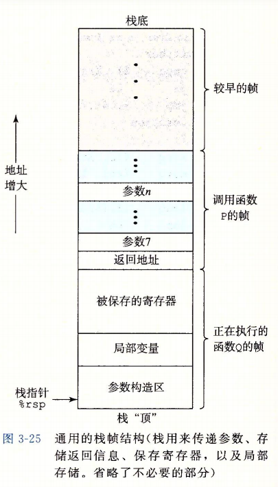
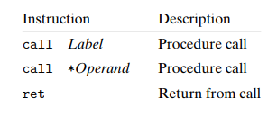
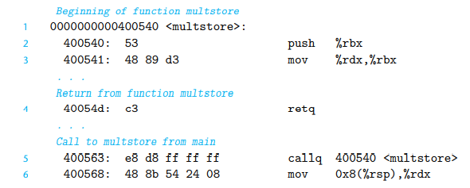
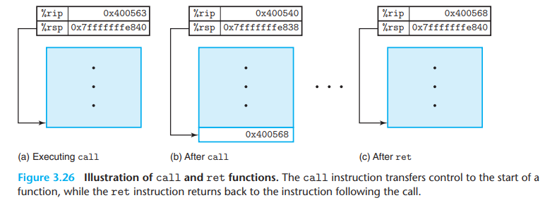
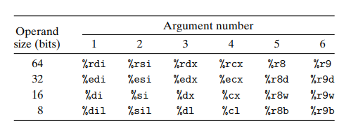
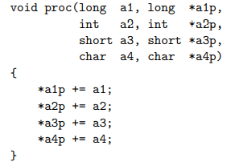
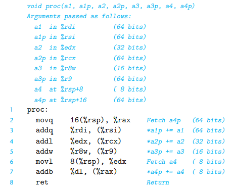

[[toc]]

# 3.7 过程

过程是软件的一种很重要的抽象，它提供了一种封装代码的方式，用一组参数和一个可选返回值实现了某种功能。在不同编程语言中，过程形式多样：函数（function）、方法（method）、子例程（subroutine）、处理函数（handler）等，但它们有一些共有特性。

假设过程 P 调用过程 Q，Q 执行后返回到 P，这些动作包括下面一个或多个机制：
+ **传递控制**：PC 指向 Q
+ **传递数据**
+ **分配和释放内存**：开始前 Q 为局部变量等分配空间，返回前又必须释放

## 3.7.1 运行时栈

栈和程序寄存器存放着传递控制和数据、分配内存所需要的信息。

- 将栈指针减小一个适当的量就可以为没有指定初始值的数据在栈上分配空间。类似地，也可以通过增加栈指针来释放空间。
- 当 x86-64 过程所需要的存储空间超过寄存器能够存放的大小时，就会在栈上分配空间。这个部分称为过程的**栈帧**，即栈中单个过程实例的状态数据。
- 当前正在执行的过程的帧总是在栈顶。
- 为了提高空间和效率，x86-64 过程只分配自己所需要的栈帧部分。比如参数全部可以通过 reg 来传递。实际上有的函数根本不需要栈帧。

## 3.7.2 转移控制

将控制从函数 P 转移到 Q，可以通过 call Q 指令来实现，这个指令会把地址 A 压入栈中，并把 PC 设置为 Q 的起始地址。压入的地址 A 称为**返回地址**，是<u>紧跟在 call 指令后面的那条指令的地址</u> <a-tag color="blue">易错</a-tag>。

call 指令有一个目标，直接调用的目标是一个标号，而间接调用的目标是 $*$ 后面紧跟一个操作数指示符。

::: details 转移控制示例
有下面的汇编代码，main 调用了 multstore：

其执行情况是：

:::

可以看到，这种把返回地址压入栈的简单机制能够让函数在稍后返回到程序中正确的点（即调用完后会使栈恢复至调用前的状态）。

## 3.7.3 数据传送

x86-64 中大部分过程见的数据传送是通过寄存器实现的。

+ 寄存器是按照特殊顺序来使用的，而使用的名字是根据参数的大小来确定的。

如果一个函数有大于 6 个整型参数，那超出部分要通过栈来传递。要把参数 1-6 复制到对应的寄存器，把参数 7-n 放到栈上，而参数 7 位于栈顶。通过栈传递参数时，所有的数据大小都向 8 的倍数对齐。参数就放在图 3-25 中“参数构造区”的区域。

::: details Example
C 函数：

生成的汇编代码：

:::

## 3.7.4 栈上的局部存储

有些时候，局部数据必须存放到内存上，常见的情况包括：

+ **寄存器不足**以存放所有本地数据；
+ 对一个局部变量**取地址**，因此必须能够为它产生一个地址；
+ 某些局部变量是**数组或结构**，因此必须能够通过数组或结构引用被访问到。

一般来说，过程通过减少栈指针在栈上分配空间，分配的结果作为栈帧的一部分，标号为“局部变量”。过程返回时要释放掉所分配的空间。

## 3.7.5 寄存器中的局部存储空间

寄存器是唯一被所有过程共享的资源，因此必须采用统一的寄存器使用惯例，所有的过程都必须遵循：

### 被调用者保存寄存器

寄存器%rbx、%rbp 和 %r12 ~ %r15 被划分为**被调用者保存寄存器**。

当过程 P 调用 Q 时，Q 必须保存这些寄存器的值，保证在返回给 Q 时内容不变。这是 Q 可以：
+ 要么根本不去改变它；
+ 要么把原始值压入栈帧中的“被保存的寄存器”部分，返回前在弹出旧值恢复。（注意弹出顺序与压入顺序相反）

### 调用者保存寄存器

所有其他寄存器，除了栈指针 %rsp，都分类为**调用者保存寄存器**。

这意味着任何函数都能修改他们。在调用之前保存好这些数据是调用者 P 的责任。

## 3.7.6 递归过程

递归调用一个函数本身与调用其他函数一样。栈规则提供了一种机制，每次函数调用都有它自己私有的状态信息，如果需要，它还可以提供局部变量的存储。
