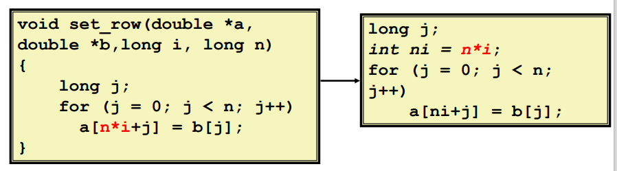
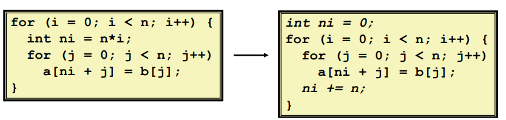
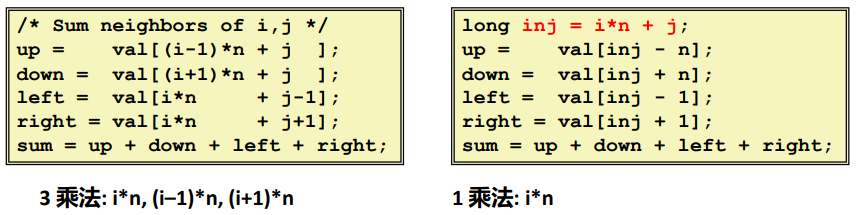
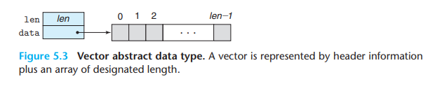
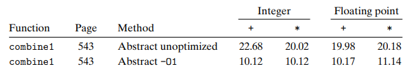
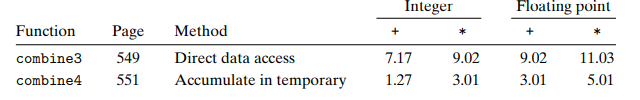

# Chapter 5 优化程序性能

[[toc]]

## 5.1 优化编译器的能力和局限性

最简单的控制就是指定**优化级别**。例如，命令行选项`-Og`调用 GCC 是让它使用一组基本的优化，以选项`-O1`（甚至更高）会使用更大量的优化。这样可以进一步提升程序性能，但也肯能使调试工具更难对程序进行调试。

### 局限性

+ 在基本约束条件下运行：不能引起程序行为的任何改变。
+ 对程序员来说很明显的行为可能会被语言和编码风格混淆：如数据范围可能比变量类型建议的范围更小。
+ 大多数分析只在过程中执行：全程序分析过于昂贵，新版本的GCC在单独的文件中进行了过程间分析，但是,不是在不同文件之间的代码。
+ 大多数分析都是**基于静态信息**的：编译器很难预测运行时输入。
+ **当有疑问时，编译器必须是保守的**。


### 两个妨碍优化的因素

#### **妨碍因素 1：<u>内存别名使用</u>**

在只执行安全的优化中，编译器必须假设不同的指针可能会指向内存中同一个位置。

::: details For Example

```c
void twiddle1(long *xp, long *yp) {
    *xp += *yp;
    *xp += *yp
}

void twiddle2(long *xp, long *yp) {
    *xp += 2 * (*yp);
}
```

两个函数看上去功能相同，而且 `twiddle2` 的性能更高，实际上当 xp 和 yp 指向相同位置时，两个函数的运行结果是不同的，所以当我们写出 twiddle1 的代码时，编译器不能将其优化成 twiddle2。
:::

#### **妨碍因素 2：<u>函数调用</u>**

大多数编译器不会试图判断一个函数有没有副作用，编译器会假设最糟的情况，并保持所有的函数调用不变。

补救措施：使用内联函数；自己做代码移动。

::: details For Example

```c
long f();

long func1() {
    return f() + f() + f() + f();
}

long func2() {
    return 4 * f();
}

```

当 `f()` 没有副作用时，func2 的性能比 func1 好，但编译器会假设 func2 有副作用，比如更改了全局变量，所有不会优化。
:::

### 常用的优化手段

不考虑具体处理器与编译器

#### **（1）代码移动**

减少计算执行的频率。如果它总是产生相同的结果，将代码从循环中移出。



#### **（2）复杂运算简化**

用更简单的方法替换昂贵的操作，如用移位而不是乘法或除法。



#### **（3）共享公用子表达式**

重用表达式的一部分。



## 5.2 表示程序性能

程序性能度量标准 —— **每个元素的周期数**(Cycles Per Element, **CPE**)。我们更愿用每个元素的周期数而不是每个循环的周期数来度量，这是因为像循环展开这样的技术使得我们能够使用较少的循环完成计算。

## 5.3 程序示例



::: details 完整代码

```c
/* Create abstract data type for vector */
typedef struct {
    long len;
    data_t *data;
} vec_rec, *vec_ptr;

#define IDENT 0
#define OP +

/* Create vector of specified length */
vec_ptr new_vec(long len)
{
    /* Allocate header structure */
    vec_ptr result = (vec_ptr) malloc(sizeof(vec_rec));
    data_t *data = NULL;
    if (!result)
        return NULL; /* Couldn’t allocate storage */
    result->len = len;

    /* Allocate array */
    if (len > 0) {
        data = (data_t *)calloc(len, sizeof(data_t));
        if (!data) {
            free((void *) result);
            return NULL; /* Couldn’t allocate storage */
        }
    }
    
    /* Data will either be NULL or allocated array */
    result->data = data;
    return result;
}

/*
* Retrieve vector element and store at dest.
* Return 0 (out of bounds) or 1 (successful)
*/
int get_vec_element(vec_ptr v, long index, data_t *dest)
{
    if (index < 0 || index >= v->len)
        return 0;
    *dest = v->data[index];
    return 1;
}

/* Return length of vector */
long vec_length(vec_ptr v)
{
    return v->len;
}

```

:::

最初的 `combine` 版本：

```c
/* Implementation with maximum use of data abstraction */
void combine1(vec_ptr v, data_t *dest)
{
    long i;

    *dest = IDENT;
    for (i = 0; i < vec_length(v); i++) {
        data_t val;
        get_vec_element(v, i, &val);
        *dest = *dest OP val;
    }
}
```

测试数据：



## 5.4 消除循环的低效率 —— 代码移动

**代码移动**：这类优化包括识别要执行多次（例如在循环里）但是计算结果不会改变的计算。因而可以将计算移动到代码前面不会被多次求值的部分。

`combine2` 在开始时调用 `vec_length` 并将结果存入局部变量 `length` 中，避免每次循环都会计算向量长度。

```c {4}
/* Move call to vec_length out of loop */
void combine2(vec_ptr v, data_t *dest) {
    long i;
    long length = vec_length(v);

    *dest = IDENT;
    for(i = 0; i < length; i++) {
        data_t val;
        get_vec_element(v, i, &val);
        *dest = *dest OP val;
    }
}
```

为了改进代码，程序员必须经常帮助编译器显示地完成代码的移动。

## 5.5 减少过程调用

过程调用会带来开销，而且妨碍大多数形式的程序优化。

在 `combine2` 中，每次循环都会调用 `get_vec_element` 来获取下一个元素，而这个函数会检查索引 i 和向量边界，因此造成了低效率。假设我们增加函数 `get_vec_start` 获取数组首地址并循环直接访问数组：

```c {8,12}
data_t *get_vec_start(vec_ptr v) {
    return v->data;
}

void combine3(vec_ptr v, data_t *dest) {
    long i;
    long length = vec_length(v);
    data_t *data = get_vec_start(v);

    *dest = IDENT;
    for (i = 0; i < length; i++) {
        *dest = *dest OP data[i];
    }
}
```

## 5.6 消除不必要的内存引用

`combine3` 中每次循环都要对 `dest` 做解引用操作使得累计变量的数值每次都要从内存中读出再写入到内存，这样的读写很浪费，因为每次迭代开始时从 dest 读出的值就是上次迭代最后写入的值。

**优化方法**：引入一个临时变量 `acc`，它在循环中用来累计计算出来的值，只有在循环完成之后才将结果放到 `dest` 中。实现如下

```c {6,9,11}
/* Accumulate result in local variable */
void combine4(vec_ptr v, data_t *dest) {
    long i;
    long length = vec_length(v);
    data_t *data = get_vec_start(v);
    data_t acc = IDENT;

    for (i = 0; i < length; i++) {
        acc = acc OP data[i];
    }
    *dest = acc;
}
```

程序性能有了显著的提高：



