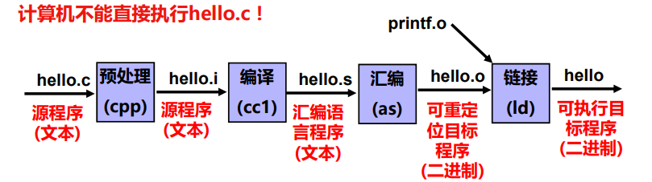
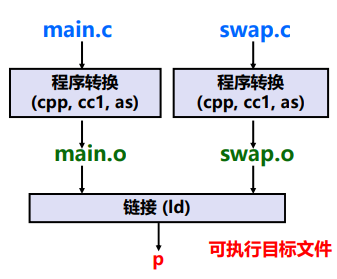

# 一、可执行文件生成概述

[[toc]]




## 1.1 GCC 处理 C 程序的过程

### 1）预处理

C 预处理程序为 cpp（C Preprocessor），主要用于 C 语言编译器对**各种预处理命令进行处理**。包括：

+ **宏定义的展开**：删除`#define`并展开所定义的宏
+ **条件预编译的选择**：处理如`#if`,`#ifdef`, `#endif`等
+ **头文件的包含**：插入头文件到`#include`处，可以递归方式进行处理
+ **删除注释**
+ **添加行号和文件名标识**，以便编译时编译器产生调试用的行号信息
+ **保留所有`#pragma`编译指令**（编译器需要用）

**GCC 预处理命令**：

+ **gcc –E** hello.c –o hello.i
+ **cpp** hello.c > hello.i

经过预编译处理后，得到的是预处理文件（如，hello.i) ，它还是一个可读的文本文件，但不包含任何宏定义。

### 2）编译

编译过程就是将预处理后得到的预处理文件（如 hello.i）进行词法分析、语法分析、语义分析、优化后，生成汇编代码文件。

用来进行编译处理的程序称为编译程序（**编译器**，Compiler）。

**GCC 编译命令**：

+ **gcc –S** hello.i –o hello.s 
+ **gcc –S** hello.c –o hello.s 
+ **cc1** hello.c

经过编译后，得到的汇编代码文件（如 hello.s）还是可读的文本文件，CPU 无法理解和执行它。

::: tip
gcc命令实际上是具体程序（如ccp、cc1、as等）的包装命令，用户通过 gcc 命令来使用具体的预处理程序 ccp、编译程序 cc1 和
汇编程序 as 等
:::

### 3）汇编

汇编的功能是将编译生成的汇编语言代码转换成机器指令序列。

**GCC 汇编命令**：

+ **gcc –c** hello.s –o hello.o
+ **gcc –c** hello.c –o hello.o
+ **as** hello.s -o hello.o （as是一个汇编程序）

汇编结果是一个可重定位目标文件（如，hello.o），其中包含的是不可读的二进制代码。

### 4）链接

预处理、编译和汇编三个阶段针对一个模块（一个*.c文件）进行处理，得到对应的一个可重定位目标文件（一个*.o文件）。

链接过程将多个可重定位目标文件合并以生成可执行目标文件。链接的本质：合并相同的节。

**GCC 链接命令**：

+ **gcc –static** –o myproc main.o test.o
+ **ld –static** –o myproc main.o test.o

> `–static` 表示静态链接。如果不指定 -o 选项，则默认生成的可执行文件名为“a.out”。

**链接的好处**：

+ 1：模块化
  + （1）一个程序可以分成很多源程序文件
  + （2）可构建公共函数库，如数学库，标准C库等
+ 2：效率高
  + （1）时间上，可分开编译：只需重新编译被修改的源程序文件，然后重新链接；
  + （2）空间上，无需包含共享库所有代码：源文件中无需包含共享库函数的源码，只要直接调用即可（如，只要直接调用printf()函数，无需包含其源码）。

## 1.2 可执行目标文件的生成

示例：

```c
// main.c
int buf[2] = {1, 2};
void swap(); 

int main() 
{
    swap();
    return 0;
}

// swap.c
extern int buf[]; 
int *bufp0 = &buf[0];
static int *bufp1;

void swap()
{
    int temp;
    bufp1 = &buf[1];
    temp = *bufp0;
    *bufp0 = *bufp1;
    *bufp1 = temp;
}
```

+ 每个模块有自己的代码、数据（初始化全局变量、未初始化全局变量，静态变量、局部变量）；
+ 局部变量temp分配在栈中，不会在过程外被引用，因此不是符号定义。


使用GCC编译器编译并链接生成可执行程序 P：

```sh
$ gcc -O2 -g -o p main.c swap.c
$ ./p
```

gcc 编译器的静态链接过程：



链接操作的步骤：

1. 符号解析
2. 合并相关 .o 文件
3. 确定每个符号的地址
4. 在指令中填入新地址