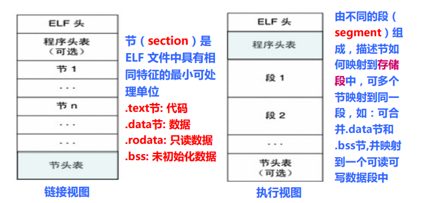
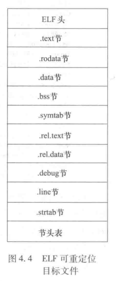
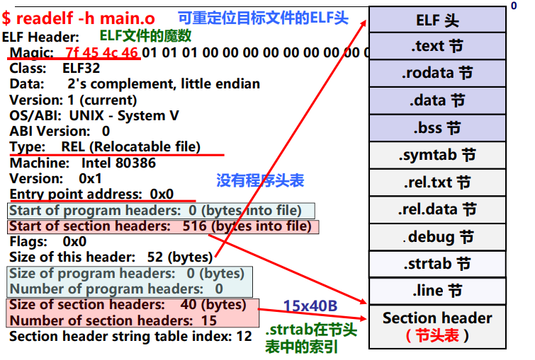
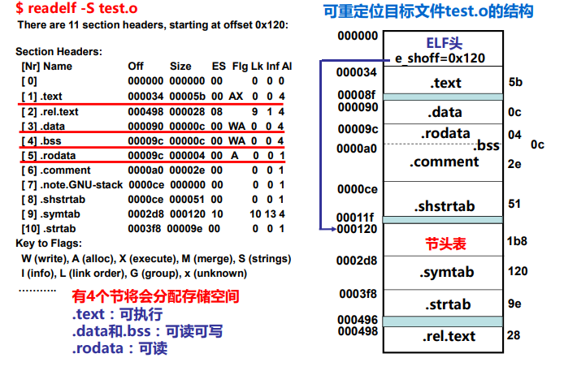
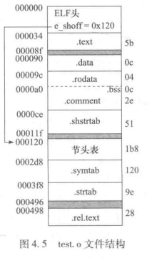
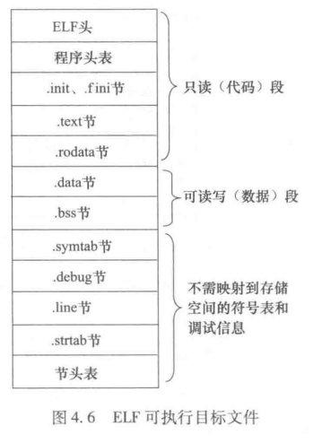
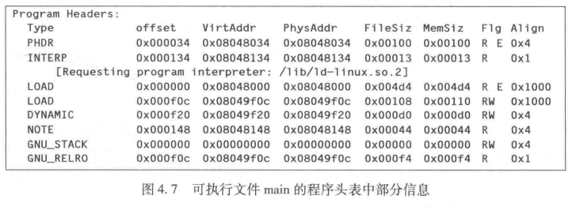
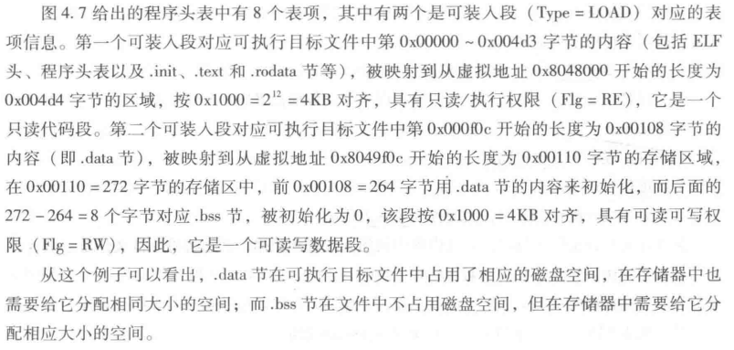

# 二、目标文件格式

[[toc]]

## 2.1 三类目标文件

1. **可重定位目标文件**（.o）
   + 其代码和数据可和其他可重定位文件合并为可执行文件；
   + 每个 .o 文件由对应的 .c 文件生成；
   + 每个 .o 文件代码和数据<u>地址都是从 0 开始</u>。
2. **可执行目标文件**（default：a.out）
   + 包含的代码和数据可以被直接复制到内存并被执行；
   + 代码和数据<u>地址为虚拟地址</u>空间中的地址
3. **共享的目标文件**（.so）
   + 特殊的可重定位目标文件，能在装入或运行时被装入到内存并自动被链接，称为**共享库文件**
   + Windows 中称其为 Dynamic Link Libraries (DLLs)

## 2.2 目标文件的格式

**目标代码**（Object Code）指编译器和汇编器处理源代码后所生成的机器语言目标代码。

**目标文件**（Object File）指包含目标代码的文件。

目标文件的标准二进制格式：

+ DOS 操作系统：COM 格式
+ System V UNIX 早期版本：COFF 格式
+ Windows：PE 格式
+ Linux 等类 UNIX：ELF 格式

## 2.3 ELF 目标文件格式

目标文件既可用于程序的链接，也可用于程序的执行。

有两种视图：

+ **链接视图**，被链接，可重定位目标文件；
  + 主要由不同的*节*组成，不同的节描述了目标文件中不同类型的信息及特征。
+ **执行视图**，被执行，可执行目标文件。
  + 主要由不同的*段*组成，描述了目标文件中的节如何映射到存储空间的段。



## 2.4 可重定位目标文件格式

> 可重定位目标文件主要包含代码部分和数据部分，它可以与其他可重定位目标文件链接，从而创建可执行目标文件、共享库文件。

+ 可被链接（合并）生成可执行文件或共享目标文件；
+ 静态链接库文件由若干个可重定位目标文件组成；
+ 包含代码、数据（已初始化全局变量和局部静态变量.data和未初始化的全局变量和局部静态变量.bss）；
+ 包含重定位信息（指出哪些符号引用处需要重定位）；
+ 文件扩展名为.o（相当于Windows中的 .obj文件）



### （1）ELF 头

**ELF 头**位于目标文件的起始位置，包含文件结构说明信息。分32位版本和64位版本。

32位系统对应的数据结构，共占 52（0x34） 字节：

```c
#define EI_NIDENT 16

typedef struct {
   unsigned char e_ident[EI_NIDENT]; // 开始的四个字节是魔数，后面的16个字节包含一些标识信息，如字节序、32/64位、版本号等
   Elf32_Half e_type;      // 目标文件类型（可重定位文件、可执行文件、共享库文件还是其他类型文件）
   Elf32_Half e_machine;   // 机器结构类型（如 IA-32、AMD 64等）
   Elf32_Word e_version;   // 目标文件版本
   Elf32_Addr e_entry;     // 指定系统将控制权转移到的起始虚拟地址（程序入口点），如果没有关联入口点则为0，比如可重定位文件就是0
   Elf32_Off e_phoff;
   Elf32_Off e_shoff;      // 节头表在文件中的偏移量（以字节为单位）
   Elf32_Word e_flags;
   Elf32_Half e_ehsize;    // ELF 头的大小（以字节为单位）
   Elf32_Half e_phentsize; 
   Elf32_Half e_phnum;
   Elf32_Half e_shentsize; // 节头表中一个表项的大小，所有表项大小相同
   Elf32_Half e_shnum;     // 节头表项的个数
   Elf32_Half e_shstrndx;
} Elf32_Ehdr;
```

+ **魔数**：文件开头几个字节通常用来确定文件的类型或格式。
  + a.out的魔数：01H 07H
  + PE格式魔数：4DH 5AH
  + <u>加载或读取文件时，可用魔数确认文件类型是否正确</u>
+ 仅 ELF 头在文件中具有固定位置，即总是在开头位置，其余部分的位置由 ELF 头和节头表指出。

可以用 `readelf -h` 命令对某个可重定位目标文件的 ELF 头进行解析。

::: details ELF头信息举例


+ 因为是可重定位文件，所以字段 `e_entry` 为0，无程序头表（Size of program headers = 0）。
  :::

### （2）节

**节**是 ELF 文件中的主体信息，包含了链接过程所用的目标代码信息，包括指令、数据、符号表和重定位信息等。

|   节名    | 说明                                                         |
| :-------: | :----------------------------------------------------------- |
|   .text   | 已编译程序的机器代码                                         |
|  .rodata  | 只读数据，如 printf 语句中的格式串、开关语句（switch-case）的跳转表等 |
|   .data   | 已初始化的全局变量                                           |
|   .bss    | 未初始化的全局和静态变量，以及所有被初始化为 0 的全局或静态变量。**在目标文件中这个节不占据实际的空间**，它仅仅是一个占位符，为了节省空间。在运行时，在内存中将这些变量初始化为 0。 |
|  .symtab  | 符号表（symbol table）,程序中定义的函数名和全局静态变量名都属于**符号**，与这些符号相关的信息保存在符号表中。每个可重定位目标文件都有一个 .symtab 节。和编译器中的符号表不同， .symtab 符号表不包含局部变量的条目。 |
| .rel.text | .text 节相关的重定位信息。当链接器合并目标文件时，.text 中的代码合并后部分位置的数据需要修改。一般而言，任何调用外部函数或者引用全局变量的指令都需要修改定位信息。另一方面，调用本地函数的指令则不需要修改。 TIP：可执行文件中并不需要重定位信息。 |
| .rel.data | .data 节相关的可重定位信息。一般而言，任何已初始化的全局变量，如果它的初始值是一个全局变量地址或者外部定义函数的地址，都需要被修改。 |
|  .debug   | 调试用符号表。其条目是程序中定义的全局变量和类型定义，程序中定义和引用的全局变量，以及原始的 C 源文件。 |
|   .line   | C 源程序中的行号和 .text 节中机器指令之间的映射。            |
|  .strtab  | 字符串表。包括 .symtab 节和 .debug 节中的符号以及节头表中的节名。字符串表就是以 null 结尾的字符序列。 |

+ .bss 可以记成 "Better Save Space"。
+ 只有使用 -g 选项的 gcc 命令才能得到 .debug 和 .line 表。

### （3）节头表

节头表（Section Header Table）由若干表项组成，<u>每个表项描述相应的一个节的节名、在文件中的偏移、大小、访问属性、对齐方式等</u>，目标文件中的每个节都有一个表项与之对应。

+ 除ELF头之外，节头表是ELF可重定位目标文件中最重要的部分内容。

以下是 32 位系统对应的数据结构（每个表项占40B）：

```c
typedef struct {
   Elf32_Word sh_name;  // 节名字符串在.strtab中的偏移
   Elf32_Word sh_type;  // 节类型：无效/代码或数据/符号/字符串/…
   Elf32_Word sh_flags; // 节标志：该节在虚拟空间中的访问属性
   Elf32_Addr sh_addr;  // 虚拟地址：若可被加载，则对应虚拟地址
   Elf32_Off sh_offset; // 在文件中的偏移地址，对.bss节而言则无意义
   Elf32_Word sh_size;  // 节在文件中所占的长度
   Elf32_Word sh_link;  // sh_link和sh_info用于与链接相关的节（如.rel.text节、.rel.data节、.symtab节等）
   Elf32_Word sh_info;
   Elf32_Word sh_addralign;   // 节的对齐要求
   Elf32_Word sh_entsize;     // 节中每个表项的长度，0表示无固定长度表项
} Elf32_Shdr;
```

::: details 节头表信息举例


+ 从上述解析结果可以看出，该 test.o 共 11 个节。节头表从 120 字节开始。
+ 其中，.text、.data、<u>.bss</u> 和 .rodata 节需要在存储器中分配空间。.text 是可执行的，.data 和 .bss 是可读写的，.rodata 是只读的。
  + 由于在真正运行时也要对 .bss 节中的数据进行读写，所以它也要占空间。
+ 根据每个节在文件中的偏移地址和长度，可以画出 test.o 的结构：



+ 比较特殊的一个地方：.bss 在文件中不占用空间，但节头表记录了 .bss 节的长度为 0x0c = 12，因此需要在主存中给 .bss 节分配 12 字节空间。
  :::

整体就是通过 ELF 头连接了节头表，再通过节头表把每一个节连接起来了。

## 2.5 可执行目标文件格式



与可重定文件稍有不同：

+ ELF头中字段 e_entry 给出执行程序时第一条指令的地址，而在可重定位文件中，此字段为0；
+ 多一个**程序头表**，也称段头表（segment header table），是一个结构数组，用来说明段信息；
+ 多一个.init节，用于定义_init函数，该函数用来进行可执行目标文件开始执行时的初始化工作；
+ 少两个.rel节（无需重定位）。

在可执行文件中，ELF 头、程序头表、.init 节、.fini 节、.text 节和 .rodata 节合起来可构成一个**只读代码段**；.data 节和 .bss 节合起来可构成一个**可读写数据段**。显然，在可执行文件启动执行时，这两个段必须装入内存，因而称为**可装入段**。

### 程序头表

为了可执行文件执行时能够给在内存中访问到代码和数据，必须将可执行文件中这些**连续的**、**具有相同访问属性的**代码和数据段映射到存储空间（通常是虚拟地址空间）。<u>程序头表就用于描述这种映射关系</u>，一个表项对应一个连续的存储段或特殊节。程序头表表项大小分别由 ELF 头中的字段 e_phentsize 和 e_phnum 指定。

32 为系统的程序头表中每个表项具有如下数据结构：

```c
typedef struct {
   Elf32_Word p_type;   // 描述存储段的类型或特殊节的类型
   Elf32_Off p_offset;  // 指出本段的首字节在文件中的偏移地址
   Elf32_Addr p_vaddr;  // 指出本段首字节的虚拟地址
   Elf32_Addr p_paddr;  // 指出本段首字节的物理地址，该信息通常无效
   Elf32_Word p_filesz; // 指出本段在文件中所占的字节数，可以为 0
   Elf32_Word p_memsz;  // 本段在存储器中所占的字节数，也可为 0
   Elf32_Word p_flags;  // 存取权限
   Elf32_Word p_align;  // 对齐方式，用一个模数表示，为 2 的正整数幂
} Elf32_Phdr; 
```

::: details 程序头表示例
使用 `readelf -l main` 命令显示的可执行文件 main 的程序头表信息：




:::