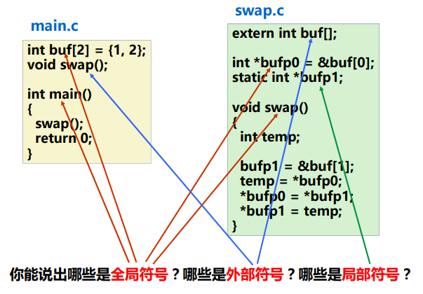
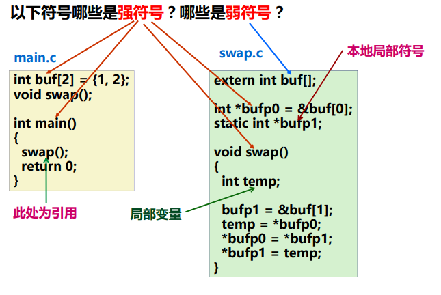
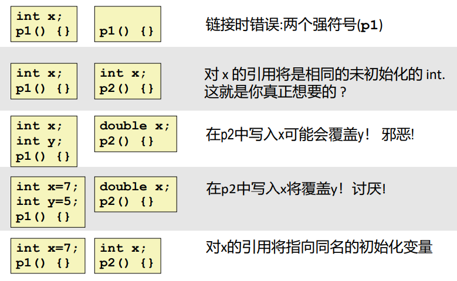
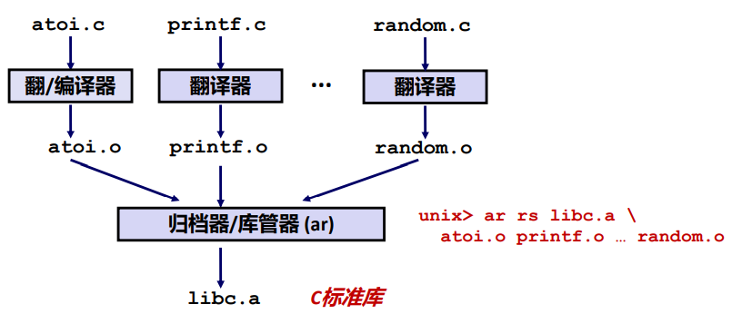
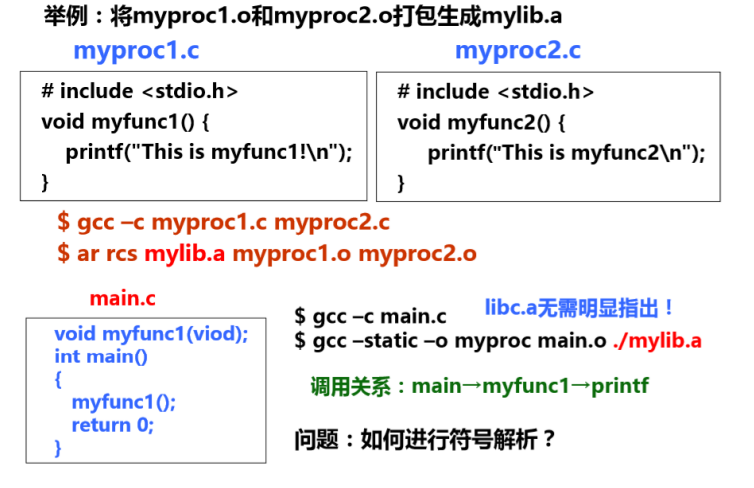
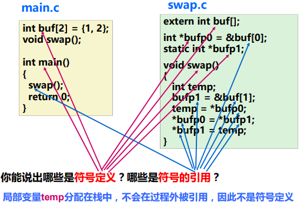
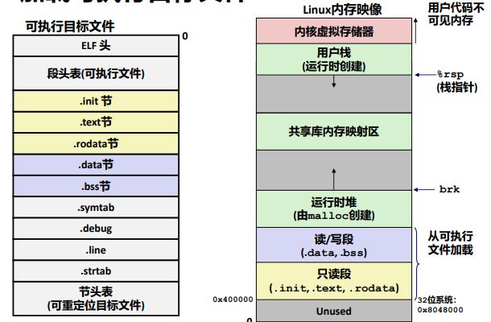
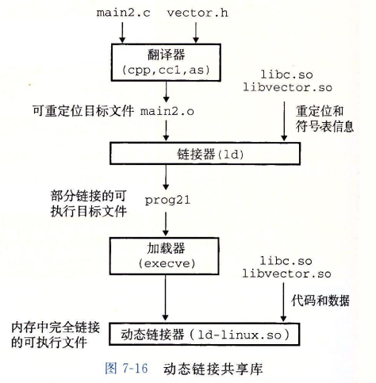

[[toc]]

## 三、符号解析与重定位

回顾：链接操作的步骤：

Step 1. **符号解析**（Symbol resolution）

+ 程序中有定义和引用的符号（包括变量和函数等）；
+ 编译器将定义的符号存放在一个符号表中；
  + 符号表是一个结构数组
  + 每个表项包含符号名、长度和位置等信息
+ 链接器将每个符号的引用都与一个确定的符号定义建立关联；

Step 2. **重定位**

+ 将多个代码段与数据段分别合并为一个单独的代码段和数据段；
+ 计算每个定义的符号在虚拟地址空间中的绝对地址；
+ 将可执行文件中的符号引用处的地址修改为重定位后的地址信息；

## 步骤一：符号解析

### 1.1 符号和符号表

每个可重定位目标模块都有一个符号表，表中包含了在程序模块中被定义的所有符号的相关信息。

对于某个 C 程序模块 m 来说，符号有以下三种类型：

1. **全局符号**：由模块m定义并能被其他模块引用的符号。包括非 static 的C函数和非 static 的C全局变量（指不带static的全局变量）。
2. **外部符号**：由其他模块定义并被模块m引用的全局符号。包括在其他模块定义的外部函数名和外部变量名。
3. **局部符号**：仅由模块m定义和引用的本地符号。包括带 static 的函数名和全局变量名。这类在一个函数内部定义的带 static 属性的本地变量不在栈中管理，而是被分配在静态数据区，即在节 .data 或 .bss 中分配空间。

::: warning 本地非静态C变量 VS 本地静态C变量
本地符号（局部符号）不包括局部变量。局部变量时运行时动态分配在栈或寄存器中，因此他们不是符号，不会记录在符号表中。

+ 本地非静态C变量：存储在栈上
+ 本地的静态C变量：存储在 .data 或 .bss
  :::

::: details 不同类型的符号举例

:::

### 1.2 符号

符号解析**目的**：将每个模块中引用的符号与某个目标模块中的定义符号建立关联。

每个定义符号在代码段或数据段中都被分配了存储空间，因此，将引用符号与对应的定义符号建立关联后，就可以在重定位时将引用符号的地址重定位为相关联的定义符号的地址。

> ”**符号的定义**“ 其实质就是指被分配了存储空间。函数名指其代码所在区，变量名指其所占的静态数据区。所有定义符号的值就是其所在的首地址。

+ <u>本地符号</u>在本模块内定义并引用，因此，其解析较简单，只要与本模块内唯一的定义符号关联即可。
+ <u>全局符号</u>（外部定义的、内部定义的）的解析涉及多个模块，故较复杂.

#### **全局符号的强、弱特性**

编译器在编译时，会把每个全局符号输出到汇编代码文件中，每个全局符号要么是强符号，要么是弱符号。并将这些信息存到符号表中供链接器的符号解析使用。

+ **强符号**：函数名和已初始化的全局变量名
+ **弱符号**：未初始化的全局变量名

::: details 强弱符号举例

:::

::: tip
本地符号没有强弱之分。
:::

#### **链接器的符号处理规则**：

+ 规则1：强符号只能定义一次；
+ 规则2：如果有一个强符号和多个弱符号同名，那么选择强符号；
  + 对弱符号的引用被解析为强符号
+ 规则3：如果有多个弱符号同名，那么从这些弱符号中任意选择一个。
  + 可以用 `gcc –fno-common` 命令，告诉连接器在遇到多个弱定义的全局符号时输出警告信息

::: details 链接器谜题
如果在两个不同模块定义相同的变量名，那么很可能会发生程序员意想不到的结果。特别是当两个重复定义的变量具有不同类型时，更容易出现难以理解的结果。

:::

#### **解决定义全局符号的问题的方法：**

1. 尽量避免使用全局变量；
2. 如果一定要用的话：
   + 把全局变量定义为 static，这样就没有强弱之分，如果其他函数需要引用它，就封装成一个函数。
   + 尽量给全局变量赋初值使其成为强符号，而外部变量尽量使用 extern。

### 1.3 与静态库的链接

所有的编译系统都提供一种机制，将所有相关目标模块打包成一个单独的文件，称为**静态库**，它可以用作链接器的输入。当链接时，它只复制静态库中被应用程序引用的目标模块。

> **背景**：如果为每个函数如 printf、scanf 等都创建一个独立的可重定文件，程序员就要显式地一次链接，这容易出错又耗时，于是静态库的概念被提出：相关的函数可以被编译成独立的目标模块，然后封装成一个单独的静态库文件，在连接时，链接器只复制被程序引用的目标模块。

+ C 编译器总是默认传送 libc.a 给链接器，因此在gcc命令行中无需明显指定。

在 Linux 系统中，静态库以一种称为**存档**（archive）的特殊文件存放在磁盘中。存档文件是一组连接起来的可重定位目标文件的集合，由 .a 后缀标识。

**创建静态库**：


::: details 自定义一个静态库文件

:::

#### **关于静态库的链接顺序问题**：

+ 通常的准则是将静态库文件放在命令行中的文件列表的后面。
+ 若相互之间有引用关系，则必须按照引用关系在命令行中排列静态文件，使得对于每个静态库目标模块中的外部引用符号，在命令行中至少有一个包含其定义的静态库文件排在后面。
+ 如果两个静态库的目标模块有相互引用关系，则在命令行中可以重复静态库文件名。

### 1.4 链接器符号解析的过程

在符号解析阶段，链接器从左到右按照他们在编译器驱动程序命令行上出现的顺序来扫描可重定位目标文件和存档文件，

链接器维护三个集合：

+ **E**：<u>可重定位目标文件的集合</u>。这个集合中的文件会被合并起来形成可执行文件。
+ **U**：<u>一个未解析的符号的集合</u>。即引用了但是尚未看到定义的。
+ **D**：<u>一个在前面输入文件中已定义的符号集合</u>。

过程：

+ 初始时，E、U、D 均为空。
+ 对命令行中每个输入文件f：
  + 若 f 是目标文件：把 f 添加到 E，修改 U 和 D 来反映 f 中的符号定义和引用，并继续下一个输入文件；
  + 若 f 是存档文件：尝试匹配 U 中所有未解析符号和由 f 定义的符号。如果检测到 f 中的成员 m 定义了一个 U 中的符号，就把 m 加到 E 中，并修改 U 和 D 来反映 m 中的符号定义和引用。对存档文件中所有成员目标文件都依次进行这个过程，直到 U 和 D 不再发生变化，就继续下一个输入文件。
+ 如果所有输入文件全部扫描完后，U 是非空的，name链接器就会输出一个错误并终止，否则，它会合并和重定位 E 中的目标文件，构建输出的可执行文件。

> 具体示例可见教材

## 步骤二：重定位

> 编译 main.c 时，因为编译器还不知道函数 myproc1 的地址，所以编译器只是将一个“临时地址”放到可重定位目标文件 main.o 的 call 指令中，在链接阶段，这个“临时地址”将被修正为正确的引用地址，这个过程叫做**重定位**。

符号解析完成后，可进行重定位工作，分三步：

1. **合并相同的节**

  + 将集合 E 的所有目标模块中相同的节合并成新节。
  + 例如，所有.text节合并作为可执行文件中的.text节。

2. **对定义符号进行重定位（确定地址）**

  + 确定新节中所有定义符号在虚拟地址空间中的地址。
  + 例如，为函数确定首地址，进而确定每条指令的地址，为变量确定首地址.

3. **对引用符号进行重定位（确定地址）**

  + 修改.text节和.data节中对每个符号的引用（地址）。
  + 需要用到在.rel_data和.rel_text节中保存的重定位信息。

### 2.1 重定位信息

> 汇编器在遇到引用时，将引用先换为一个“临时地址”，同时生成一个**重定位条目**用于重定位。

在可重定位目标文件的 .rel.text 节和 .rel.data 节中，存放着每个需要重定位的符号的**重定位信息**。

+ 数据引用的重定位条目在 .rel_data 节中；
+ 指令中引用的重定位条目在 .rel_text 节中。

#### **重定位条目格式：**

```c
typedef struct {
  int offset;     /*节内偏移*/
  int symbol:24,  /*所绑定符号*/
      type: 8;    /*重定位类型*/
} Elf32_Rel;
```

+ offset：当前需重定位的位置相对于所在节起始位置的字节偏移量；
+ symbol：当前需重定位的符号在符号表中的索引值；
+ type：重定位类型。

**IA-32 重定位类型**：

1. R_386_PC32：引用处 PC 相对寻址方式。即`有效地址 = PC + 重定位值`，PC 的内容是下条指令的指令地址。
2. R_386_32：引用处绝对寻址。即`有效地址 = 重定位值`。

::: details 重定位操作举例

:::

### 2.2 重定位过程

#### **1. 重定位 PC 相对引用**

对重定位条目 r，由`有效地址 = PC + 重定位值`得`重定位值 = 有效地址 - PC`：

$$有效地址 = \And r.symbol$$

$$PC = 需重定位的地址 - init$$

$$需重定位的地址 = \And .text + r.offset$$

所以：

$$重定位值 = \And r.symbol - [(\And .text + r.offset) - init]$$

+ 在 x86-64 中，init 即 r.addend。

#### **2. 重定位绝对引用**

$$重定位值 = init + \And r.symbol$$

+ 例如像 `bufp1 = &buf[1]` 这个语句，init = 0x4，引用符号为 buf，故重定位值为 init + &buf，即 &buf[1]。

## 四、可执行文件的加载



运行可执行目标文件 prog，输入命令行：

```bash
$ ./prog
```

+ 通过调用某个驻留在存储器中称为**加载器**（loader）的操作系统代码来运行它。任何 Linux 程序都可以通过调用`execve`函数来调用加载器。
  + `execve()`函数的功能是在当前进程上下文中加载并运行一个新程序；
  + 当加载器运行时，它创建一个内存映像。在程序头部表的引导下，加载器将可执行文件的片（chunk）复制到代码段和数据段。接下来，加载器跳转到程序的入口点，也就是 _start 函数的地址。（_start 函数是在系统目标文件 ctrl.o 中定义的，对所有的 C 程序都一样。）_start 函数调用系统启动函数 __libc_start_main，该函数定义在 libc.so 中。它初始化执行环境，调用用户层的 main 函数，处理 main 函数的返回值，并且在需要的时候把控制返回给内核。
+ 加载器将可执行目标文件中的代码和数据从磁盘复制到内存中，然后通过跳转到程序的第一条指令或入口点来运行该程序。这个将程序复制到内存并运行的过程叫做**加载**。
  + 实际上除了一些头部信息，在加载过程中并没有任何从磁盘到内存的数据复制。操作系统利用它的页面调度机制自动将页面从磁盘传送到内存。
+ 特定的系统平台中的每个可执行文件都采用统一的存储器映像，映射到统一的一个虚拟地址空间。
  + 代码段总是从地址 0x400000 处开始。

## 五、动态链接共享库

### 4.1 静态库的缺点

+ 库函数（如printf）被包含在每个运行进程的代码段中，对于并发运行上百个进程的系统，造成极大的**主存资源浪费**；
+ 库函数（如printf）被合并在可执行目标中，磁盘上存放着数千个可执行文件，造成**磁盘空间的极大浪费**；
+ 程序员需关注是否有函数库的新版本出现，并须定期下载、重新编译和链接，**更新困难、使用不便**。

### 4.2 共享库

**共享库**是一个目标文件，在运行或加载时，可以加载到任意的内存位置，并和一个在内存中的程序链接起来，这个过程叫做**动态链接**。

+ Windows 称其为动态链接库（.dll）
+ Linux称其为动态共享对象（.so）

动态链接可以按以下两种方式进行：

+ 在第一次加载并运行时进行；
  + Linux通常由动态链接器(ld-linux.so)自动处理，标准C库（libc.so）通常按这种方式动态被链接
+ 在已经开始运行后进行。
  + 在 Linux 中调用 `dlopen()` 等接口实现，如分发软件包、构建高性能Web服务器等。

#### **1. 在第一次加载并运行时进行动态链接：**



以下命令生成可执行目标文件 prog21：

```bash
gcc -o prog21 main.c ./libvector.so
```

基本思路是当创建可执行文件时，静态库执行一些链接，然后在程序加载时，动态完成链接过程。

``` tip
注意，此时没有任何 libvector.so 的代码和数据节真的被复制到可执行文件 prog21 中。反之，链接器复制了一些重定位和符号表信息，他们使得运行时可以解析对 libvector.so 中代码和数据的引用。
```

动态链接器通过执行下面的重定位来完成链接任务：

+ 重定位 libc.so 的文本和数据到某个内存段；
+ 重定位 libvector.so 的文本和数据到另一个内存段；
+ 重定位 prog21 中所有对由 libc.so 和 libvector.so 定义的符号的引用。
  最后，动态链接器将控制传递给应用程序。从这个时刻开始，共享库的位置就固定了，并且在程序执行的过程中都不会改变。

#### **2. 从应用程序中加载和链接共享库：**

应用程序可能要求在运行时加载和链接，而无需在编译时链接起来。这样，在运行时无需停止服务器，就可以更新已存在的函数，以及添加新的函数。

+ `dlopen()`：加载和链接共享库 filename.
+ `dlsym()`：输入时一个指向前面已经打开了的共享库句柄和一个 symbol 名字，如果符号存在就返回地址，否则 NULL。
+ `dlclose()`：卸载一个共享库。
+ `dlerror()`：返回一个描述调用以上函数最近发生的错误的字符串。

### 4.3 位置无关代码

使用共享库，无限多个进程可以共享一个共享模块的代码段的单一副本（当然，每个进程仍然会有他自己的读/写数据块）。

可以加载而无需重定位的代码称为**位置无关代码**（Position-Independent Code，PIC）。

+ gcc 使用 `-fpic` 生成 PIC 代码。要实现动态链接，必须生成 PIC 代码。

共享库代码是一种 PIC：

+ 共享库代码的位置可以是不确定的；
+ 即使共享库代码的长度发生变化，也不影响调用它的程序。

引入PIC的**目的**：链接器无需修改代码即可将共享库**加载到任意地址**运行。

所有引用情况：

1. 模块内的过程调用、跳转，采用PC相对偏移寻址
2. 模块内数据访问，如模块内的全局变量和静态变量
3. 模块外的过程调用、跳转
4. 模块外的数据访问，如外部变量的访问