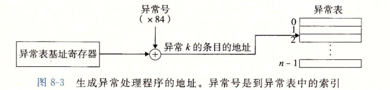
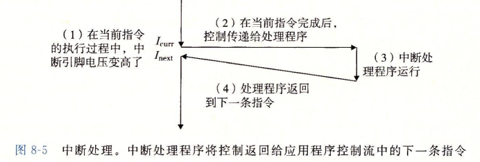
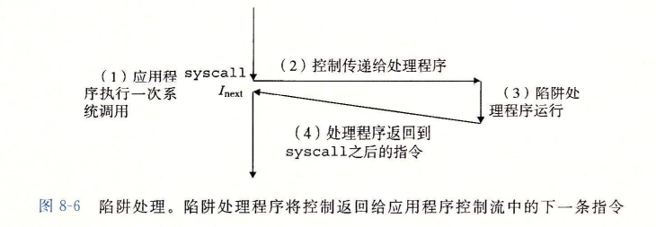
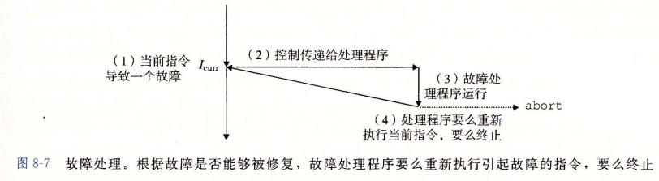
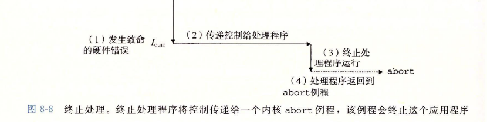

## 8.1 异常

处理器中每条指令的过渡称为**控制转移**，这样的控制转移序列叫做处理器的**控制流**。

用来响应某些处理器状态变化的控制流的突变称为**异常控制流（ECF）**，状态变化称为**事件**。

+ 异常控制流发生在计算机系统的各个层次。在高层中，如<u>进程切换</u>（OS+硬件定时器实现）、<u>信号到来</u>（OS实现）、<u>非本地跳转</u>（C运行库实现）；在低层中，如<u>异常</u>（OS+硬件实现）。
+ 事件可能和当前指令的执行直接相关，如缺页、算术溢出等；也可能和当前指令的执行无关，如系统定时器产生信号、IO请求完成。

事件发生时，处理器通过**异常表**进行间接过程调用一个**异常处理程序**。

### 8.1.1 异常的处理

每个异常有一个唯一的**异常号**。

系统启动时，操作系统分配和初始化一张称为**异常表**的跳转表，使得表目 k 包含异常 k 的处理程序的地址。异常号是到异常表的索引，异常表的起始地址放在**异常表基址寄存器**中。

一旦硬件触发异常，剩下的工作就是由异常处理程序在软件中完成。处理完后通过执行“从中断返回”指令，可选地返回到被中断的程序。

### 8.1.2 异常的类别

| 类别 | 原因                             | 异步/同步 | 返回行为             |
| :--: | :------------------------------- | :-------: | :------------------- |
| 中断 | 来自 I/O 设备的信号              |   异步    | 总是返回到下一条指令 |
| 陷阱 | 有意的异常，是执行一条指令的结果 |   同步    | 总是返回到下一条指令 |
| 故障 | 潜在的可恢复的错误，如缺页       |   同步    | 可能返回到当前指令   |
| 终止 | 不可恢复的错误，如硬件错误       |   同步    | 不会返回             |

+ **异步异常**是由处理器外部的 I/O 设备中的事件产生的，**同步异常**是执行一条指令的直接产物。

#### 1）中断（interrupt）

硬件中断不是由任何一条专门的指令造成的，是来自处理器外部的 I/O 设备的信号的结果。硬件中断的异常处理程序也叫**中断处理程序**。

#### 2）陷阱（trap）

为了允许对操作系统内核服务的受控访问，处理器提供了`syscall n`指令，执行该指令会导致一个到异常处理程序的陷阱，处理程序解析参数并调用适当的内核程序。

#### 3）故障（fault）

故障由错误情况引起，它可能能够被故障处理程序修正。能修正就在返回后重新执行指令；不能修正则返回到内核的 abort 例程，从而终止应用程序。

一个经典的故障示例是缺页异常。发生缺页时引发故障，缺页处理程序从磁盘加载适当的页面后将控制重新返回给引起故障的指令，从而可以正常继续运行了。

#### 4）终止（abort）

终止是不可恢复的致命错误造成的结果，通常是一些硬件错误。终止处理程序从不将控制返回给应用程序。

