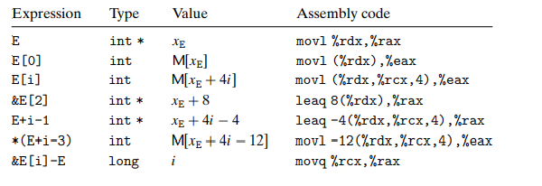
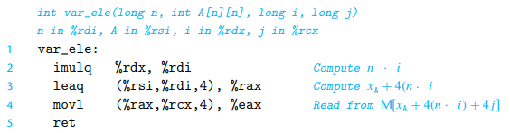
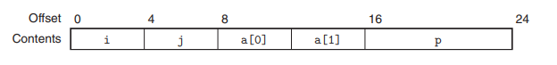
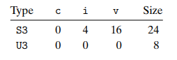
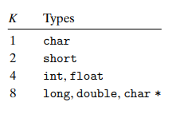
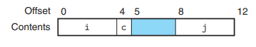
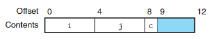
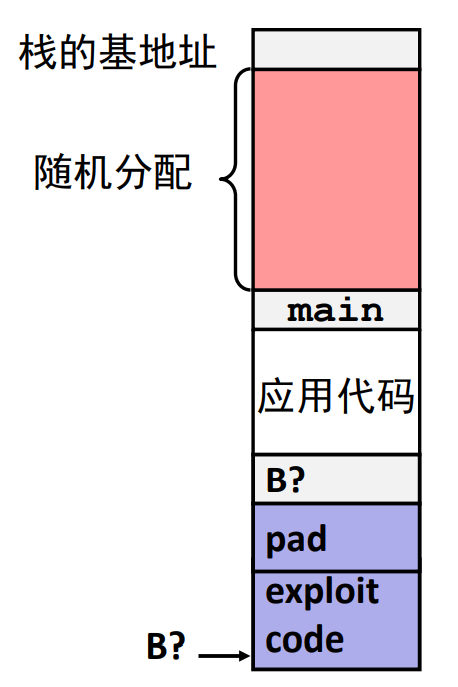
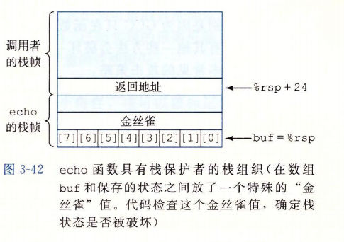
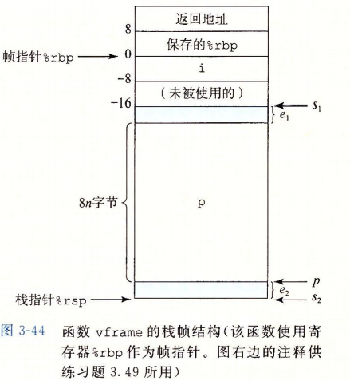

[[toc]]

# 3.8 数组分配和访问

在机器代码中，指针会被翻译成地址计算。

## 3.8.1 基本原则

对于数据类型 T 和整型常数 N，声明如下：

```c
T A[N]
```

起始地址为 $x_A$，可以用 0 ~ N-1 来索引，这样数组元素 i 会被存放在地址 $x_A + L \cdot i$ 的地方。

x86-64 的内存引用指令可以简化数组的访问。

## 3.8.2 指针运算

假设整型数组 E 的起始地址和整数索引分别放在寄存器 %rdx 和 %rcx 中，下面是一些与 E 有关的表达式，结果存放在 %eax（如果是数据）或 %rax（如果是指针）中：



+ 最后一个例子表明可以计算同一个数据结构中两个指针之差，结果的数据类型为 long，值等于两个地址之差除以该数据类型的大小。

## 3.8.3 嵌套的数组

嵌套数组元素在内存中按照“行优先”的顺序排列，这种排列是嵌套声明的结果.

通常来说，对于一个声明如下的数组：

```c
T D[R][C]
```
它的数组元素 D[i][j] 的内存地址为：$\And D[i][j] = x_D + L(C \cdot i + j)$

## 3.8.4 定长数组

```c
#define N 16
typedef int fix_matrix[N][N]
```

对其访问时，编译器往往包含很多聪明的优化，比如去掉索引而使用指针间接引用，避免每次计算地址。具体参考 CSAPP P180.

## 3.8.5 变长数组

ISO C99 引入一种功能，允许数组的维度是表达式，在数组被分配的时候才计算出来：
```c
int A[expr1][expr2];
```

例如我们要访问 $n \times n$ 数组：
```c
int var_ele(long n, int A[n][n], long i, long j) {
    return A[i][j];
}
```

产生代码：



+ 注意汇编第一行，由于每一列元素个数无法预知，所以在定位某行首元素位置时需要做乘法来动态计算，而不能使用 leaq 来实现计算了。

在一个循环中引用变成数组时，编译器常常可以利用访问模式的规律性来优化索引的计算。如果允许使用优化，GCC 能够识别出程序访问多维数组的元素的步长，然后只需要每轮递增一个步长即可，使得生成的代码避免直接计算索引而导致的乘法。

# 3.9 异质的数据结构

struct 和 union

## 3.9.1 结构

结构的所有组成部分都存放在内存中一段连续区域中，而指向结构的指针就是结构的第一个字节的地址。编译器维护关于每个结构类型的信息，指示每个字段的字节偏移。它以这些偏移作为内存引用指令中的位移，从而产生对结构元素的引用。

假设一个结构声明如下：

```c
struct rec {
    int i;
    int j;
    int a[2];
    int *p;
};
```
其内存布局为：



为了访问这些字段，编译器产生的代码要将结构的地址加上适当的偏移。

::: tip
结构的各个字段的选取完全是在编译时处理的，机器代码不包含关于字段声明或字段名字的任何信息。
:::

## 3.9.2 联合

联合提供了一种方式，能够规避 C 语言的类型系统，允许以多种类型来引用同一对象。联合是用不同的字段来引用相同的内存块。

考虑下面的声明：

```c
struct S3 {
    char c;
    int i[2];
    double v;
};

union U3 {
    char c;
    int i[2];
    double v;
};
```
其内存布局为：



可以观察到，一个联合的总和大小等于它最大字段的大小。

### Union 的使用

#### 1. 已事先知道一个数据结构中的不同字段的使用是互斥的

::: details Example
例如一个 JsonValue 中 data 字段的类型、二叉树中内部节点（只含有孩子指针）和叶子节点（只含有数据）的 Node 类型。
:::

不过这样编码没法确定一个给定节点中数据所使用的哪个类型，通常的方法是引入一个枚举类型，定义这个联合中可能的不同选择，然后在创建一个结构，包含一个标签字段和这个联合。

#### 2. 用来访问不同数据类型的位模式

::: details Example
比如对于 double 类型的变量 d：`unsigned long u = (unsigned long) d`，得到的 u 是 d 的整数表示而非位模式的重新解读，若想实现位模式的重新解读，则可以使用下面这个函数：

```c
unsigned long double2bits(double d) {
    union {
        double d;
        unsigned long u;
    } temp;
    temp.d = d;
    return temp.u;
};
```
:::

当用联合来将各种不同大小的数据类型结合到一起的时候，字节序就变得很重要了。

::: details union 与字节序的例子
```c
union {
    double d;
    unsigned u[2];
} temp;
```
这时 temp.u[0]、temp.u[1] 与 double 的高低位对应关系就与字节序有关了。
:::

## 3.9.3 数据对齐

### 基本类型的对齐

> 内存按 4 字节或 8 字节（对齐的）块来访问（4/8取决于系统）

数据对齐的**动机**：
1. 不能高效的装载或存储**跨越四字边界**的数据。
2. 当一个数据**跨页**时，虚拟内存比较棘手。

**对齐原则**是任何 K 字节的接不对象的地址必须是 K 的倍数。



编译器在汇编代码中放入命令，指明全局数据所需要的对齐。例如跳转表声明时的 `.align 8` 就保证了他后面的数据的起始地址都是 8 的倍数。

### 结构体的对齐

对于结构，编译器可能需要在字段的分配中插入间隙，以保证每个结构元素都满足他的对其要求。结构体对象的地址对齐要求迁就于其中对齐要求最大的字段，使得对它的访问也满足对齐要求。

::: details 结构对齐示例
```c
struct S1 {
    int i;
    char c;
    int j;
};
```

其内存布局：



此外，该结构体对象的地址也必须满足 4 字节对齐，这保证了 `p->i` 和 `p->j` 都满足对齐要求。
:::

另外，编译器结构的末尾可能也需要一些填充，这样结构体数组中每个元素都会满足它的对齐要求。

::: details Example
```c
struct S2 {
    int i;
    int j;
    char c;
};
```
为使得 struct S2[4] 中每个元素都能对齐，编译器会为 S2 分配 12 个字节，最后 3 个字节浪费掉：


:::

**重排字段压缩结构空间**：当所有的数据元素的长度都是 2 的幂时，一种行之有效的策略是按照字段长度大小降序排列各字段，以最小化浪费空间。

# 3.10 在机器级程序中将控制和数据结合起来

## 3.10.1 理解指针

指针类型不是机器代码的一部分，而是 C 语言提供的一种抽象，对不同指针类型的转换是对位模式的重新解读。

指针也可以指向函数。函数指针的值是该函数机器代码表示中的第一条指令的地址。

## 3.10.3 内存越界引用和缓冲区溢出

两个事实：
1. C 对于数组不进行越界检查
2. 局部变量和状态信息都存放在栈中

这两种情况结合到一起就能导致严重错误，对越界数组的写操作会破坏存储在栈中的状态信息。一种特别常见的状态破坏成为**缓冲区溢出**。

如下面危险代码：
```C {3}
void echo() {
    char buf[4];
    gets(buf);
    puts(buf);
}
```

gets 的问题是它没有办法确定是否为保存整个字符串分配了足够的空间。

### 代码注入攻击

缓冲区溢出的一个更加致命的使用就是让程序执行它本来不愿意执行的函数。通常给程序一个字符串，这个字符串包含一些可执行代码的编码，成为**攻击代码**（exploit code）,另外还有一些字节会用一个指向攻击代码的指针覆盖返回地址。那么。执行 ret 指令的效果就是跳转到攻击代码。

缓冲区溢出错误允许远程机器在受害者机器上执行任意代码。

**攻击形式**：
1. 攻击代码会使用系统调用来启动一个 shell 程序，给攻击者提供一组操作系统函数。
2. 攻击代码会执行一些未授权任务，修复对栈的破坏，然后第二次执行 ret 指令，表面上正常地返回到调用者。

### 蠕虫和病毒

+ **蠕虫**（worm）<u>可以自己运行</u>，并且能够将自己的等效副本传播到其他机器上。
+ **病毒**（virus）能将自己添加到包括操作系统在内的其他程序中，但<u>它不能独立运行</u>。

## 3.10.4 对抗缓冲区溢出攻击

### method 1 使用安全函数

应该使用安全函数 fgets、strncpy、strnlen（用于检测不可信数据）、strncmp、snprintf等，在 scanf 中用 %ns 替代 %s。

### method 2 栈随机化

为了在系统中插入攻击代码，攻击者既要插入代码，也要插入指向这段代码的指针，而这个指针也要知道攻击代码所在的栈地址。

过去栈地址十分固定而容易猜测，如果攻击者可以确定一个常见的 Web 服务器所使用的栈空间就可以设计一个在许多机器都能实施的攻击，这种现象称为**安全单一化**。

**栈随机化**的思想是使得栈的位置在程序每次运行时都有变化。实现方式是：程序开始时，在栈上分配一段 0~n 字节之间随机大小的空间，程序不使用这段空间，它会导致程序每次执行时后续的栈位置发生了变化。



在 Linux 中，栈随机化已经成为了标准行为，它是更大的一类技术中的一种，称为**地址空间布局随机化**（Address-Space Layout Randomization, ASLR）。采用 ASLR，每次运行时程序的不同部分，包括程序代码、库代码、栈、全局变量和堆数据都会被加载到内存的不同区域。

攻击方法：空安全雪橇等。

### method 3 栈破坏检测

GCC 中加入了**栈保护者**机制来检测缓冲区越界。

**思想**：
+ 在栈帧中任何局部缓冲区与栈状态之间存储一个特殊的**金丝雀值**（canary）
+ 在恢复寄存器状态和从函数返回之前，程序检查这个金丝雀值是否被改变。如果是的，那么程序异常终止。



### method 4 限制可执行代码区域

在典型的程序中，只有保存编译器产生的代码的那部分内存才需要是可执行的，其他部分可以被限制为只允许读和写而不允许执行。

许多系统允许控制的三种访问形式：读（从内存读）、写（向内存写）、执行（将内存的内容看做机器级代码）。

**NX技术**（No-Execute，不可执行技术）将读和执行访问模式分开。有了这个特性，栈可以被标记为可读和可写，但是不可执行，而检查页是否可执行由硬件完成，在效率上没有损失。

## 3.10.5 支持变长栈帧

有些函数需要的局部存储是变长的，比如调用了 alloca 时就会发生这种情况（alloca 是标准库函数，可以在栈上分配任意字节数量的存储），当代码声明一个局部变长数组时，也会发生这种情况。

为了管理变长栈帧，x86-64 使用 %rbp 作为**帧指针**（也成为基指针 base pointer，这也是 %rbp 中 bp 名字的由来）。



可以看到代码必须把 %rbp 之前的值保存到栈中，因为它是一个被调用者保存寄存器，然后在函数的整个执行过程中，都使得 %rbp 指向那个时刻栈的位置，然后用固定长度的局部变量（例如 i）相对于 %rbp 的偏移量来引用他们。

在函数结尾，**leave 指令**将帧指针恢复到它之前的值，这条指令不需要参数，它等价于执行下面两条指令：
```
movq %rbp, %rsp     Set stack pointer to beginning of frame
popq %rbp           Restore saved %rbp and set stack ptr to end of caller’s frame
```
也就是首先把栈指针设置为保存 %rbp 值的位置，然后把该值从栈中弹出到 %rbp，从而恢复 %rsp 和 %rbp。这个指令组合具有释放整个栈帧的效果。

现在只有栈帧长可变的情况下才会使用帧指针。