# 4.1 Y86-64 指令集体系结构

[[toc]]

**ISA**：一个处理器支持的指令和指令的字节级编码被称为它的**指令集体系结构**（Instruction-Set Architecture, ISA）。

ISA 在编译器编写者和处理器设计人员之间提供了一个概念抽象层

::: details ISA 提供的抽象

- 编译器编写者只需要知道允许哪些指令，以及它们是如何编码的；
- 处理器设计者必须建造出执行这些指令的处理器。
  :::

本章首先定义了一个简单的指令集作为我们处理器实现的运行示例，称之为“Y86-64”指令集。作为设计处理器的第一步，我们给出了一个基于顺序操作、功能正确但是有点不实用的 Y86-64 处理器。

## 4.1.1 程序员的可见状态

<Badge text="重要" />

Y86-64 程序中的每条指令都会读取或修改处理器状态的某些部分，这称为<strong>程序员可见状态</strong>，其包含：

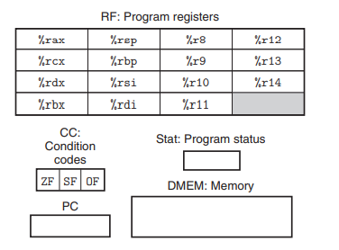

- **程序寄存器**，15 个，%rsp 作为栈指针寄存器，除此之外寄存器没有固定的含义或固定值
- **条件码**，3 个，保存着最近的算术或逻辑指令所造成的影响
- **程序计数器**（PC），存放当前正在执行指令的地址
- **程序状态码 Stat**，表明程序执行的总体状态，它会指示是正常运行还是出现了某种异常
- **内存**，从概念上说就是一个很大的字节数组，保存着程序和数据

## 4.1.2 Y86-64 指令

> 它只包含 8 字节整数操作，所以称之为“字”也不会有歧义。

Y86-64 ISA 的简单描述：

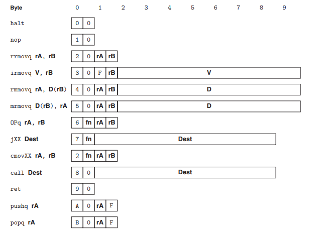

- 两个内存传送指令中的内存引用方式是简单的基址和偏移量形式，即 $Imm(r_b)$ 的形式。
- halt 指令停止指令的执行。这对于 Y86-64 来说，执行 halt 指令会导致处理器停止，并将状态码设置为 HLT。

## 4.1.3 指令编码

每个指令需要 1~10 个字节不等，每条指令的第一个字节表明指令的类型（从而可以判断指令的长度），该字节分为高四位的**代码部分**和低四位的**功能部分**。

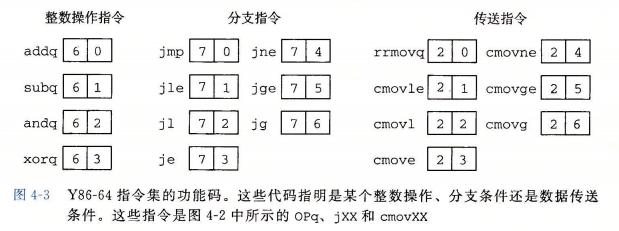

**字节编码必须有唯一的解释**。即使代码嵌入在程序的其他字节中，只要从需要序列的第一个字节开始处理，我们仍然可以无二义地确定指令序列。

### 对程序寄存器编码

15 个程序寄存器中每个都有一个相对应的范围在 0 到 0xE 之间的**寄存器标识符**（register ID），程序寄存器存在 CPU 中的一个寄存器文件中。

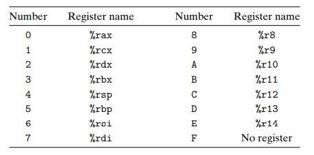

- 当需要指明不应访问任何寄存器时，就用 ID 值 0xF 来表示。比如那些只需要一个寄存器操作数的指令（irmovq、pushq、pop）就将另一个寄存器指示符设为 0xF。

### 数字的表示

注意分支指令和调用指令的目的是一个绝对地址，而不像 IA32 中使用相对寻址方式。

所有整数采用**小端序编码**。当指令按照反汇编格式书写时，这些字节就以相反的顺序出现。

### 指令示例

#### （1）**加法指令**：

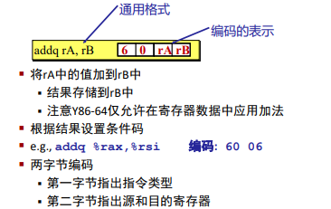

#### （2）**算术和逻辑操作**：

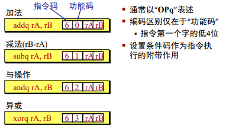

#### （3）**传送操作**：

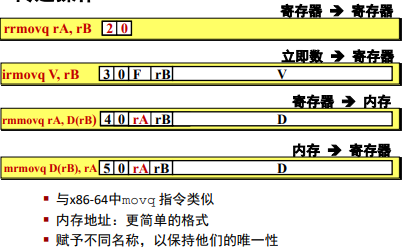

#### （4）**条件传送指令**：

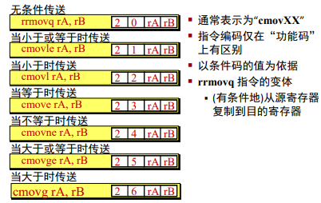

#### （5）**跳转指令**：

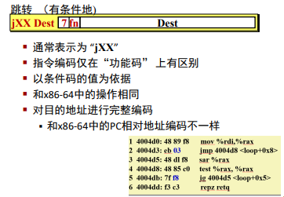

#### （6）**栈操作**：

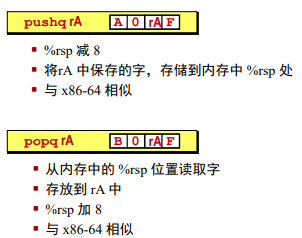

#### （7）**子程序调用和返回**：

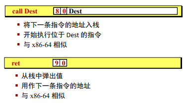

#### （8）**其他指令**：

## 4.1.4 程序状态码 Stat

它描述了程序执行的总体状态。

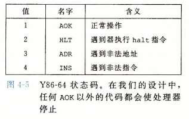

- 对于 Y86-64，当遇到这些异常时我们让处理器停止执行指令。在更完整的设计中，处理器会调用一个**异常处理程序**来处理遇到的异常。

## 4.1.5 Y86-64 程序示例

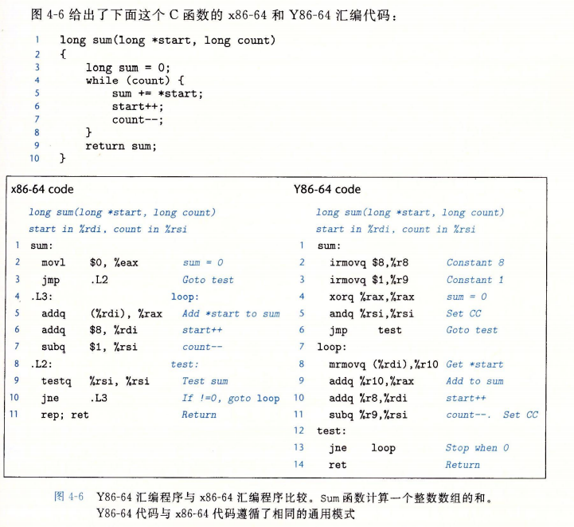

下图我们给出了用 Y86-64 汇编代码编写的一个完整的程序文件例子，这个程序说明了栈的位置、数据初始化、程序初始化和程序结束等问题：

- **伪指令**指明了应该将代码或数据放在什么位置，以及如何对齐。
  - 在这个程序中，以`.`开头的词是汇编伪指令，它们告诉汇编器调整地址，以便在那儿产生代码或者插入一些数据。
- 我们必须保证栈不会增长得太大以至于覆盖了代码或者其他程序数据。

我们实现了一个**指令集模拟器**，称为 YIS。它的目的是模拟 Y86-64 机器代码程序的执行，而不是试图去模拟任何具体处理器实现的行为。

## 4.1.6 一些 Y86-64 指令的详情 <Badge text="不重要" />

有两个指令的处理器行为是不确定的，我们采用和 x86-64 一样的做法：

- `pushq %rsp`：压入的是 %rsp 的旧值；
- `popq %rsp`：将 %rsp 设置为从内存中读出来的数。

## 4.1.7 RISC 和 CISC 指令集

+ CISC：复杂指令集计算机
+ RISC：精简指令集计算机

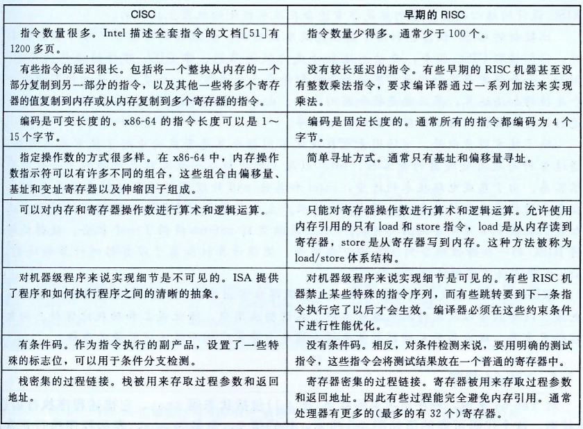

+ 事实已经很清楚了，无论是单纯的 RISC 还是单纯的 CISC 都不如结合两者思想精华的设计。
+ 今天的 RISC 指令表中有几百条指令了，几乎与“精简”不相匹配了。那种将实现细节暴露给机器级程序的思想已经被证明是目光短浅的。
+ 比较新的 CISC 机器也利用了高性能流水线结构。他们读取指令并动态翻译成简单的指令序列。
