# 4.3 Y86-64 的顺序实现

[[toc]]

## 4.3.1 将处理组织成阶段

1. **取指**（fetch）：从内存中读取地址为 PC 的指令字节。valP = PC + 指令长度。
2. **译码**（decode）：从寄存器文件读入最多两个操作数，得到 valA、valB。通常是读入指令 rA 和 rB 字段指明的寄存器，不过也有些指令是读 %rsp 的。
3. **执行**（execute）：ALU 要么执行指令指明的操作（根据 ifun），计算内存引用的有效地址，要么增加或减小栈指针。得到的值称为 valE。在此也有可能设置条件码，这个阶段会决定是否应该选择分支。
4. **访存**（memory）：读写内存，读出的值为 valM。
5. **写回**（write back）：最多可以写两个结果到寄存器文件。
6. **更新 PC**（PC update）：将 PC 设置为下一条指令的地址。

### 计算中各数值的含义

**取指：**

| 名称        | 含义           |
| ------------- |:-------------:|
| icode  | 指令码 |
| ifun  | 指令功能  |
| rA、rB | 指令寄存器 A、B      |
| valC  |  指令中的常数  |

**译码：**

| 名称        | 含义           |
| ------------- |:-------------:|
| srcA、srcB  | 寄存器 ID A、B |
| dstE、dstM  | 目的寄存器 E、M  |
| valA、valB | 寄存器值 A、B      |

**执行：**

| 名称        | 含义           |
| ------------- |:-------------:|
| valE  | ALU 运算结果 |
| cnd  | 分支或转移标识  |

### Arith/Log. Opq

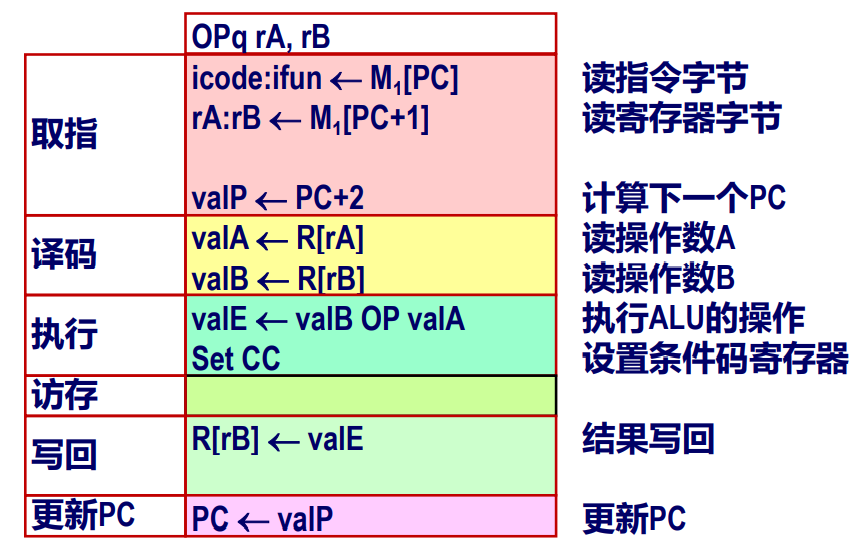

### rrmovq 和 irmovq

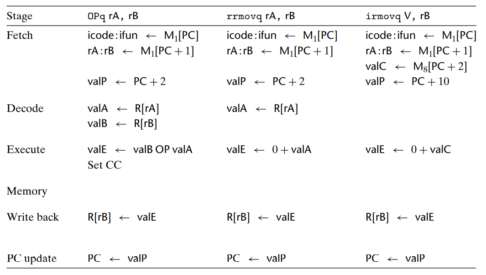

### rmmovq

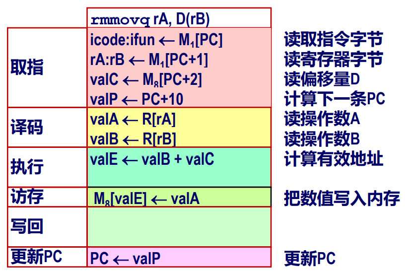

### mrmovq

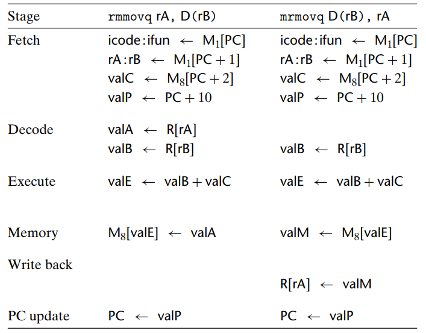

+ 注意 `mrmovq D(rB), rA` 指令的写法中 rA、rB 所在的先后顺序与指令编码中是相反的。

### pushq、popq

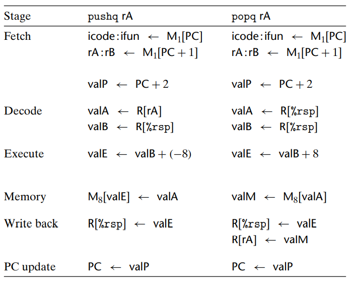

+ `pushq` 应该先将栈指针减去 8，即使栈指针的更新实际上是在内存操作完成后才进行的。
+ `pop` 应该首先读内存，然后再增加栈指针。

### jumps

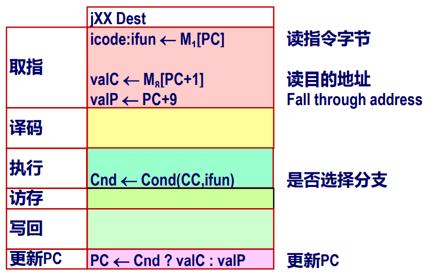

+ 跳转的实现：在执行阶段，检查条件码和跳转条件来确定是否要选择分支，产生一个一位信号 Cnd。在更新 PC 阶段，检查这个标志，如果这个标志为 1，就将 PC 设为 valC（跳转目标），如果为 0，就设为 valP（下一条指令的地址）。

### call

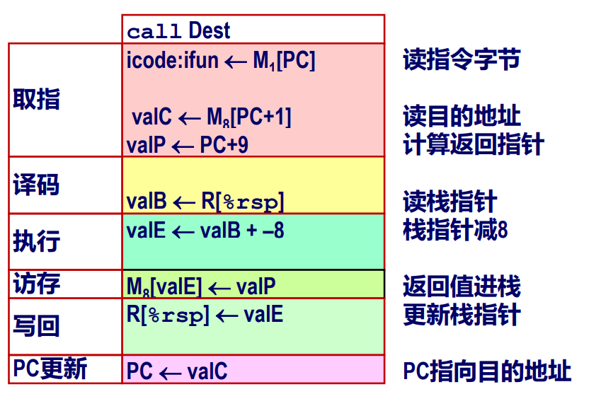

+ 对指令 call，我们要将 valP，也就是 call 指令后紧跟着的那条指令的地址，压入栈中。在更新 PC 阶段，将 PC 设为 valC，也就是调用的目的地。

### ret

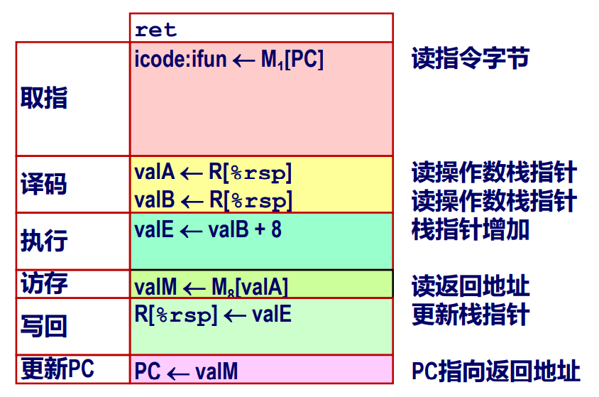

+ 对指令 ret，在更新 PC 阶段，我们将 valM，即从栈中取出的值，赋值给 PC。

### Conditional Move

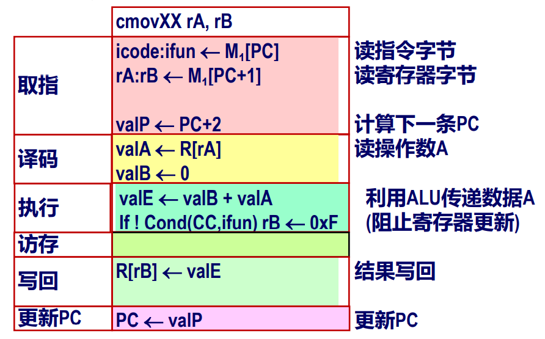

## 4.3.2 SEQ 的硬件结构

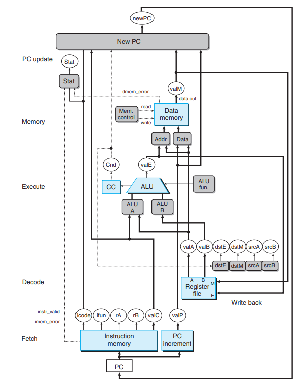

::: details 图片说明
+ 浅蓝色方框：硬件单元，如内存、ALU 等
+ 灰色方框：控制逻辑，用 HCL 描述
+ 白色椭圆框：信号标识
+ 粗线：宽度为字长的数据（64位）
+ 细线：宽度为字节或更窄的数据（4-8位）
+ 虚线：单个位的数据
:::

### （1）取指阶段

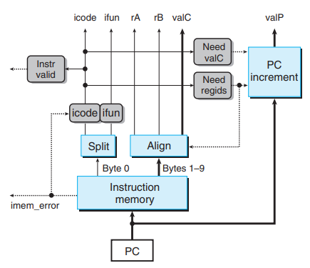

**预定义的单元：**

+ PC：存储 PC 的寄存器
+ 指令内存：读出 10 个字节（PC ~ PC+9），发出指令地址不合法的信号（imem_error）
+ Split：把指令字节分为 icode 和 ifun
+ Align：把读出的字节放入寄存器和常数字（valC）中

**控制逻辑：**

+ instr_valid：指令是否有效？
+ icode、ifun：指令地址无效时（检查 imem_error 信号）生成 no-op 指令；有效时是指令的相应字段
+ need_regids：指令是否有寄存器字节？
+ need_valC：指令中是否有常数字？

### （2）译码和写回阶段

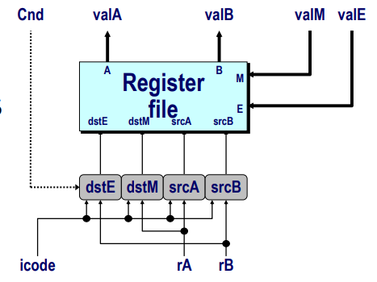

**寄存器文件：**
+ 读端口 A, B
+ 写端口 E, M
+ 地址为寄存器 ID 或者是 15（0xF），15 时无法访问

**控制逻辑：**
+  srcA, srcB: 读端口地址
+  dstE, dstM: 写端口地址

**信号：**
+ Cnd: 标明是否触发条件转移。在执行阶段计算出Cnd条件信号。

### （3）执行阶段

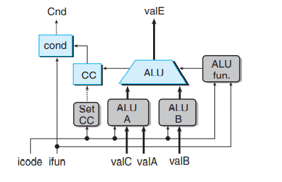

**单元：**

+ ALU：实现四种所需的功能；生成条件码
+ CC：包含三个条件码的寄存器
+ cond：计算条件转移或跳转标识

**控制逻辑：**

+ Set CC：是否加载条件码寄存器？
+ ALU A：数据 A 送入 ALU
+ ALU fun：ALU 执行哪个功能

### （4）访存阶段

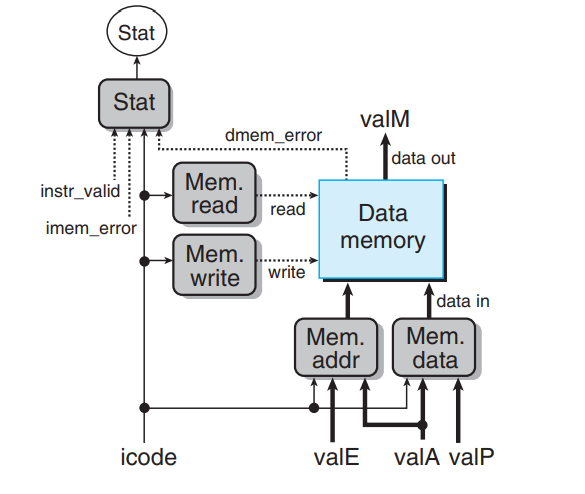

**控制逻辑：**
+ stat：指令的状态是什么
+ Mem.read：是否读数据字
+ Mem.write：是否写数据字
+ Mem.addr：选择地址
+ Mem.data：选择数据

### （5）更新 PC 阶段

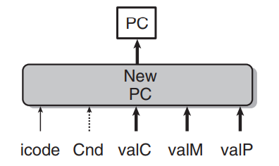

+ 新 PC：选取下一个 PC 的值

