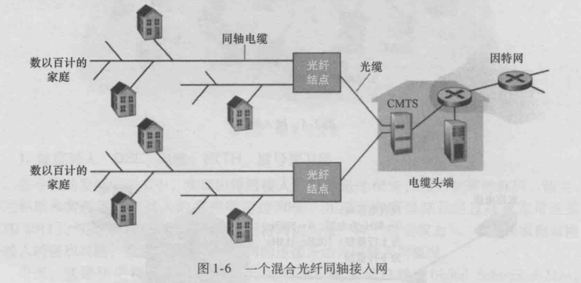
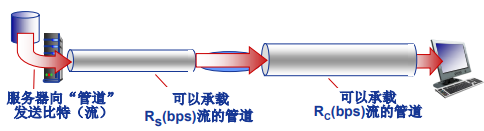

[[toc]]

::: tip 考试大纲

1. 计算机网络的概念、组成、功能与分类 
2. 电路交换、报文交换与分组交换 
3. 多路复用技术（频分多路复用、时分多路复用、波分多路复用、码分多路复用） 
4. 计算机网络性能指标（速率、带宽、时延、时延带宽积、吞吐量） 
5. 计算机网络分层体系结构 
6. 计算机网络协议、接口、服务等概念 
7. ISO/OSI 参考模型和 TCP/IP 模型

:::

## 1. 什么是因特网

### 1.1 构成描述

*计算机网络*就是**互联**的、**自治**的计算机集合。

+ 自治：无主从关系；
+ 互联：互联互通，通过**交换网络**互联主机。

 <iframe :src="$withBase('/markmap/net-struct.html')" width="100%" height="200" frameborder="0" scrolling="No" leftmargin="0" topmargin="0"></iframe>

*Internet*是全球最大的互联网络：

+ **主机**（或称**端系统**）：智能手机、平板、服务器等，运行各种网络应用。
+ 端系统通过**通信链路**和**分组交换机**连接在一起，如光纤、铜缆等。
+ 当一台端系统向另一台端系统发送数据时，将数据分段并加上首部字节形成**分组**（packet）。
+ 端系统通过 **ISP** （Internet Service Provider）接入互联网。
  + 较低层的 ISP 通过国家的较高层 ISP 互联起来。

### 1.2 服务描述

因特网应用程序运行在端系统上而不是运行在网络核心中的分组交换机中。

端系统提供了**套接字接口** socket 用于交换数据，套接字接口是一套发送程序必须遵循的规则集合。

### 1.3 网络协议

**协议**规定了通信实体之间所交换的消息的 格式、意义、顺序以及针对收到信息或发生的事件所采取的动作。因特网中涉及两个或多个远程通信实体的所有活动都受到协议的制约。

协议的三要素：

1. **语法** Syntax
   + 数据与控制信息的结构或格式
2. **语义** Semantics
   + 需要发出何种控制信息；完成何种动作以及做出何种响应；差错控制
3. **时序** Timing
   + 事件顺序；速度匹配

因特网标准：RFC（请求评论，Request For Comment）

## 2. 网络边缘

**主机（端系统）**：位于网络边缘，运行网络应用程序（如 Web、Email）

**Client/Server （CS）应用模型**：client 发送请求，server 响应。

+ 谁主动发起请求，谁就是 client

**对等（peer-peer，P2P）应用模型**：无专用服务器，通信在对等实体之间直接进行 ，如：Gnutella, BT, Skype, QQ

::: note

Q: 如何将网络边缘接入核 心网（边缘路由器）? 

A: 接入网络

:::

### 2.1 家庭接入：DSL、电缆

#### DSL（数字用户线路）：

每个用户的 DSL 调制解调器使用现有的电话线（双绞铜线）与位于电话公司的本地中心j局（CO）中的数字用户线接入复用器（DSLAM）交换数据。家庭的 DSL 调制解调器得到数字数据后将其转换成高频音，以通过电话线传输给本地中心局，来自许多家庭的模拟信号在 DSLAM 处被转换回数字形式。

家庭电话线同时承载了数据和传统的电话信号，**他们用不同的频率进行解码**：

+ \>50 kHz - 1 MHz用于下行 
+ 4 kHz - 50 kHz用于上行 
+ 0 kHz - 4 kHz用于传统电话

#### 电缆网络：

**电缆因特网接入**利用了有线电视公司现有的有线电视基础设施，住户从提供有线电视的公司获得了电缆因特网接入。

+ 光纤和同轴电缆称为**混合光纤同轴（HFC）系统**。
+ 电缆调制解调器端接系统（**CMTS**）将来自许多下行家庭中的电缆调制解调器发送的模拟信号转换回数字形式。

::: details 典型家庭网络的接入

:::

### 2.2 企业（和家庭）接入：以太网和 WiFi

### 2.3  无线接入网络

+ 无线局域网（LANs）：WiFi...
+ 广域无线接入：蜂窝网络...

## 3. 网络核心

网络核心的关键功能：路由 + 转发，通过数据交换解决了数据从源主机通过网络核心送达目的主机的问题。

+ **路由**：确定分组从源到目的的传输路径
+ **转发**：将分组从路由器的输入端口交换至正确的输出端口

### 3.1 数据交换

#### **报文交换：**

**报文**：源（应用）发送信息的整体，比如一个文件。

报文交换是报文整个地发送，一次一跳。

#### **电路交换：**

最典型的电路交换网络：电话网络

电路交换的三个阶段：

1. 建立连接（呼叫/电路建立）
2. 通信
3. 释放连接（拆除电路）

最显著特点：**独占资源**

+ 电路交换网络如何共享中继线？ —— 多路复用

#### **分组交换：**

**分组：**报文分拆出来的一系列相对较小的数据包。

分组交换需要报文的拆分与重组，会产生额外开销。每个分组都通过链路和分组交换机（交换机主要有路由器和链路层交换机）。

分组交换：统计多路复用，A & B分组序列不确定，按需共享链路：

报文交换与分组交换均采用**存储-转发**交换方式。

::: note 存储转发传输

存储转发传输是指在交换机能够开始向输出链路传输该分组的第一个比特之前，必须接收到整个分组。

:::

考虑一般情况，通过 N 条速率为 R (bps) 的链路组成的路径（源和目的之间有 N - 1 个交换机），从源到目的地发送一个分组（长度为 L bits）的时延是：

$$d_i=N \frac{L}{R}$$

P 个分组经过 N 条链路的时延是：

$$d=(P + N - 1) \frac{L}{R}$$

::: tip 例题

**例 1**：在下图所示的采用“存储-转发”方式的分组交换网络中， 所有链路的数据传输速率为100 Mbps，分组大小为1000 B ，其中分组头大小为 20 B。若主机H1向主机H2发送一个大 小为980 000 B的文件，则在不考虑分组拆装时间和传播延迟的情况下，从H1发送开始到H2接收完为止，需要的时间至少是多少？

**解**：980 000 B大小的文件需要分**1000**个分组，每个分组1000 B。H1发送整个文件需要的传输延迟为(980 000+20\*1000)\*8/100 000 000=80ms；根据路由选择基本原理，所有数据分组应该经过两个路由器的转发，所以再加上**最后一个分组的两次转发**的传输延迟，即2*1000*8/100 000 000=0.16ms。所以 ，H2收完整个文件至少需要80+0.16=80.16ms。

:::

分组交换相比于电路交换允许更多用户同时使用网络！

::: note 分组交换 VS 电路交换

Q：分组交换绝对优于电路交换吗？

+ 电路交换适用于**突发**数据传输网络
  + 资源充分共享
  + 简单、无需呼叫建立
+ 分组交换**可能产生拥塞**：分组延迟和丢失
  + 需要协议处理可靠数据传输和拥塞控制

:::

### 3.2 多路复用

典型多路复用方法: 

+ 频分多路复用( frequency  division multiplexing-**FDM** ) 
+ 时分多路复用( time division  multiplexing-**TDM** ) 
+ 波分多路复用(Wavelength  division multiplexing-**WDM**) 
+ 码分多路复用( Code  division multiplexing-**CDM** )

#### **频分多路复用 FDM：**

在连接期间，链路为每条连接专用一个频段，各用户占用不同的带宽资源（指的是频率带宽，单位 Hz 而不是数据发送速率）。用户在分配到一定的频带后，在通信过程中自始至终都占用这个频带。

+ 不同的颜色代表不同的用户。

+ 注意横坐标是频率。

#### **时分多路复用 TDM：**

时分复用则是将时间划分为一段段等长的**时分复用帧**（TDM 帧），每个用户在每个 TDM 帧中占用固定序号的时隙，每个用户所占用的时隙是周期性出现（其周期就是 TDM 帧的长度）：

+ 时分复用的所有用户是在不同的时间占用**相同的**频带宽度

#### **波分多路复用 WDM：**

波分复用就是光的频分复用：

#### **码分多路复用 CDM：**

广泛应用于无线链路共享 （如蜂窝网,卫星通信等）。每个用 户分 配一个唯一的 m bit 的码片序列 (chipping sequence)，其中“0”用“-1”表示、 “1”用“+1”表示，例如一个用户的码片序列 S = (–1 –1 –1 +1 +1 –1 +1 +1) 。

各用户使用相同频率载波发送数据，发送出去的数据是原始的数据用码片序列编码之后的数据，编码方法：` 编码信号 = (原始数据) × (码片序列)`。

::: details Example

比如 A 用户的码片序列 S = (–1 –1 –1 +1 +1 –1 +1 +1)，如果 A 想发送一个 1，那么编码后的数据就是 (–1 –1 –1 +1 +1 –1 +1 +1)；如果 A 想发送一个 0，视为 -1，那么编码后的数据就是 (+1 +1 +1 -1 -1 +1 -1 -1)。

:::

各用户**码片序列相互正交**：

令{}为原始数据序列，各用户的叠加向量为：

$$P = \sum_{i=1}^N{d_i \cdot S_i}$$

**解码**: 码片序列与编码信号的内积：

::: details

:::

### 3.4 网络之网络

端系统通过接入ISP连接到 Internet，接入ISP必须进一步互联，构成复杂的网络互联的网络。

+ **第一层 ISP**（tier-1 ISP）：类似于我们假想的全球传输 ISP，没有组织正式任何第一层的存在，但他们确实存在，如 电信、AT&T 等。
+ **区域 ISP**（regional ISP）：没有哪个第一层 ISP 是无处不在的，在给定的区域可能有一个区域 ISP，由它来与第一层 ISP 连接。
+ **因特网交换点 IXP**：是一个汇合点，多个 ISP 能够在这里一起对等，直接将它们的网络连在一起，这样他们的流量就是直接连接而不是通过上游的中间 ISP 传输，降低了费用。
+ **内容提供商网络**（content provider network）：私有网络， 连接其数据中心与Internet，通常绕过一级ISP和区域ISPs，并就近为端用户提供服务、内容。如 Google、Microsoft。

## 4. 网络的性能指标

### 4.1 时延

**速率**（或称数据传输速率）是单位时间(s)传输信息(bit)的量。

+ 单位：b/s(bps)、kb/s、Mb/s 等

+ 速率往往是额定速率或标称速率。

**带宽**是数字信道所能传送的“最高数据率”，单位 b/s(bps)。

::: note 区分“带宽”的不同含义

在通信原理中，带宽原本指的是信号所具有的频带宽度，即最高频率与最低频率之差，单位是 Hz，比如频分多路复用中所指的带宽就是这个意思。而在网络中，通常指的是信道的最高数据率，单位 bps。

:::

注意单位： 

$$k = 10^3，M = 10^6，G = 10^9$$

分组从源主机出发，经过一系列路由中转，到达目的主机，沿着这条路径经受了不同类型的时延。

#### **时延的类型：**

$$d_{nodal} = d_{proc} + d_{queue} + d_{trans} + d_{prop}$$

（1）**处理时延** d_proc

+ 检查分组首部
+ 差错检测
+ 确定输出链路

通常是微秒或更低的数量级。

（2）**排队时延** d_queue

+ 分组在队列中等待输出链路可用

取决于路由器的拥塞程度。如果队列为空，那么排队时延为0。

（3）**传输时延** d_trans

+ 将所有分组的比特推向（即传输，或者说发射）链路所需要的时间。

对于长度为 L bits 的分组，链路带宽为 R bps，则传输时延是 L / R。

（4）**传播时延** d_prop

+ 一个比特被推向链路后，从链路的起点到下一个路由器传播所需要的时间是传播时延。

对于物理链路长度为 d，信号传播速度为 s，则传播时延是 d / s。

::: warning 区别传输时延和传播时延

+ **传输时延**是路由器推出分组所需时间，与分组长度和链路传输速率有关，而与两台路由器之间距离无关；
+ **传播时延**是一个比特从一台路由器传播到下一台路由器所需时间，是两台路由器之间距离的函数。

:::

### 4.2 排队时延

+ R: 链路带宽(bps) 

+ L: 分组长度 (bits) 
+ a: 平均分组到达速率

那么，`流量强度 = La / R`

+ La/R ~ 0: 平均排队延迟很小 
+ La/R -> 1: 平均排队延迟很大
+ La/R > 1: 超出服务能力，平均排队延迟无限大！

### 4.3 时延带宽积

$$时延带宽积 = 传播时延 \times 带宽 = d_prop \times R$$

+ 链路的时延带宽积又称为<u>以比特为单位</u>的链路长度。

### 4.4 丢包

现实中，一条链路前的队列只有有限的容量，分组到达已满的队列将被丢弃（即丢包）。

$$丢包率 = \frac{丢包数}{已发分组数}$$

+ 分组丢失的比例随着流量强度的增加而增加。

### 4.5 吞吐量

**吞吐量**表示在发送端与接收端之间传送数据速率 (b/s)。

+ 即时吞吐量: 给定时刻的速率
+ 平均吞吐量: 一段时间的平均速率

+ **瓶颈链路**：端到端路径上，限制端到端吞吐量的链路。比如 Rs > Rc 时，第二段就是瓶颈链路。

::: details Internet 场景

+ 每条“连接”的端到端吞吐量:  min(Rc ,Rs ,R/10)
+ 实际网络: Rc 或 Rs 通常是瓶颈

:::

## 5. 计算机网络分层体系结构

+ 网络体系结构是从**功能**上描述计算机网络结构；
+ 计算机网络体系结构是计算机网络的**各层**及其协议的集合；
+ 体系结构是**抽象的**。

为什么采用分层结构：结构清晰、易于更新和维护。

### 5.1 基本概念

+ **实体**(entity) 表示任何可发送或接收信息的硬件或软件进程。 
+ 协议是控制两个对等实体进行通信的规则的集合，**协议是“水平的” **。 
+ 任一层实体需要使用下层服务，遵循本层协议，实现本层功能，向上层提供服务，**服务是“垂直的” **。 
+ 下层协议的实现对上层的服务用户是透明的。 
+ 同系统的相邻层实体间通过接口进行交互，通过服务访问点 **SAP** (Service Access Point)，**交换原语**，指定请求的特定服务。

### 5.2 OSI 参考模型

它是：

+ 异构网络系统互连的国际标准；
+ 理解网络通信的最佳学习工具；
  + 理论成功，市场失败
+ 7层（功能）,每层完成特定的网络功能。

**数据封装**需要增加**控制信息**。在各层次中，每个报文都分为两部分，一是数据部分，称为 SDU，二是控制信息部分，称为 PCI，他们共同组成 **PDU**。

控制信息主要包括地址、差错检测码、协议功能附加信息。

#### **1. 物理层**

+ 传输单位：比特
+ 任务：透明地传输比特流
+ 功能：在物理媒体上为数据端设备透明地传输原始比特流。

物理层主要定义通信设备的物理与逻辑连接方法，所以也称为物理层接口标准。包括接口特性（机械特性、电气特性等）、比特同步方式（时钟同步）、传输模式（单工、半双工、全双工）等。

注意，物理媒体如双绞线、光缆等并不在物理层协议之内，而是在物理层协议之下。

#### **2. 数据链路层**

+ 传输单位：帧
+ 任务：将网络层传来的 IP 数据报组装成帧，负责结点-结点数据传输。
+ 功能：
  + 组帧
  + 差错控制（因为外界噪声可能使得物理连接在传输比特流时发生错误）
  + 流量控制（两端结点性能不同，避免淹没接收端）
  + 访问控制（在任一时刻决定哪个设备拥有链路的控制使用权）
  + 物理寻址（在帧头中增加发送端或接收端的物理地址来标识该帧）等。

#### **3. 网络层**

+ 传输单位：数据报
+ 任务：负责源主机到目的主机数据分组（packet）交付
+ 功能：
  + 路由选择（使用全局唯一逻辑地址，确保分组被送达目的主机，如 IP 地址）
  + 分组转发

#### **4. 传输层**

也称运输层

+ 传输单位：报文段（TCP）或用户数据报（UDP）
+ 任务：负责主机中两个进程的通信
+ 功能：
  + 分段与重组
  + SAP 寻址（确保将完整报文交付给正确进程，如端口号）
  + 流量控制、差错控制等

#### **5. 会话层**

+ 对话控制
  + 建立、维护会话
+ 为会话建立同步（在连接上有序地传输数据）

#### **6. 表示层**

处理两个系统间交换信息的语法与语义（syntax and semantics）问题：

+ 数据表示转化 
+ 转换为主机独立的编码 
+ 加密/解密 
+ 压缩/解压缩

#### **7. 应用层**

+ 传输单位：报文

支持用户通过用户代理（如浏览器）或网络接口 使用网络（服务），如 HTTP、FTP、SMTP 协议。

### 5.3 TCP/IP 参考模型

+ IP 可应用到各式各样的网络上

五层模型：

+ **应用层**: 支持各种网络应用
  + FTP, SMTP, HTTP

+ **传输层**: 进程-进程的数据传输
  + TCP, UDP

+ **网络层**: 源主机到目的主机的数据分 组路由与转发
  + IP协议、路由协议等
+ **链路层**: 相邻网络元素（主机、交换 机、路由器等）的数据传输
  + 以太网（Ethernet）、802.11 (WiFi)、 PPP
+ **物理层**:比特传输

