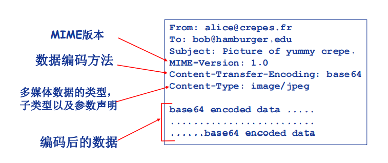

[[toc]]

::: tip 考试大纲

1. 客户/服务器（C/S）应用模型与 P2P 应用模型 
2. 网络应用通信原理 
3. DNS 系统（层次域名空间、域名服务器、域名解析过程） 
4. FTP（FTP 协议的工作原理、控制连接与数据连接） 
5. 电子邮件系统（组成结构、邮件格式与 MIME、SMTP 与 POP3） 
6. WWW（WWW 的概念与组成结构、HTTP 协议） 
7. P2P 文件分发应用的基本原理

:::

研发网络应用程序的核心是写出能够运行在不同的端系统和通过网络彼此通信的程序。

## 1. 网络应用程序体系结构

+ 客户机/服务器结构 (Client-Server, C/S) 
+ 点对点结构 (Peer-to-peer, P2P) 
+ 混合结构 (Hybrid)

### 1.1 CS 结构

**服务器 Server**：

+ 7*24小时提供服务 
+ 永久性访问地址/域名 
+ 利用大量服务器实现可扩展性

**客户端 Client**：

+ 与服务器通信，使用服务器提供的服务
+ 间歇性接入网络
+ 可能使用动态 IP 地址 
+ 不会与其他客户机直接通信

### 1.2 P2P 结构

+ 没有永远在线的服务器 
+ 任意端系统/节点之间可以直接通讯 
+ 节点间歇性接入网络 
+ 节点可能改变IP地址

应用程序在间接连接的主机对之间使用直接通信，这些主机对被称为**对等方**。

P2P 体系结构具有**自扩展性**：在一个 P2P 文件共享应用中，尽管每个对等方都由于请求文件产生工作负荷，但每个对等方通过向其他对等发分发文件也为系统增加服务能力。

优点：高度可伸缩

缺点：难于管理

### 1.3 混合结构

将 CS 结构和 P2P 结构混合在一起使用。

案例：**Napster**，文件传输使用P2P结构，文件的搜索采用C/S结构——集中式

+  每个节点向中央服务器登记自己的内容
+ 每个节点向中央服务器提交查询请求， 查找感兴趣的内容

## 2. 网络应用进程通信

在应用层，两个进程跨越计算机网络交换**报文**而相互通信。

**客户机进程**: 发起通信的进程 

**服务器进程**: 等待通信请求的进程

> P2P 架构的应用也存在客户机进程和服务器进程。比如 A 向 B 请求文件时，A 是客户，B 是服务器。

### 2.1 socket 套接字

进程通过一个称为**套接字**的软件接口向网络发送报文和从网络接收报文。

应用程序开发者可以选择传输层协议、设定几个传输层参数等。

### 2.2 进程寻址

寻址主机——IP 地址

寻址进程——端口号

所以，进程的标识符：IP + port

### 2.3 应用层协议

+ 公开协议：由RFC定义
  + 允许互操作
  + HTTP, SMTP, ……

+ 私有协议：多数P2P文件共享应用

应用层协议内容：

+ 报文类型：如请求还是响应
+ 语法：各字段以及如果描述这些字段
+ 语义：这些字段中信息的含义
+ 规则：何时发送、如何响应

## 3. 网络应用的需求与传输层服务

不止一种传输层协议，怎么选呢？大致可从四个方面对应用程序服务要求进行分类：可靠数据传输、吞吐量、定时和安全性。

+ 可靠数据传输
  + 某些网络应用能够容忍一定的数据丢失：网络电话
  + 某些网络应用要求100%可靠的数据传输：文件传输，telnet
+ 吞吐量
  + 某些应用只有在带宽达到最低要求时才“有效”：网络视频
  + 某些应用能够适应任何带宽——弹性应用：email
+ 定时
  + 定时服务对交互式实时应用有吸引力，如网络电话、多方游戏等
+ 安全性
  + 运输协议能够为应用程序提供一种或多种安全性服务。如在发送时加密，接收时解密。

**因特网所提供的服务**：TCP 和 UDP。

+ TCP：
  + 面向连接
  + 可靠的传输
  + 流量控制
  + 拥塞控制: 当网络负载过重时能够 限制发送方的发送速度
  + 不提供时间/延迟保障和最小带宽保障
+ UDP：
  + 无连接
  + 不可靠的数据传输
  + 不提供： • 可靠性保障 • 流量控制 • 拥塞控制 • 延迟保障 • 带宽保障

因特网并没有提供吞吐量、定时保证等服务。

|     应用     |    应用层协议    | 支持的运输层协议 |
| :----------: | :--------------: | :--------------: |
|   电子邮件   |     SMTPTCP      |       TCP        |
| 远程终端访问 |      Telnet      |       TCP        |
|     Web      |       HTTP       |       TCP        |
|   文件传输   |       FTP        |       TCP        |
|  流式多媒体  |       HTTP       |       TCP        |
|  因特网电话  | SIP、RTP或专用的 |    UDP 或 TCP    |

## 4. Web 和 HTTP

### 4.1 HTTP 概况

HTTP：超文本传输协议

Web 页面包含多个对象(objects)。一个对象是一个文件，如 HTML 文件、JPEG 图形或一个视频片段等。

URL：统一资源定位器，格式：`scheme://host:port/path`

使用TCP传输服务，服务器在80端口等待客户的请求。

**无状态**，服务器不维护任何有关客户端过去所发请求的信息。

### 4.2 HTTP 连接

HTTP 连接的两种类型：

+ 非持久性连接（HTTP1.0，每个连接最多传输一个对象）；
+ 持久性连接（HTTP1.1默认，每个TCP连接允许传输多个对象）

### 4.3 响应时间分析与建模

**RTT**(Round Trip Time)：从客户端发送一个很小的数据包到服务器 并返回所经历的时间。

**响应时间**：

+ 发起、建立TCP连接：1个RTT 
+ 发送 HTTP 请求消息到 HTTP 响应消息的前几个字节到达：1个RTT 
+ 响应消息中所含的文件/对象传输时间

**（1）采用非持续连接的 HTTP**


$$Total = 2 RTT + 文件发送时间$$

**（2）采用持续连接的 HTTP**

发送响应后，服务器保持TCP连接的打开，后续的HTTP消息可以通过这个连接发送。

+ **无流水(pipelining)的持久性连接**
  + 客户端只有收到前一个响应后才发送新的请求
  + 每个被引用的对象耗时1个RTT
+ **带有流水机制的持久性连接**
  + HTTP 1.1的默认选项
  + 客户端只要遇到一个引用对象就尽快发出请求
  + 理想情况下，收到所有的引用对象只需耗时约1个RTT

### 4.4 HTTP 报文格式

HTTP 报文有两种：请求报文和响应报文。

ASCII 编码，人直接可读

#### **4.4.1 请求报文**

一个典型的 HTTP 请求报文：

```
GET /somedir/page.html HTTP/1.1
Host: www.someschool.edu
Connection: close
User-agent: Mozilla/5.0
Accept-language: fr
```

+ 用 ASCII 文本书写；
+ 每行有一个回车和换行符结束；
+ 最后一行再附加一个回车或换行符表示结束；
+ HTTP 请求报文的第一行叫做**请求行**，有三个字段：方法字段、URL 字段和 HTTP 版本字段；
+ 剩下的行称为**头部行**。

HTTP 请求报文的通用格式：


+ 使用 GET 方法时实体体（Entity body）为空。
+ HEAD 方法类似于 GET 方法，服务器收到这种请求时，将会响应，但不返回请求对象。开发者常使用 HEAD 方法进行调试跟踪。

#### **4.4.2 响应报文**

一条典型的 HTTP 响应报文：

```
HTTP/1.1 200 OK
Connection: close
Date: Tue, 18 Aug 2015 15:44:04 GMT
Server: Apache/2.2.3 (CentOS)
Last-Modified: Tue, 18 Aug 2015 15:11:03 GMT
Content-Length: 6821
Content-Type: text/html

(data data data data data ...)
```

+ 有三个部分：状态行，6个首部行，实体体；
+ 状态行有三个字段：协议版本字段、状态码和相应状态信息。

常见的状态码：

+ 200 OK
+ 301 Moved Permanently 
+ 400 Bad Request 
+ 404 Not Found 
+ 505 HTTP Version Not Supported

> 可以使用 Telnet 登录到你喜欢的 Web 服务器，接下来输入一个只有一行的请求报文就可以去请求该服务器上的某些对象。

### 4.5 Cookie

cookie 允许站点对用户进行跟踪。

Cookie的组件

+ HTTP响应消息的 cookie 头部行
+ HTTP请求消息的 cookie 头部行
+ 保存在客户端主机上的 cookie 文件，由浏览器管理
+ Web服务器端的后台数据库


### 4.6 Web 缓存

Web 缓存器（Web cache）也叫代理服务器（proxy server）。

功能：在不访问服务器的前提下满足客户端的 HTTP 请求。

 过程：

+ 用户设定浏览器通过缓存进行Web访问
+ 浏览器向缓存/代理服务器发送所有的 HTTP请求 
  + 如果所请求对象在缓存中，缓存返回对象 
  + 否则，缓存服务器向原始服务器发送HTTP 请求，获取对象，然后返回给客户端并保存 该对象


一般由 ISP (Internet服务提供商)架设。

### 4.7 条件 GET 方法

缓存服务器中的对象副本可能是陈旧的，条件 GET 方法允许缓存器证实它的对象时最新的。

如果：① 请求方法为 GET ② 请求报文中有一个`If-Modified-Since`首部行，那么这个 HTTP 请求就是条件 GET 请求。

条件 GET 报文告诉服务器，如果自指定日期之后修改过，则发送对象；否则不发送，同时响应状态行为 304 Not Modified。

## 5. Email


电子邮件是一种异步通信媒介，有三个主要组成部分：

+ **用户代理**：允许用户阅读、恢复、转发、保存和撰写报文，如微软的 Outlook；
+ **邮件服务器**：核心，每个用户在服务器上有个邮箱和报文队列；
  + 邮箱：存储发给该用户的 Email
  + 报文队列：存储等待发送出去的 Email

+ **邮件传输协议**：SMTP 是 Internet Email 中主要的应用层协议；


### 5.1 SMTP 协议

SMTP 用于从发送方的邮件服务器发送报文到接收方的邮件服务器。

+ 使用 TCP 进行 email 消息的可靠传输；
+ 端口 25
+ 使用持久性连接
+ 传输过程的三个阶段：握手 -> 消息的传输 -> 关闭
+ 采用命令/响应交互模式
  + 命令（command）：ASCII文本
  + 响应（response）：状态代码和语句
+ 只包含 7 位的 ASCII 码

SMTP 交互示例（命令/响应交互模式）：

```
S: 220 hamburger.edu
C: HELO crepes.fr
S: 250 Hello crepes.fr, pleased to meet you
C: MAIL FROM: <alice@crepes.fr>
S: 250 alice@crepes.fr ... Sender ok
C: RCPT TO: <bob@hamburger.edu>
S: 250 bob@hamburger.edu ... Recipient ok
C: DATA
S: 354 Enter mail, end with ”.” on a line by itself
C: Do you like ketchup?
C: How about pickles?
C: .
S: 250 Message accepted for delivery
C: QUIT
S: 221 hamburger.edu closing connection
```

+ 作为对话的一部分，该客户发送了 5 条命令：HELO、MAIL FROM、RCPT TO、DATA 以及 QUIT，这些命令都是自解释的。
+ 该客户通过发送一个只包含一个句点的行，向服务器知道该报文结束了。（按照 ASCII，每个报文以 `CRLF.CRLF` 结束，其中 CR 和 LF 分别表示回车和换行）。

::: note SMTP VS HTTP

1. HTTP 是拉协议（pull protocol），SMTP 是推协议（push protocol）；
2. SMTP 要求每个报文（包括他们的体）采用 ASCII 码格式，如果要传输非 ASCII 字符，则必须按照 7 比特的 ASCII 进行编码。<u>HTTP 则不受这种限制</u>。
   + 但 HTTP 和 SMTP 的命令和状态代码都是 ASCII 码
3. 如何处理一个既包含文本又包含图形（或其他媒体类型）的文档？HTTP把每个对象封装到它自己的 HTTP 响应报文中，而 SMTP 则是把所有报文对象放在一个报文中。

:::

### 5.2 邮件报文格式

+ 头部行（header）：To、From、Subject
+ 消息体（body）：消息本身，只能是 ASCII 字符

首部行和消息体用空行（即回车换行）进行分隔。

::: tip

这些头部行与上面说的 SMTP 命令不同，那节的命令时 SMTP 握手协议的一部分，本节考察的头部行则是邮件报文自身的一部分。

:::

一个典型的报文首部如下：

```
From: alice@crepes.fr
To: bob@hamburger.edu
Subject: Searching for the meaning of life.
```

+ 报文首部之后紧接着一个空白行，然后是以 ASCII 格式表示的报文体。

#### **5.2.1 Email 消息格式：多媒体扩展 MIME**

**MIME**：多媒体邮件扩展

+ 通过在邮件头部增加额外的行以声明 MIME 的内容类型

  

### 5.3 邮件访问协议

Alice 将邮件发到了 Bob 的邮件服务器后，Bob 的用户代理不能使用 SMTP 得到报文，因为取报文是一个拉操作，而 SMTP 是一个推协议。所以需要邮件访问协议来从服务器获取邮件。

我们讲三种：POP3、IMAP、HTTP。

#### **5.3.1 POP3 协议**

三个阶段：特许（认证过程）-> 事务处理阶段 -> 更新阶段

1. <u>特许阶段</u>：用户代理以明文形式发送用户名和口令以鉴别用户；
   + 客户端命令：`user <username>` 和 `pass <password>`
   + 服务器响应：`+OK`、`-ERR`
2. <u>事务处理阶段</u>：用户代理取回报文，同时还可以进行对报文做删除标记、获取邮件统计信息等操作；
   + `List`：列出消息数；`Retr`：用编号获取信息；`Dele`：删除信息；`Quit`
3. <u>更新阶段</u>：出现在客户发出了 quit 命令之后，目的是结束该 POP3 会话，这时该邮件服务器会删除那些被标记为删除的报文。

::: details Example

```
----- 特许阶段 -----
telnet mailServer 110
+OK POP3 server ready
user bob
+OK
pass hungry
+OK user successfully logged on
----- 事务处理阶段 -----
C: list
S: 1 498
S: 2 912
S: .
C: retr 1
S: (blah blah ...
S: .................
S: ..........blah)
S: .
C: dele 1
C: retr 2
S: (blah blah ...
S: .................
S: ..........blah)
S: .
C: dele 2
C: quit
S: +OK POP3 server signing off
```

:::

POP3 中用户代理的两种模式（模式不同，事务处理阶段发送的命令序列不同）：

+ <u>下载并删除</u>：下载之后服务器的邮件被删除掉，用户如果换了客户端软件，无法重读该邮件；
+ <u>下载并保留</u>：不同客户端都可以保留消息的拷贝。

POP3 是无状态的。

#### **5.3.2  IMAP 协议**

+ 比 POP3 复杂，但有更多的特色；
+ 所有消息统一保存在一个地方：服务器；
+ 允许用户利用文件夹组织消息；
+ 用户可以创建文件夹、移动邮件、远程查询邮件等；
+ 与 POP3 不同，IMAP 服务维护了 IMAP 会话的用户状态信息，如文件夹的名字以及哪些报文与哪些文件夹关联；
+ 有允许用户代理获取报文某些部分的命令。

#### **5.3.3 基于 Web 的电子邮件**

<badge text="miss"/>

使用这种服务，用户代理就是浏览器，用户和他远程邮箱之间的通信则通过 HTTP 进行。

## 6. DNS：因特网的目录服务

DNS 是：① 一个由分层的 DNS 服务器实现的分布式数据库；② 一个使得主机能够查询分布式数据库的应用层协议。

+ DNS 运行在 UDP 之上；
+ 使用 53 端口；

### 6.1 DNS 提供的服务

DNS 通常是由其他应用层协议所使用，而不是直接和用户打交道。

考虑小明在浏览器上请求  URL `www.baidu.com` 会发生什么现象：

::: details 发生的现象

1. 同一台用户主机上运行着 DNS 应用的客户端；
2. 浏览器从上述 URL 中抽取出主机名 `www.baidu.com`，并将这台主机名传给 DNS 应用的客户端；
3. DNS 客户向 DNS 服务器发送一个包含主机名的请求；
4. DNS 最终会受到一份回答报文，其中含有对应于该主机名的 IP 地址；
5. 一旦浏览器接收到来自 DNS 的该 IP 地址，它能够向位于该 IP 地址 80 端口的 HTTP 服务器进程发起一个 TCP    连接。

:::

DNS 提供的**重要服务**：

+ **主机名到 IP 地址的转换**；
+ **主机别名**：往往有一个规范主机名，同时还有很多别名，应用程序可以调用 DNS 来获得主机别名对应的规范主机名以及主机的 IP 地址；
+ **邮件服务器别名**：比如 Bob 在雅虎上有一个账户，但是雅虎的邮件服务器主机名并不像 yahoo.com 那么好记。于是 MX 记录允许一个公司的邮件服务器和 Web 服务器使用相同（别名化）的主机名。
+ **负载均衡**：一个 IP 地址集合与同一个规范主机名相联系，从而将请求压力分摊到多个服务器上。

### 6.2 DNS 工作机理

某些应用程序需要将主机名转换成 IP 地址，这时需要调用 DNS 的客户端并指明需要被转换的主机名。在 UNIX 上，这种转换需要调用函数 `gethostbyname()`。

所有的 DNS 请求和回答报文使用 UDP 数据报经过端口 53 发送。在用户看来，DSN 是一个提供简单、直接的转换服务的黑盒子。

#### **6.2.1 分布式、层次数据库**

DNS 采用了分布式的设计方案。


::: details

客户端想要查询www.amazon.com的 IP：

1. 客户端查询根服务器，找到com域名解析服务器 
2. 客户端查询com域名解析服务器，找到amazon.com域名解析服务器
3. 客户端查询amazon.com域名解析服务器，获得www.amazon.com的IP地址 

:::

+ **根 DNS 服务器**：由 13 个不同的组织管理，其组织与 IP 地址可在 [Root Servers 2016] 中找到。本地域名解析服务器无法解析域名时，访问根域名服务器，它提供 TLD 服务器（顶级域名服务器）的 IP 地址。
+ **顶级域 DNS 服务器**：对每个顶级域（如 com、org、edu 等）都有 TLD 服务器，提供了权威 DNS 服务器的 IP 地址。
+ **权威 DNS 服务器**：具有可访问主机的每个组织机构必须提供公共可访问的 DNS 记录，这些记录将这些主机名字映射到 IP 地址。多数大学和大公司实现和维护了他们自己的权威 DNS 服务器。

除此之外，还有一个**本地 DNS 服务器**，每个 ISP 有一个本地域名服务器。当主机进行 DNS 查询时，查询被发送到本地域名服务器，它作为代理(proxy)，将查询转发给（层级式）域名解析服务器系统。


递归查询：


迭代查询：


#### **6.2.2 DNS 缓存**

只要域名解析服务器获得域名到IP的映射，即缓存这一映射。一段时间过后，缓存条目失效（删除）。

本地域名服务器一般会缓存顶级域名服务器的映射，因此根域名服务器不经常被访问。

#### **6.2.3 DNS 记录**

<badge text="miss"/>

所有 DNS 服务器存储了资源记录（Resource Record，**RR**），RR 提供了主机名到 IP 地址的映射。

资源记录是一个包含了下列字段的 4 元组：(Name，Value，Type，TTL)：

+ TTL：该记录的生存时间，它决定了资源记录应当从缓存中删除的时间。
+ Name 和 Value 的值取决于 Type：
  + if Type = A，then Name 是主机名，Value 是该主机名对应的 IP 地址，如`(relay1.bar.foo.com, 145.37.93.126, A)`；
  + if Type = NS，then Name 是个域（如 foo.com），Value 是个知道如何获得该域中主机 IP 地址的权威 DNS 服务器的主机名，如 `(foo.com, dns.foo.com, NS)`；
  + if  Type = CNAME，then Value 是别名为 Name 的主机对应的规范主机名，如`(foo.com, relay1.bar.foo.com, CNAME)`；
  + if Type = MX，then Value 是个别名为 Name 的主机对应的规范主机名，如`(foo.com, mail.bar.foo.com, MX)`。

#### **6.2.4 DNS 报文格式**

<badge text="miss"/>

DNS 只有两种报文：查询报文和回答报文，且有着相同的格式：


## 7. P2P 文件分发

在 CS 架构中，服务器承受了极大的负担。在 P2P 文件分发中，每个对等方能够向任何其他对等方重新分发它已经收到的该文件的任何部分，从而在分发过程中协助该处理器。目前最流行的 P2P 文件分发协议是 BitTorrent。

纯 P2P 架构：

+ 没有服务器
+ 任意端系统之间直接通信 
+ 节点阶段性接入Internet 
+ 节点可能更换IP地址

### 7.1 P2P 体系结构的扩展性

将 P2P 与 CS 架构进行比较：


+ CS 结构：服务器穿行发送 N 个副本：时间 $NF/d_s$；客户端下载时间 $F/d_i$：

  $$d_{cs} = max\{NF/u_s, F/min(d_i)\}$$

+ P2P 结构：服务器必须发送一个副本 $F/u_s$；客户机 i 需要 $F/d_i$ 时间下载；总共需要下载 NF 比特；最快的可能上传速率：$u_s + \sum{u_i}$：

$$d_{p2p} = max\{F/u_s, F/d_i, NF/(u_s + \sum{u_i})\}$$


+ 可以看出，随着 N 的增大，CS 架构的最小分发时间成线性增长，而 P2P 结构增长较慢。因此，具有 P2P 体系结构的应用程序能够是自扩展的。

### 7.2 BitTorrent

BitTorrent 是一种用于文件分发的流行的 P2P 协议。参与一个特定文件分发的所有对等方的集合被称为一个**洪流**（torrent），在一个洪流中的对等方彼此下载等长度的**文件块（chunk）**，典型的 chunk 长度为 256 KB。

**过程**：当一个节点加入torrent时，它没有 chunk，但是会逐渐积累（向tracker注册以获得节点清单，与某些节点（ “邻居”）建立连接）。下载的同时，节点需要向其他节点上传 chunk，节点可能加入或离开。一旦节点获得完整的文件，它可能（自私 地）离开或（无私地）留下。

每个洪流具有一个基础设施节点，称为**追踪器（tracker）**。当一个对等发加入某洪流时，它向追踪器注册自己，并周期性的通知追踪器它仍在该洪流中。以这种方式，追踪器追踪参与在洪流的对等方。一个给定的洪流可能在任何时刻具有数以百计或数以千计的对等方。

当一个新的对等方 Alice 加入该洪流时，追踪器随机地从参与对等方的集合中选择对等方的一个子集（假设50个），并将这 50 个对等方的 IP 地址发送给 Alice。Alice 持有对等方的这张列表，试图与该列表上的所有对等方建立并行的 TCP 连接。我们称这样与 Alice 成功创建连接的对等方为“**邻近对等方**”。一个对等方的邻近对等方将随时间波动。

**获取chunk：**给定任一时刻，不同的节点持有文件的不同chunk集合，节点(Alice)定期查询每个邻居所持有的chunk列表，节点发送请求，请求获取缺失的chunk（稀缺优先）。

+ 最稀缺的块就是那些在她邻居中副本数量最少的块，并首先请求这样的块，均衡洪流中每个块的副本数量。

为了决定她响应哪个请求，BitTorrent 使用了机灵的**对换算法**（一报还一报，tit-for-tit）：

+ Alice向4个邻居发送chunk：正在向其发送Chunk，速率最快的4个。每10秒重新评估 top 4。
+ 每 30 秒随机选择一个其他节点 Bob，向其发送chunk。这样 Alice 可能成为 Bob 的 top4，Bob 也可能成为 Alice 的 top4，如果两者都满足此对换，那么就将对方加入 top4 并继续对换，直到该对等方之一找到一个更好的伴侣为止。

### 7.3 P2P 应用：索引技术

P2P系统的**索引**：信息到节点位置(IP地址+端口号)的映射

即时消息(QQ) ：

+ 索引负责将用户名映射到位置 
+ 当用户开启 IM 应用时，需要通知索引它的位置
+ 节点检索索引，确定用户的IP地址

#### **7.3.1 洪泛式查询**

+ 查询消息通过已有的TCP连接发送；
+ 节点转发查询消息；
+ 如果查询命中，则利用反向路径发回查询节点。


#### **7.3.2 层次式覆盖网络**

介于集中式索引和洪泛查询之间的方法

+ 每个节点或者是一个超级节点，或者被分配一个超级节点；
+ 节点和超级节点间维持TCP连接；
+ 某些超级节点对之间维持TCP连接；
+ 超级节点负责跟踪子节点的内容

