[[toc]]

::: tip 考试大纲

1. 传输层的功能 
2. 复用与分解 
3. 传输层寻址与端口号、无连接服务与面向连接服务 
4. 流量控制与拥塞控制 
5. 可靠数据传输、停止—等待协议、滑动窗口协议（后退 N 步协议-GBN、 选择重传协议-SR）、协议信道利用率 
6. UDP 数据报、UDP 校验 
7. TCP 协议特点、TCP 段结构、TCP 连接管理、TCP 可靠传输、TCP 流量控制与拥塞控制

:::

## 1. 概述与传输层服务

传输层协议为运行在不同主机上的进程提供了一种逻辑（而非物理）通信机制，在端系统中实现。

+ 发送方：将应用递交的消息分成一个或多个的报文段，并向下传给网络层。
+ 接收方：将接收到的报文段组装成消息， 并向上交给应用层。

传输层的数据分组称为**报文段（segment）**。

网络路由器仅作用于数据报的网络层字段，即他们不检查传输层报文段的字段。

可以使用多种运输层协议，因特网提供了 TCP 和 UDP 两种协议。

::: note 传输层 vs. 网络层

网络层：提供主机之间的逻辑通信机制；

传输层：提供应用进程之间的逻辑通信机制。

:::

UDP（用户数据报协议）：“尽力而为”的不可靠、无连接的服务；

TCP（传输控制协议）：可靠的、面向连接的服务。

均不保证延迟和带宽。

> 我们将传输层分组称为报文段，但有些因特网文献称 TCP 分组为报文段，UDP 分组为数据报。我们统称都为报文段，以免与网络层的分组“数据报”混淆。

## 2. 多路复用和多路分解

这项技术的**目的**：将由网络层提供的主机到主机交付服务延伸到为运行在主机上的应用程序提供进程到进程的交付服务。

> 如果某层的一个协议对应直接上层的多个协议/实体，则需要多路复用/分用。

在接收主机中的运输层实际上并没有直接将数据交付给进程，而是将数据交给了一个中间套接字。任一时刻不只有一个套接字。每个套接字都有唯一的标识符：

+ UDP Socket 标识符：（dst-ip，dst-port）
+ TCP Socket 标识符：（src-ip，src-port，dst-ip，dst-port）

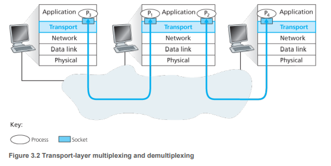

将传输层报文段中的数据交付给正确的套接字的工作称为**多路分解**；

在源主机从不同套接字中收集数据块，并为每个数据块封装上首部信息从而生成报文段，然后将报文段传递到网络层，所有这些工作称为**多路复用**。

**端口号**：16 比特的数，范围 0 ~ 65535，0 ~ 1023 是周知端口号。

### 2.1 无连接的多路复用与多路分解

一个 UDP 由一个（dst-ip，dst-port）标识。如果两个 UDP 报文段有着不同的源 ip 或源端口号，但具有相同的目的 ip 和目的端口，那么这两个报文将通过相同的套接字被定向到相同的目的进程。

> 但这不是说接收方就无法获得源 ip 和源端口号了，只是不把他作为标识而已。

### 2.2 面向连接的多路复用与多路分解

一个 TCP 套接字由 （src-ip，src-port，dst-ip，dst-port）标识。

+ 服务器可能同时支持多个TCP  Socket；
+ Web服务器为每个客户端开不同的 Socket

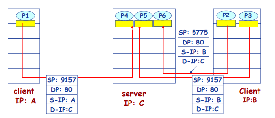

## 3. UDP

+ “Best effort”服务，UDP段可能丢失或非按序到达。
+ 无连接，UDP发送方和接收方之间不需要握手，每个UDP段的处理独立于其他段

::: details UDP 为什么存在

+ 无需建立连接 (减少延迟) 
+ 实现简单：无需维护连接状态 
+ 头部开销少 
+ 没有拥塞控制: 应用可更好地控制发送时间和速度

:::

使用 UDP 的应用是可能实现可靠传输的，这可以通过在应用程序自身中建立可靠机制来完成。

### 3.1 UDP 报文段结构

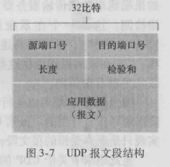

+ UDP 首部只有四个字段，每个字段由两个字节组成，共 8 个字段。
+ 长度字段指示了在 UDP 报文段中的字节数（首部 + 数据）

### 3.2 UDP 检验和

::: note UDP 为什么提供了检验和？

虽然许多链路层协议也提供了差错检测，但不能保证所有链路都提供了差错检测。此外，即使报文段经链路正确地传输，当报文段存储在某台路由器的内存中时，也可能引入比特差错。在既无法确保逐链路的可靠性，又无法确保内存中的差错检测的情况下，如果端到端数据传输服务要提供差错检测，UDP 就必须在端到端的基础上在运输层提供差错检测，这是一个在系统设计中被称颂的**端到端原则**的例子。

端到端原则：因为某种功能必须基于端到端实现，在与较高级别提供这些功能的代价相比，在较低级别上设置的功能可能是冗余的或几乎没有价值的。

:::

UDP 检验和提供了差错检测功能，用于确定当 UDP 报文段从源到达目的地移动时，其中的比特是否发生了改变。但他对差错恢复无能为力。

**发送方**：将段的内容视为16-bit整数。<u>校验和计算</u>：计算所有整数的和 ，进位加在和的后面而不是丢弃（称为回卷），将得到的值按位求反，得到校验和。发送方将校验和放入校验和字段。

**接收方**：计算所收到段的校验和，将其与校验和字段进行对比：不相等则检测出错误，相等则没有检测出错误（<u>但可能有错误</u>）。

::: details 校验和计算示例

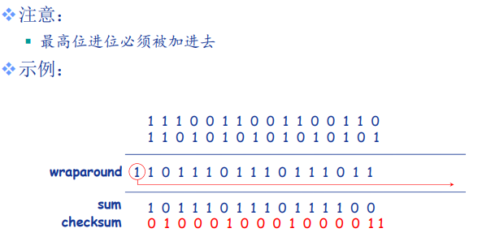

:::

## 4. 可靠数据传输的原理 <Badge text="★"/>

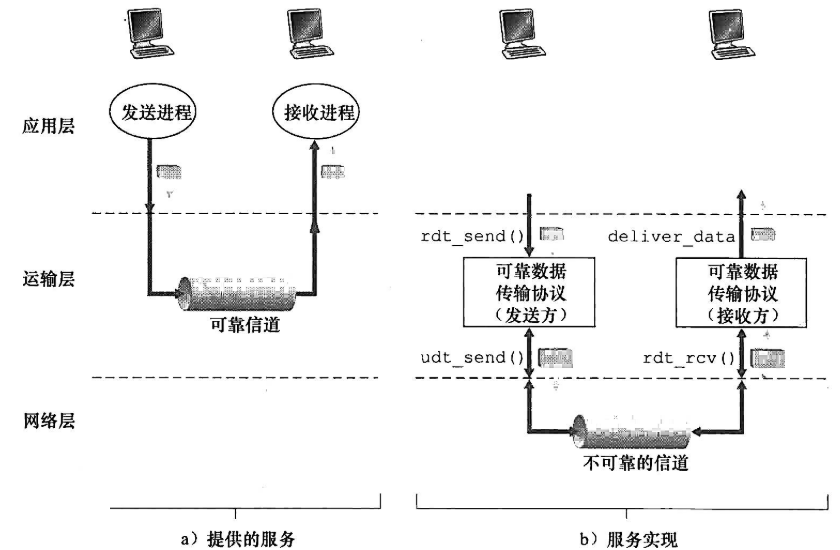

什么是**可靠**：不错、不乱、不丢。

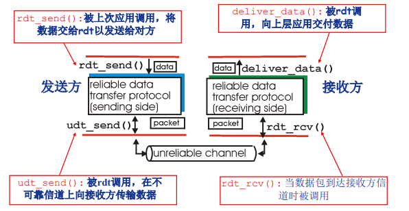

约定：

- rdt/udt: 可靠/不可靠数据
- rdt_send():上层调用(如app),传输可靠数据

- udt_send():由rdt调用,通过不可靠信道传输数据给receiver
- deliver_data():rdt调用,传递数据给上层

- rdt_rcv():当packets抵达信道的rcv端时调用

渐进地设计可靠数据传输协议的发送方和接收方，只考虑单向数据传输，但控制信息双向流动。

### 4.1 构造可靠数据传输协议

#### **4.1.1 经完全可靠信道的可靠数据传输：rdt 1.0**

rdt1.0假设了完全可靠信道的可靠数据传输。

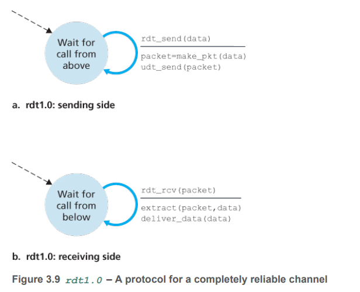

::: note rdt1.0

+ **sender**：接收高层数据,打包后通过信道传输

- **receiver**：从底层接收packet,从中取数数据后传给较高层

:::

+ 横线上面是事件，下面是动作。

- 这种理想情况下,receiver 无需提供任何信息给sender,因为无需担心出错

#### **4.1.2 经具有比特差错信道的可靠数据传输：rdt 2.0**

rdt2.0 针对有bit差错信道的可靠数据传输。

+ 如何从错误中恢复？ 
  + ACK: 接收方显式地告知发送方分组已正确接收
  + NAK:接收方显式地告知发送方分组有错误
  + 发送方收到 NAK 后，重传分组
+ 基于这种重传机制的rdt协议称为**ARQ**(Automatic Repeat reQuest)协议

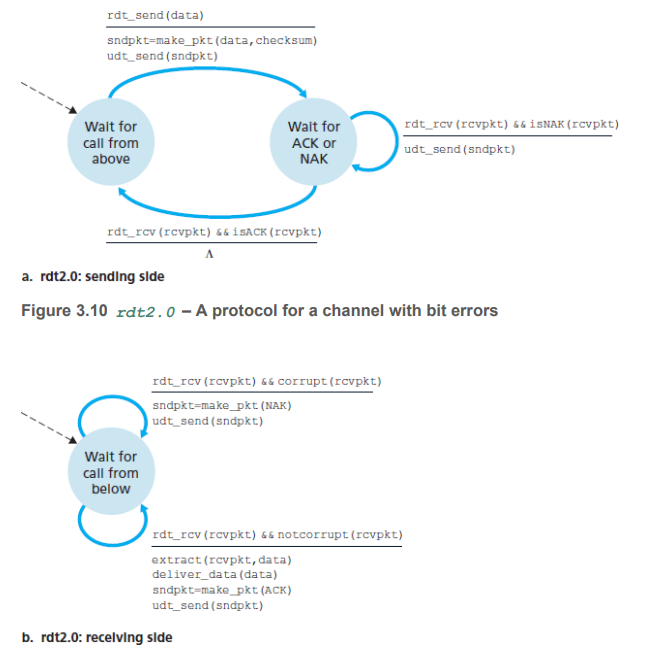

::: note rdt2.0

+ **sender**：接收上层调用后把数据和checksum打包通过信道发送-->进入wait state:如果收到NAK,则重发packet继续当前state;如果收到ACK-->进入等待命令的下一状态

- **receiver**：收到packet后,如果pkt中有bit错误,返回NAK；如果没有错误,提取数据,传递数据,返回ACK

:::

注意，当发送方处于等待 ACK 或 NAK 的状态时，它不能从上层获得更多的数据；这就是说，`rdt_send()` 事件不可能出现；仅当接收到 ACK 并离开该状态时才能发生这样的事件。因此发送方将不会发送一块新的数据，除非发送方确信接收方已正确接收当前分组。由于这种行为，rdt2.0 这样的协议被称为**停等**协议。

Rdt 2.0中引入的新机制：

+ 差错检测
+ 接收方反馈控制消息: ACK/NAK
+ 重传

#### **4.1.3 rdt 2.1**

**rdt 2.0 缺陷**：ACK/NAK本身出现错误。

**可能的解决和新的问题**：简单的方法是给Receiver返回的ACK/NAK也设置checksum.当Sender收到含糊的ACK/NAK分组,则重传pkt。**困难在于** receiver 不知道上一次 ACK/NAK 是否被 sender 正确接收,从而无法区分自己正在接收的 pkt 是上次重传还是新的。

**实际方案**：在pkt中添加序号,即把当前pkt的序号放在字段中,结合停等机制,sender会重发不确定的pkt,而receiver通过序号就知道接受的是重发pkt还是全新pkt。

sender：

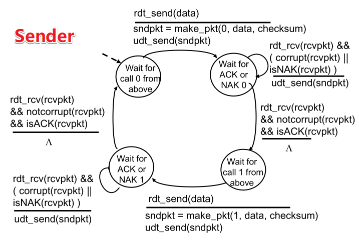

::: note rdt2.1 sender

等待调用0状态 --> 打包发送pkt0 --> 停等0状态:

+ 当收到NAK或发现ACK/NAK出错(corrupt),则重新发送pkt(ACK/NAK本身无需携带序号,由于停等机制,sender知道这次ACK/NAK出错发生在最近的pkt0),继续停等0状态
+ 当收到ACK且反馈本身无误(notcorrupt)-->进入等待调用1状态

:::

receiver：

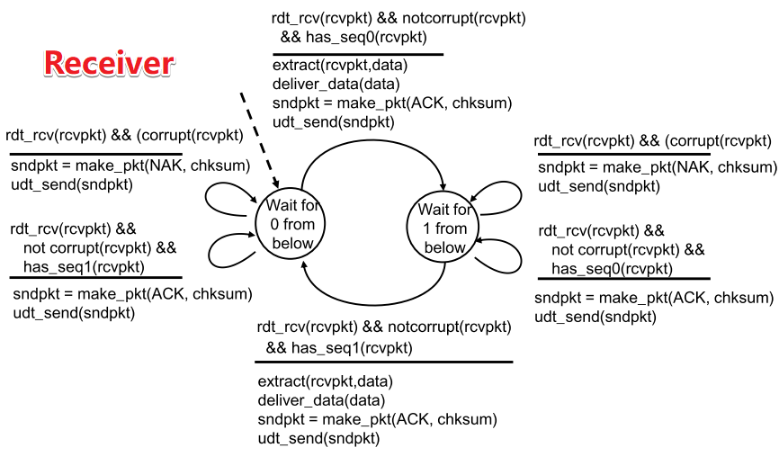

::: note rdt2.1 receiver

等待传入0状态:

+ 如果发现传递出错(corrupt),则打包返回NAK,继续等待传入0状态;(错误分组)
+ 如果接收到pkt1,传递无误,<u>则返回ACK</u>,继续等待传入0状态(失序分组)
+ 如果发现pkt0,传递无误-->提取数据,传递数据,返回ACK(正常分组)-->进入等待传入1状态

:::

注：

+ sender端的corrupt表示ACK/NAK混淆，receiver端的corrupt表示pkt有误；
+ receiver 在等待 pkt0 时如果接收到 pkt1，表示这是一个失序的以前的分组，要回复一个 ACK。如果回复了 NAK，则 sender 会继续发送该分组从而陷入死循环。

::: tip rdt2.1 VS. rdt2.0

**sender**：

+ 为每个分组增加了序列号；
+ 两个序列号(0, 1)就够用，是因为采用了停等协议； 
+ 需校验ACK/NAK消息是否发生错误 
+ 状态数量翻倍，状态必须“记住”“当前”的分组序列号

**receiver**：

+ 需判断分组是否是重复。当前所处状态提供了期望收到分组的序列号，如果重复则丢弃。
+ 注意：接收方无法知道 ACK/NAK 是否被发送方正确收到

:::

#### 4.1.4 rdt2.2（可视为不使用 NAK 的 rdt2.1）

rdt2.2 是在有比特差错的信道上实现的一个无 NAK 的可靠数据传输协议。

分析：rdt2.1 使用了从接收方到发送方的肯定确认和否定确认。当接收到失序的分组时，接收方对所接收的分组发送一个肯定确认。如果接收到受损的分组，则接收方将发送一个否定确认。<u>如果不发送 NAK，而是对上一次正确接收的分组发送一个 ACK，我们也能实现与 NAK 一样的效果</u>。

FSM：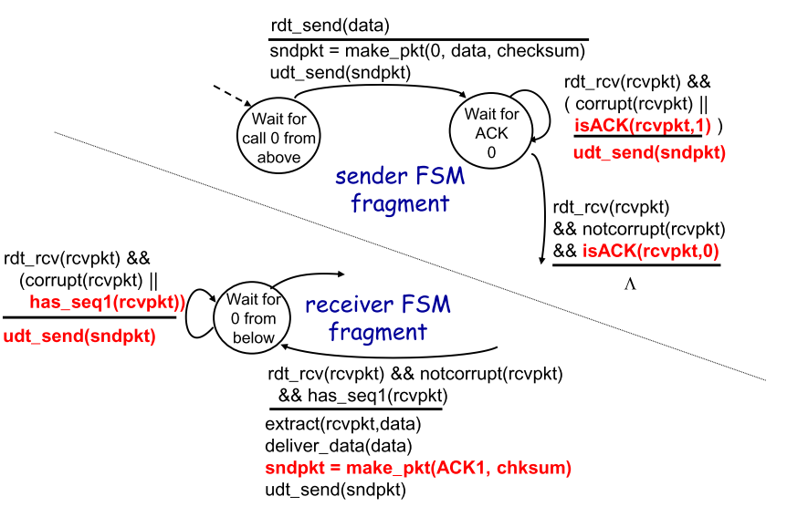

::: note rdt2.2

- **Sender**：等待调用0状态 --> 打包发送pkt0 --> 停等0状态:
  - ① 当收到ACK1或ACK/NAK混淆时,重发pkt0,继续停等0状态
  - ② 当收到ACK0且反馈本身无误(notcorrupt) --> 进入等待调用1状态

- **Receiver**：等待传入0状态:
  - ① 收到pkt1或传递出错,发送ACK1
  - ② 收到pkt0且传递无误 --> 提取数据,传递数据,返回ACK0 --> 进入等待传入1

冗余ACK体现在：进入①前,Sender必定收到了ACK1,再次进入①收到ACK1,说明Receiver没有正确接收pkt0

:::

#### **4.1.5 rdt3.0**

rdt3.0即比特交替协议(alternating-bit protocol)实现了<u>有bit差错和丢包的可靠数据传输</u>。

问题：如果信道既可能发生错误，也可能丢失分组，怎么办？“校验和 + 序列号 + ACK + 重传”够用吗？

解决方法：发送方等待“合理”时间：

+ 如果没收到ACK，重传；
+ 如果分组或ACK只是延迟而不是丢了，重传会产生重复，序列号机制能够处理，接收方需在ACK中显式告知所确认的分组；
+ 需要定时器。

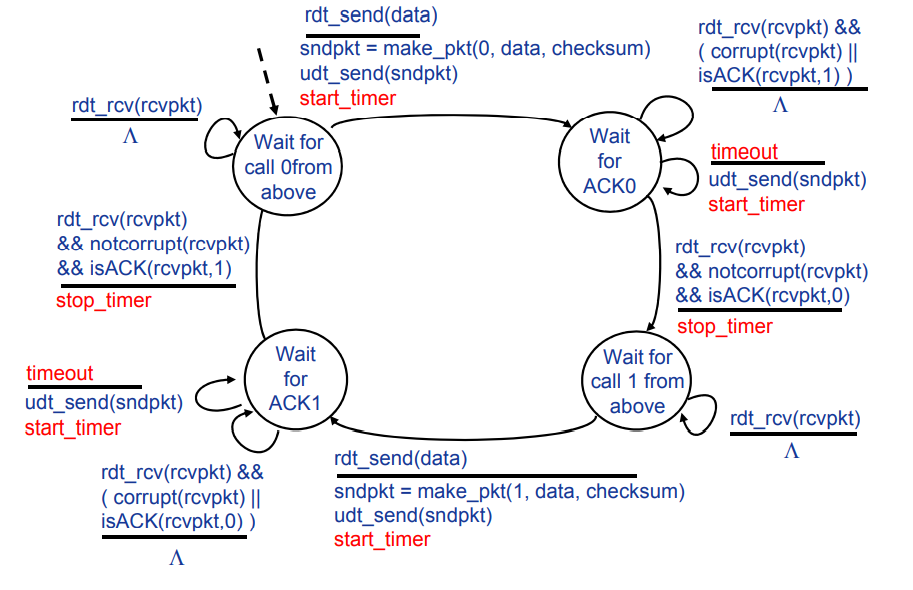

::: note rdt3.0

- **Sender**：基本类似rdt2.2版本。等待调用0状态 -->打包发送pkt0,开始计时 --> 停等0状态:
  - ① 收到ACK1或ACK/NAK混淆,触发计数器进入（计时一直进行）
  - ② 时间到,重发pkt0,重新计时
  - ③ 收到ACK0且反馈本身无误,停止计时-->进入等待调用1状态

- **Receiver**：等待传入0状态:
  - ① 收到pkt1或传递出错,返回ACK1,保持等待0
  - ②收到pkt0且传递无误,返回ACK0 --> 进入等待传入1状态

:::

总结rdt3.0的四种运行，分组号总在 01 间交替，因此叫**比特交替协议**。

 ::: details rdt3.0 运行示例

|                          无丢包操作                          |                           分组丢失                           |                           丢失ACK                            |                           过早超时                           |
| :----------------------------------------------------------: | :----------------------------------------------------------: | :----------------------------------------------------------: | :----------------------------------------------------------: |
| 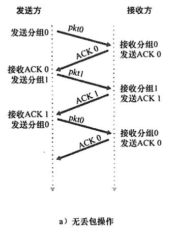 | 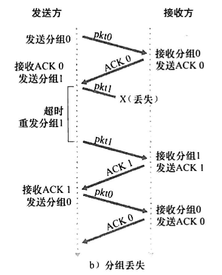 | 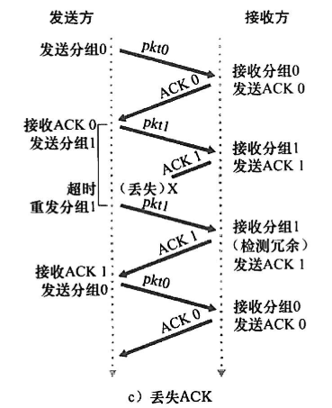 | 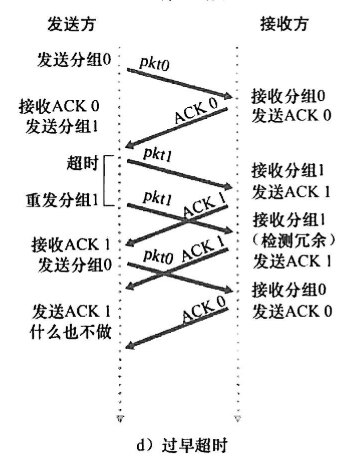 |

:::

归纳一下数据传输协议的要点，在检验和、序号、定时器、肯定和否定确认分组这些技术中，每种机制都在协议的运行中起到了必不可少的作用。

### 4.2 流水线可靠数据传输

这是对 rdt3.0 停等协议的一种改进。rdt3.0中信道的利用率过低，一个简单解决办法是：不以停等方式运行，允许发送发发送多个分组而无需等待确认。许多从发送方向的分组可视为一条流水线，故这种技术被称为流水线技术。

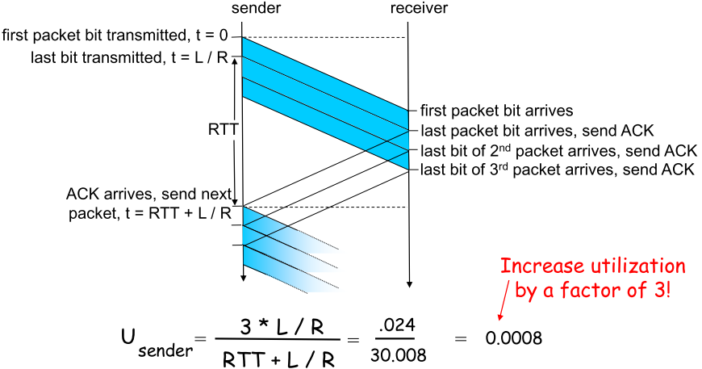

+ 必须增加序号范围。每个输送中的分组必须有一个唯一的序号。
+ 协议的 sender 和 receiver 两端不得不缓存搓个分组。sender 至少应能缓冲已发送但还未确认的分组，receiver 或许也需要缓存那些已正确接收的分组。
+ 所需序号范围和对缓冲的要求取决于协议如何处理丢失、损坏以及延时过大的分组。解决流水线的差错恢复有两种方法：回退 N 步（GBN）协议和选择重传（SR）协议。

#### 4.2.1 回退 N 步协议（GBN 协议）

GMN 协议允许发送方发送多个分组（当有多个分组可用时）而不需要等待确认，但也受限于在流水线中未确认的分组数不能超过某个最大允许数 N。

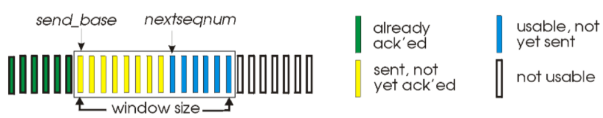

+ 基序号（base）：最早未确认分组的序号；
+ 下一个序号（nextseqnum）：最小的未使用的序号（即下一个待发分组的序号）；
+ N：窗口长度，即流水线中未确认的分组数不能超过最大允许数 N。
+ [0, base - 1] 段内的序号：已经发送并被确认的分组
+ [base, nextseqnum - 1] 段内的序号：已经发送但未被确认的分组
+ [nextseqnum, base + N - 1] 段内的序号：能用于那些要立即被发送的分组

> 施加 N 的窗口大小的限制原因是：1. 流量控制 2. 拥塞控制

在实践中，如果分组的序号字段的比特数为 k，则序号范围是 $[0, 2^k - 1]$，所有涉及序号的运算必须使用模 $2^k$ 运算。

> 在 TCP 中有一个 32 bit 的序号字段，其中 TCP 序号是按字节流中的字节来进行计数的，而不是按分组计数。

**sender FSM**：

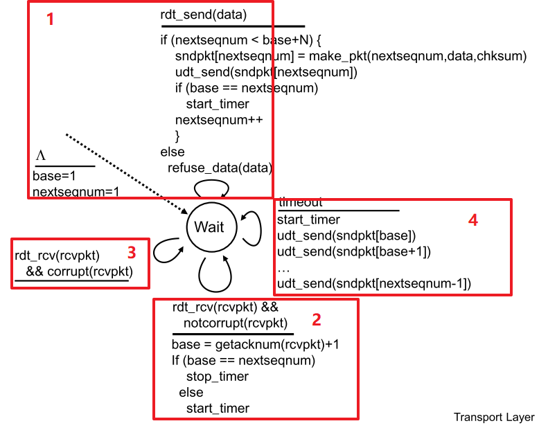

::: note GBN sender

1. 初始base=(next)seq=1,此后等待上层的调用，只要seq<base+N即buffer未满,就可接收数据打包发送,然后seq++;（如果发送数据时 base == seq，表示没有已发送但未被确认的分组，此时定时器要重启）
2. 如果收到正确ACK，对序号为 n 的分组的确认采用**累计确认**的方式，表明接收方已正确接收到序号 n 及以前的所有分组。当base==seq说明buffer里没有pkt等待确认,停止计时,否则重启计时;
3. 收到错误回复时什么都不用做；
4. 当时间到发生超时事件,重发当前窗口从[base]~[seq-1]的所有pkt

:::

所以 GBN Sender 一共响应三种类型的事件：上层的调用、收到一个 ACK、超时事件。

**receiver FSM**：

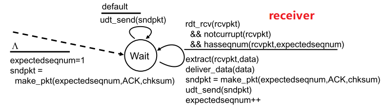

::: note GBN receiver

1. 初始化(expect)seq=1;
2. 接收到正确且合序的pkt,提取数据，并将分组数据交付到上层,返回对应序号的ACK,seq++;
3. 其余默认情况下丢弃收到的分组并返回当前最大正确顺序seq的ACK;

:::

GBN 特点：

1. *顺序性*：对于sender,必须收到base的ACK才能窗口向右滑动,否则do nothing;对于receiver,必须接收expectseq的pkt才能返回相应序号的ACK并seq++
2. *按窗口重发*：当timeout时,无论处于sender的 [base, seq-1] 的pkt是否能正确到达,重发所有(回退)
3. *累计确认*：对序号为n的分组确认时,表明接收方对n和n之前所有的pkt都正确接收

#### 4.2.2 **选择重传**（SR）

GBN 本身存在的性能问题：单个分组的差错就能够引起 GBN 重传大量分组，许多分组根本没必要重传。随着信道差错率的增加，流水线可能会被这些不必要重传的分组所充斥。

选择重传协议通过让发送方仅重传那些它怀疑在接收方出错（丢失或受损）的分组而避免了不必要的重传。再次用 N 来限制流水线中未完成、未被确认的分组个数。

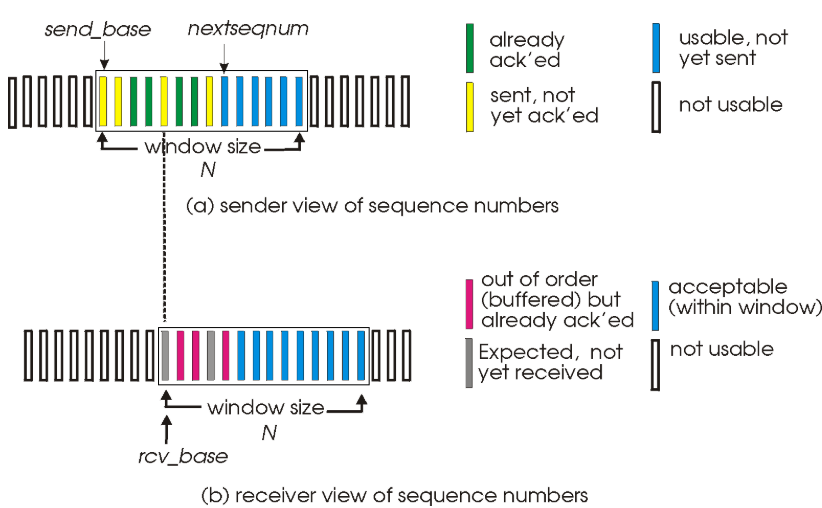

::: note SR

**Sender 的事件与动作：**

1. **从上层收到数据**。当从上层接收到数据后，SR 发送方检查下一个可用于该分组的序号。如果序号位于发送方的窗口内，则将数据打包并发送；否则就像在 GBN 中一样，要么将数据缓存，要么将其返回给上层以便以后传输。
2. **超时**。定时器再次被用来防止丢失分组。然而，<u>现在每个分组必须拥有其自己的逻辑定时器</u>，因为超时发生后只能发送一个分组。可以使用单个硬件定时器模拟多个逻辑定时器的操作。
3. **收到 ACK**。如果收到 ACK ，倘若该分组序号在窗口内，则SR发送方将那个被确认的分组标记为已接收。 如果该分组的序号等于 send_base，则窗口基序号向前移动到具有最小序号的未确认分组处。如果窗口移动了并且有序号落在窗口内的未发送分组，则发送这些分组。

**Receiver 的事件与动作：**

1. **序号在 [rcv_base, rcv_base+ N - 1] 内的分组被正确接收**。在此情况下，收到的分组落在接收方的窗口内，一个选择 ACK 被回送给发送方。如果该分组以前没收到过，则缓存该分组。如果该分组的序号等于接收窗口 的基序号（rcv_base）,则该分组以及以前缓存的序号连续的（起始于rcv_base的）分组交付给上层。 然后，接收窗口按向前移动分组的编号向上交付这些分组。举例子来说如下图，当收到一个序号为 rcv_base=2 的分组时，该分组及分组3、4、5可被交付给上层。
2. **序号在 [rcv_base - N, rcv_base - 1] 内的分组被正确收到**。在此情况下，必须产生一个ACK，即使该分组是接收方以前已确认过的分组。 
3. **其他情况**。忽略该分组。

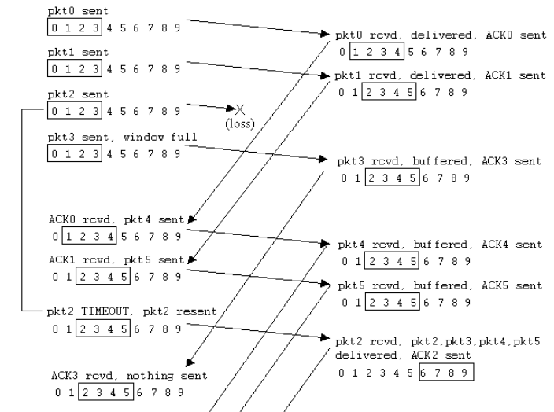

:::

+ SR 接收方将确认一个正确接收的分组而不管其是否按序。失序的分组将被缓存直到所有的丢失分组（即序号更小的分组）皆被收到为止，这时才可以将一批分组按序交付给上层。所以 SR 未采用累积确认机制。
+ SR 协议为每个分组设置了一个计时器。

::: warning Notice

Notice 1：接收方重新确认（而不是忽略）已收到过的那些序号小于当前窗口基序号的分组

例如，给定在图3-23中所示的发送方和接收方的序号空间，如果分组send_base的ACK没有从接收方传播回发送方，则发送方最终将重传分组send_base,即使显然（对我们而不是对发送方来说）接收方已经收到了该分组。如果接收方不确认该分组，则发送方窗口将永远不能向前滑动！这个例子说明了SR协议(和很多其他协议一样)的一个重要方面。<u>对于哪些分组已经被正确接收，哪些没有，发送方和接收方并不总是能看到相同的结果。对SR协议 而言，这就意味着发送方和接收方的窗口并不总是一致</u>。

:::

::: warnning Notice 

Notice 2：窗口长度必须小于或等于序号空间大小的一半

当我们面对有限序号范围的现实时，发送方和接收方窗口间缺乏同步会产生严重的后果。考虑下面例子中可能发生的情况，该例有包括4个分组序号0、1、2、3的有限序号范围且窗口长度为 3。假定发送了分组0至2,并在接收方被正确接收且确认了。此时，接收方窗口落在第4、5、6个分组上，其序号分别为3、0、1。现在考虑两种情况：

+ 在第一种情况下，如下图 a 所示，对前3个分组的ACK丢失，因此发送方重传这些分组。因此，接收方下一步要接收序号为0的分组，即第一个发送分组的副本。 
+ 在第二种情况下，如下图 b 所示，对前3个分组的ACK都被正确交付。因此发送方向前移动窗口并发送第4、5、6个分组，其序号分别为3、0、1。序号为3的分组丢失，但序号为0的分组到达(一个包含新数据的分组)。

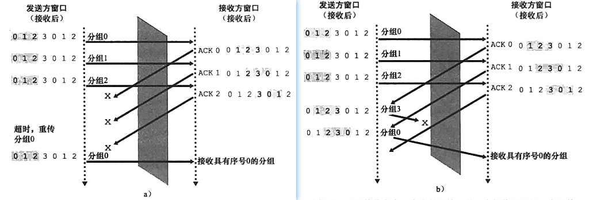

:::