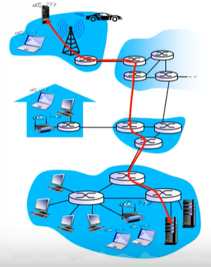
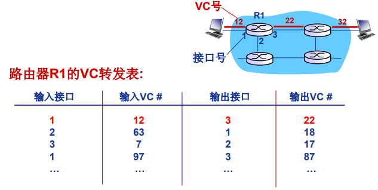
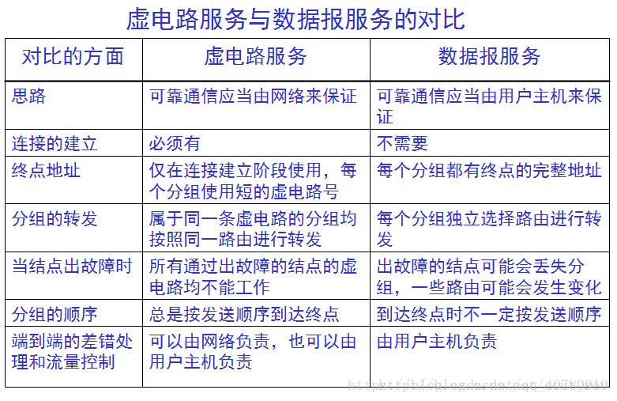
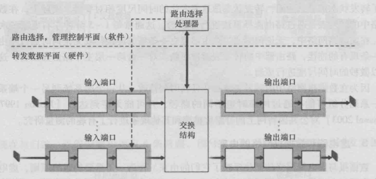
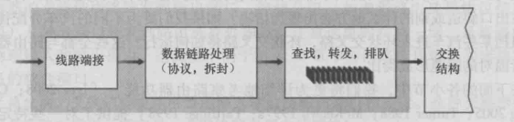
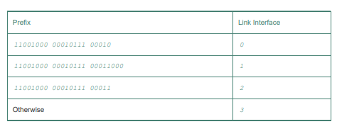
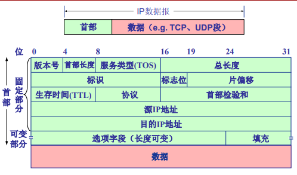

[[toc]]

::: tip 考试大纲

1. 网络层的功能 
2. 数据报网络与虚电路网络 
3. IPv4 分组、IPv4 地址、NAT、子网划分、子网掩码、CIDR、路由聚合 
4. DHCP 协议与 ICMP 协议 
5. IPv6 的主要特点、IPv6 地址 
6. 路由算法（距离向量路由算法、链路状态路由算法、层次路由） 
7. 路由协议（RIP、OSPF、BGP） 
8. 路由器的组成与功能、路由表与路由转发

:::

## 1. 网络层概述

网络层实现主机到主机的通信服务和网络核心的实现。在网络中的每一台主机和路由器都有一个网络层部分。网络层能够被分解为两个相互作用的部分：数据平面和控制平面。

每台路由器的**数据平面**的主要作用是从其输入链路向其输出链路转发数据报；**控制平面**的主要作用是协调这些本地的每个路由的转发动作，使得数据报沿着源和目的地主机之间的路由器路径最终进行端到端传送。

网络层的核心功能：建立连接（虚拟/逻辑连接）。

::: note 网络层连接 VS. 传输层连接

+ 网络层连接：两个主机之间。
  + 路径上的路由器等网络设备参与其中。
+ 传输层连接：两个应用进程之间。
  + 对中间网络设备透明。

:::

### 1.1 转发和路由选择：数据平面和控制平面

将一个分组从一台主机移动到另一台主机，需要两种重要的网络层功能：

+ **转发**：将分组从路由器的 输入端口转移到合适的输出端口
  + 转发是在数据平面实现的唯一功能；
  + 分组也有可能被现有的路由器阻挡
  + 时间尺度很短（几纳秒），常用硬件实现
+ **路由选择**：确定分组从源到目的经过的路径
  + 计算这些路径的算法被称为**路由选择算法**；
  + 路由选择在控制平面实现
  + 时间尺度很长（几秒），常用软件实现

路由器有一个关键元素是**转发表**，路由器在输入端口使用转发表进行查询决定分组的输出端口。

::: note 分组交换机

+ 某些分组交换机是**链路层交换机**，基于链路层帧中的字段值做出某些转发决定，是链路层设备；
+ 某些分组交换机是**路由器**，基于网络层数据包中的首部字段值做出转发决定，是网络层设备。

:::

### 1.2 网络服务模型

**网络服务模型**定义了分组在发送与接收端系统之间的端到端运输特性。因特网的网络层提供了单一的**尽力而为的服务**，既不保证被顺序接收，也不保证端到端时延，还不保证最终交付；既不保证端到端时延，也不保证有最小带宽。

#### **1.2.1 两种服务模型**

+ **无连接服务**(connection-less service):  
  + 不事先为系列分组的传输确定传输路径 
  + 每个分组独立确定传输路径
  + 不同分组可能传输路径不同
  + 数据报网络(datagram network ) 

+ **连接服务**(connection service):
  + 首先为系列分组的传输确定从源到目的经过的路径 (建立连接)
  + 然后沿该路径（连接）传输系列分组
  + 系列分组传输路径相同
  + 传输结束后拆除连接
  + 虚电路网络(virtual-circuit network )

数据报网络与虚电路网络是典型两类分组交换网络

+ 数据报网络提供网络层无连接服务
+ 虚电路网络提供网络层连接服务

#### **1.2.2 虚电路网络**

**虚电路**：一条从源主机到目的主机，类似于电路的路径(逻辑连接)。

+ 分组交换
+ 每个分组的传输利用链路的全部带宽
+ 源到目的路径经过的网络层设备共同完成虚电路功能

通信过程： 呼叫建立 → 数据传输 → 拆除呼叫

每个分组携带虚电路标识(VC ID)，而不是目的主机地址。虚电路经过的每个网络设备 （如路由器），维护每条经过它的虚电路连接状态。

每条虚电路包括: 

1. 从源主机到目的主机的**一条路径** 
2. **虚电路号**（VCID）， 沿路每段链路一个编号（同一条虚电路，在不同链路上VCID可能不一样）
3. 沿路每个网络层设备（如路由器），**利用转发表记录经过的每条虚电路**

沿某条虚电路传输的分组，携带对应虚电路的 VCID，而不是目的地址。

同一条VC ，在每段链路上的VCID通常不同，路由器转发分组时依据转发表改写/替换虚电路号。

虚电路转发表示例：

VC路径上每个路由器都需要维护VC连接的状态信息。

**虚电路信令协议**：用于VC的建立、维护与拆除，应用于虚电路网络，目前的 Internet 不采用。

::: note 虚电路网络 VS. 数据报网络

:::

## 2. 路由器工作原理

我们将注意力转向网络层的转发功能。

路由器的四个组件：输入端口、输出端口、交换结构、路由选择处理器。

+ **输入端口**：执行的功能：① 执行入物理链路的物理层功能 ② 与位于入链路远端的数据链路层交互来自行数据链路层功能 ③ 在输入端口执行转发表查询功能，决定输出端口
+ **交换结构**：将输入端口连接到它的输出端口
+ **输出端口**：存储从交换结构接收的分组，并通过执行必要的链路层和物理层功能在输出链路上传输这些分组；
+ **路由器选择处理器**：执行控制平面的功能。在传统路由器中，它执行路由选择协议，维护路由选择表和关联链路状态信息，为路由器计算转发表；在 SDN 路由器中，它负责与远程控制器通信，接收由远程控制器计算的转发表项。

数据平面以纳秒的时间尺度运行，所以路由器的输入端口、交换结构、输出端口几乎总是用硬件实现；控制平面功能以毫秒或秒的时间尺度来运行，所以控制平面的功能通常用软件实现并在路由选择器（通常是一块传统CPU）上执行。

路由器转发的一个形象比喻：● **基于目的地转发**：入口站服务员根据其最终目的地决定通向最后目的地的交叉路出口，并告诉驾驶员走哪个出口；● **通用转发**：除了目的地外，服务人员还根据许多其他因素来决定汽车的出口匝道，比如车牌照发行地、汽车模型、品牌等。

### 2.1 输入端口处理和基于目的地转发

在输入端口，路由器使用转发表来查找输出端口，并经过交换结构转发分组到该输出端口。

转发表是由路由选择处理器计算和更新的，或转发表是接收来自远程 SDN 控制器的内容。每个输入端口都有一份转发表的影子副本，使得转发决策能在输入端口本地做出。

在基于目的地转发中，我们考虑一个入分组基于目的地址交换到输出端口。在 32 bit 的 IP 地址下，转发表为每个目的地址设一个表项是不可行的。假设我们的路由器具有 4 条链路，编号 0~3，有一个如下仅包含 4 个表项的转发表就够了：

使用这种风格的转发表，路由器用分组目的地址的**前缀**（prefix）与该表中的表项进行匹配，如果存在一个匹配项，则路由器向与该匹配项相关联的链路转发分组。当有多个匹配项时，采用**最长前缀匹配规则**。

::: tip 例题

假设有如下转发表：

|              目的地址范围              | 链路接口 |
| :------------------------------------: | -------- |
| `11001000 00010111 00010*** *********` | 0        |
| `11001000 00010111 00011000 *********` | 1        |
| `11001000 00010111 00011*** *********` | 2        |
|                  其他                  | 3        |

问：`11001000 00010111 00010110 10100001 ` 从哪个接口转发？ 

答：0

问：`11001000 00010111 00011000 10101010 ` 从哪个接口转发？ 

答：1

:::

一个分组可能会在进入交换结构时被暂时阻塞，因此，一个被阻塞的分组需要在输入端口处排队。

### 2.2 交换

... 考研不考

## 3. 网际协议：IPv4、寻址、IPv6 及其他

### 3.1 IPv4 数据报格式

+ **版本号**：4 bit，IP 协议版本。通过查看版本号，路由器能够确定如何解释 IP 数据报的剩余部分。
+ **首部长度**：4 bit，数据报可含有一些可变数量的选项，故需要用这 4 bit 来确定数据报中载荷实际开始的地方。大多数不包含此选项，一般具有 20 字节的首部（IPv4 首部固定部分的长度）。
  + 以 4 字节为单位来表示长度，如首部长度为 5 表示长度为 20 字节。
+ **服务类型**（TOS）：8 bit，指示期望获得哪种类型的服务（如实时数据报和非实时流量）。一般情况下不使用，通常IP分组的该字段的值为00H。
+ **总长度**：首部加上数据的长度，以字节计。
  + 因为该字段长 16 bit，所以总长度最大为 65535 字节，但很少有超过 1500 字节的。