[[toc]]

::: tip 考试大纲

1. 网络层的功能 
2. 数据报网络与虚电路网络 
3. IPv4 分组、IPv4 地址、NAT、子网划分、子网掩码、CIDR、路由聚合 
4. DHCP 协议
5. IPv6 的主要特点、IPv6 地址 

:::

## 1. 网络层概述

网络层实现主机到主机的通信服务和网络核心的实现。在网络中的每一台主机和路由器都有一个网络层部分。网络层能够被分解为两个相互作用的部分：数据平面和控制平面。

每台路由器的**数据平面**的主要作用是从其输入链路向其输出链路转发数据报；**控制平面**的主要作用是协调这些本地的每个路由的转发动作，使得数据报沿着源和目的地主机之间的路由器路径最终进行端到端传送。

网络层的核心功能：建立连接（虚拟/逻辑连接）。

::: note 网络层连接 VS. 传输层连接

+ 网络层连接：两个主机之间。
  + 路径上的路由器等网络设备参与其中。
+ 传输层连接：两个应用进程之间。
  + 对中间网络设备透明。

:::

### 1.1 转发和路由选择：数据平面和控制平面

将一个分组从一台主机移动到另一台主机，需要两种重要的网络层功能：

+ **转发**：将分组从路由器的 输入端口转移到合适的输出端口
  + 转发是在数据平面实现的唯一功能；
  + 分组也有可能被现有的路由器阻挡
  + 时间尺度很短（几纳秒），常用硬件实现
+ **路由选择**：确定分组从源到目的经过的路径
  + 计算这些路径的算法被称为**路由选择算法**；
  + 路由选择在控制平面实现
  + 时间尺度很长（几秒），常用软件实现

路由器有一个关键元素是**转发表**，路由器在输入端口使用转发表进行查询决定分组的输出端口。

::: note 分组交换机

+ 某些分组交换机是**链路层交换机**，基于链路层帧中的字段值做出某些转发决定，是链路层设备；
+ 某些分组交换机是**路由器**，基于网络层数据包中的首部字段值做出转发决定，是网络层设备。

:::

### 1.2 网络服务模型

**网络服务模型**定义了分组在发送与接收端系统之间的端到端运输特性。因特网的网络层提供了单一的**尽力而为的服务**，既不保证被顺序接收，也不保证端到端时延，还不保证最终交付；既不保证端到端时延，也不保证有最小带宽。

#### **1.2.1 两种服务模型**

+ **无连接服务**(connection-less service):  
  + 不事先为系列分组的传输确定传输路径 
  + 每个分组独立确定传输路径
  + 不同分组可能传输路径不同
  + 数据报网络(datagram network ) 

+ **连接服务**(connection service):
  + 首先为系列分组的传输确定从源到目的经过的路径 (建立连接)
  + 然后沿该路径（连接）传输系列分组
  + 系列分组传输路径相同
  + 传输结束后拆除连接
  + 虚电路网络(virtual-circuit network )

数据报网络与虚电路网络是典型两类分组交换网络

+ 数据报网络提供网络层无连接服务
+ 虚电路网络提供网络层连接服务

#### **1.2.2 虚电路网络**

**虚电路**：一条从源主机到目的主机，类似于电路的路径(逻辑连接)。

+ 分组交换
+ 每个分组的传输利用链路的全部带宽
+ 源到目的路径经过的网络层设备共同完成虚电路功能

通信过程： 呼叫建立 → 数据传输 → 拆除呼叫

每个分组携带虚电路标识(VC ID)，而不是目的主机地址。虚电路经过的每个网络设备 （如路由器），维护每条经过它的虚电路连接状态。

每条虚电路包括: 

1. 从源主机到目的主机的**一条路径** 
2. **虚电路号**（VCID）， 沿路每段链路一个编号（同一条虚电路，在不同链路上VCID可能不一样）
3. 沿路每个网络层设备（如路由器），**利用转发表记录经过的每条虚电路**

沿某条虚电路传输的分组，携带对应虚电路的 VCID，而不是目的地址。

同一条VC ，在每段链路上的VCID通常不同，路由器转发分组时依据转发表改写/替换虚电路号。

虚电路转发表示例：

VC路径上每个路由器都需要维护VC连接的状态信息。

**虚电路信令协议**：用于VC的建立、维护与拆除，应用于虚电路网络，目前的 Internet 不采用。

::: note 虚电路网络 VS. 数据报网络

:::

## 2. 路由器工作原理

我们将注意力转向网络层的转发功能。

路由器的四个组件：输入端口、输出端口、交换结构、路由选择处理器。

+ **输入端口**：执行的功能：① 执行入物理链路的物理层功能 ② 与位于入链路远端的数据链路层交互来自行数据链路层功能 ③ 在输入端口执行转发表查询功能，决定输出端口
+ **交换结构**：将输入端口连接到它的输出端口
+ **输出端口**：存储从交换结构接收的分组，并通过执行必要的链路层和物理层功能在输出链路上传输这些分组；
+ **路由器选择处理器**：执行控制平面的功能。在传统路由器中，它执行路由选择协议，维护路由选择表和关联链路状态信息，为路由器计算转发表；在 SDN 路由器中，它负责与远程控制器通信，接收由远程控制器计算的转发表项。

数据平面以纳秒的时间尺度运行，所以路由器的输入端口、交换结构、输出端口几乎总是用硬件实现；控制平面功能以毫秒或秒的时间尺度来运行，所以控制平面的功能通常用软件实现并在路由选择器（通常是一块传统CPU）上执行。

路由器转发的一个形象比喻：● **基于目的地转发**：入口站服务员根据其最终目的地决定通向最后目的地的交叉路出口，并告诉驾驶员走哪个出口；● **通用转发**：除了目的地外，服务人员还根据许多其他因素来决定汽车的出口匝道，比如车牌照发行地、汽车模型、品牌等。

### 2.1 输入端口处理和基于目的地转发

在输入端口，路由器使用转发表来查找输出端口，并经过交换结构转发分组到该输出端口。

转发表是由路由选择处理器计算和更新的，或转发表是接收来自远程 SDN 控制器的内容。每个输入端口都有一份转发表的影子副本，使得转发决策能在输入端口本地做出。

在基于目的地转发中，我们考虑一个入分组基于目的地址交换到输出端口。在 32 bit 的 IP 地址下，转发表为每个目的地址设一个表项是不可行的。假设我们的路由器具有 4 条链路，编号 0~3，有一个如下仅包含 4 个表项的转发表就够了：

使用这种风格的转发表，路由器用分组目的地址的**前缀**（prefix）与该表中的表项进行匹配，如果存在一个匹配项，则路由器向与该匹配项相关联的链路转发分组。当有多个匹配项时，采用**最长前缀匹配规则**。

::: tip 例题

假设有如下转发表：

|              目的地址范围              | 链路接口 |
| :------------------------------------: | -------- |
| `11001000 00010111 00010*** *********` | 0        |
| `11001000 00010111 00011000 *********` | 1        |
| `11001000 00010111 00011*** *********` | 2        |
|                  其他                  | 3        |

问：`11001000 00010111 00010110 10100001 ` 从哪个接口转发？ 

答：0

问：`11001000 00010111 00011000 10101010 ` 从哪个接口转发？ 

答：1

:::

一个分组可能会在进入交换结构时被暂时阻塞，因此，一个被阻塞的分组需要在输入端口处排队。

### 2.2 交换

... 考研不考

## 3. 网际协议：IPv4、寻址、IPv6 及其他

### 3.1 IPv4 数据报格式

+ **版本号**：4 bit，IP 协议版本。通过查看版本号，路由器能够确定如何解释 IP 数据报的剩余部分。
+ **首部长度**：4 bit，数据报可含有一些可变数量的选项，故需要用这 4 bit 来确定数据报中载荷实际开始的地方。大多数不包含此选项，一般具有 20 字节的首部（IPv4 首部固定部分的长度）。
  + 以 4 字节为单位来表示长度，如首部长度为 5 表示长度为 20 字节。
+ **服务类型**（TOS）：8 bit，指示期望获得哪种类型的服务（如实时数据报和非实时流量）。一般情况下不使用，通常IP分组的该字段的值为00H。
+ **总长度**：首部加上数据的长度，以字节计。
  + 因为该字段长 16 bit，所以总长度最大为 65535 字节，但很少有超过 1500 字节的。
+ **生存时间**（TTL）：8 bit，IP分组在网络中可以通过的路由器数（或跳步数），从而确保数据报不会永远在网络中循环。每当一台路由器处理数据报时，TTL - 1，若减为 0，则丢弃该数据报。
+ **协议**：8 bit，该字段值指示了 IP 数据报的数据部分应该交给哪个特定的传输层协议。例如 6 表示交给 TCP，17 表示交给 UDP。
  + 协议号是将网络层与传输层绑定到一起的黏合剂，而端口号是将传输层和应用层绑定到一起的黏合剂。
+ **首部校验和**：16 bit，实现对 IP 分组**首部的**差错检测。每个路由器都要计算并检测，由于 TTL 字段会变化，计算的新值要再次存放在原处。
  + 计算方法：将首部中的每 2 个字节当作一个数，用反码对这些数求和。
+ **源和目的 IP 地址**：各 32 bit，表示源 IP 和目的 IP。
+ **选项**：允许 IP 首部被扩展。很少使用。在 IPv6 中已经被去掉。
+ **填充**：占长度可变，范围在0~3B之间：目的是补齐整个首部，符合32位对齐，即保证首部长度是4字节的倍数。
+ **数据（有效载荷）**：承载传输层报文或 ICMP 报文等。

### 3.2 IPv4 数据报分片

并不是所有链路层协议都能承载相同长度的网络层分组。比如以太网能够承载不超过 1500 byte 的数据。一个链路层帧所能承载的最大数据量叫作**最大传送单元（MTU）**。

不同链路的 MTU 不同，当一个 router 的入链路和出链路的 MTU 不同时，IP 数据报可能需要被分片成较小的**片**（fragment），用单独的链路层帧封装这些片然后发送。

片需要重新组装，如果由 router 组装会带来巨大的复杂性并影响性能，因此设计者决定**将数据报的重新组装工作放在了端系统中**，而不是网络路由器中。

为了让目的主机能够执行重新组装的任务，IPv4 设计者将<u>标识、标志位和片偏移</u>放在了 IP 数据报首部中：

+ **标识**：16 bit，标识一个数据报。对一个数据报分片形成的每个片具有相同的源 IP、目的 IP 和标识号。
  + IP 协议利用一个计数器，每产生 IP 分组计数器加 1，作为该IP分组的标识
+ **标识位**：3 bit，最高位保留，次高位`DF`(Don't Fragment)，最低位`MF`(More Fragment)
  + DF：1 禁止分配；0 允许分片
  + MF：1 还有更多片；0 最后一片（或未分片）
+ **片偏移**：13 bit，一个 IP 分组分片封装原 IP 分组数据的相对偏移量，为了能正确的顺序重新组装片。片偏移以 8 byte 为单位，如 $F_i = \frac{d}{8}\times(i-1)$

::: tip 例题

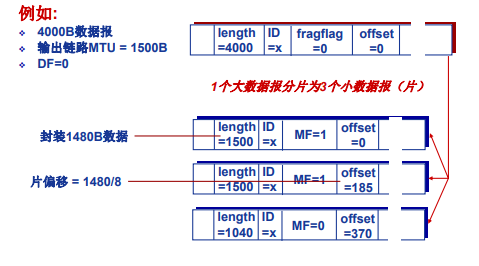

:::

### 3.3 IPv4 编址

#### **3.3.1 子网**

**接口**（interface）是主机/路由器与物理链路之间的边界。一台主机通常有一个或两个接口（如有线的以太网接口和无线的 WIFI 接口），路由器通常有多个接口。因此，从技术上讲，<mark>一个 IP 地址与一个接口相关联，而不是与包括该接口的主机或路由器相关联</mark>。

**IP 地址**：32 bit，总共$2^32$个（大约40亿个）可能的 IP 地址。这些地址通常按**点分十进制记法**书写。

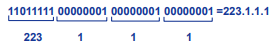

IP 地址由高比特位的网络号（Net ID）和低比特位的主机号（Host ID）组成。

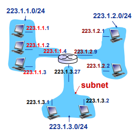

**子网**：IP地址具有相同网络号的设备接口。

+ 不跨越路由器（第三及以上层网络设备）可以彼此物理联通的接口。

::: tip 例题

图中网络有多少个 IP子网？

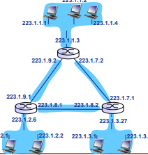

答：6个。

:::

我们能够使用下列有效方法定义系统中的子网：<u>为了确定子网，分开主机和路由器的每个接口，产生几个隔离的网络岛，使用接口端接这些隔离的网络的端点。这些隔离的网络中的每一个都叫作一个**子网**（subnet）</u>。

#### **3.3.2 无类别编址（CIDR）**

因特网的地址分配策略是**无类别域间路由选择**（Classless Interdomain Routing，**CIDR**）。

::: theorem 无类别域间路由选择

当使用子网寻址时，32 bit 的  IP 地址被划分为两部分，并且也具有点分十进制数形式 $a.b.c.d/x$，其中 x 指示了地址的第一部分（即网络前缀部分）中的比特数。

:::

形式为 $a.b.c.d/x$ 的地址的 x 最高比特构成了 IP 地址的网络部分，称为**前缀**。一个组织通常被分配一块连续的地址，即具有相同前缀的一段地址。这样当该组织网络外部的路由器转发一个目的地址为该组织内部的数据报时，仅需要考虑前 x 比特的地址。

比如下图，一个称为 Fly-By-Night-ISP 的 ISP 将 8 个组织连接到因特网，该 ISP 向外界通告“向我发送 200.23.16.0/20 开始的数据报”。实际上内部还存在着 8 个其他的组织，每个组织有自己的子网。这种使用单个网络前缀通告多个网络的能力通常称为**路由聚合**（或称为**地址聚合**）。将多个子网聚合为一个较大的子网从而构造成**超网**（super netting）。

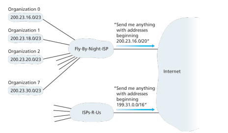

假设 Fly-By-Night-ISP 获取了 ISPs-R-Us，然后让组织 1 通过它辅助的 ISPs-R-Us （拥有地址块 199.31.0.0/16）与因特网相连，将会怎样？虽然可以将组织 1 内的 IP 重新编号使其在 ISPs-R-Us 的地址块内，但是代价很高，且以后还可能再次更换，采用的典型方案是组织 1 的 IP 保持不变，Fly-By-Night-ISP 继续通告地址块 200.23.16.0/20，但 ISPs-R-Us 除了通告之前的地址块外，还要通告组织 1 的地址块 200.23.18.0/23,。当路由选择时，发向组织 1 的数据报将使用**最长前缀匹配**的规则路由，从而被路由到 ISPs-R-Us 中。

一个地址的剩余 32 - x 比特可认为是用于区分该组织内部设备的，其中这些设备具有相同网络前缀。这些较低阶比特可能还具有另外的子网结构。

#### **3.3.3 有类编址**

CIDR 被采用之前，IP 地址的网络部分被限制为长度为 8、16 或 24 bit，这是一种称为**分类编址**的编址方案。具有 8、16 和 24 bit 子网分别被称为 A、B 和 C 类网络。

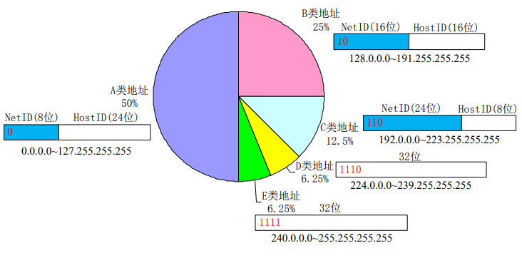

这种编址方案有问题，C 类仅能容纳 $2^8 - 0 = 254$ 台主机（其中两个地址被预留），这太小了。然而一个 B 类子网可支持多达 65 534 台主机，这又太大了，会造成太大的浪费。

#### 3.3.4 特殊 IP 地址

特殊 IP 地址：

| Net ID |       Host ID        | 作为 IP 分组源地址 | 作为 IP 分组目的地址 | 用途                                                         |
| :----: | :------------------: | :----------------: | :------------------: | ------------------------------------------------------------ |
|  全0   |         全0          |        可以        |        不可以        | 在本网范围内表示本机；在路由表中用于表示默认路由 (相当于表示整个Internet网络) |
|  全0   |        特定值        |       不可以       |         可以         | 表示本网内某个特定主机                                       |
|  全1   |         全1          |       不可以       |         可以         | 本网广播地址(路由器不转发)                                   |
| 特定值 |         全0          |       不可以       |        不可以        | 网络地址，表示一个网络                                       |
| 特定值 |         全1          |       不可以       |         可以         | 直接广播地址，对特定网络上的所有主机进行广播                 |
|  127   | 非全0或非全1的任何数 |        可以        |         可以         | 用于本地软件环回测试，称为环回地址                           |

私有 IP 地址：

| Class | Net ID                   | Block |
| :---: | :----------------------- | :---: |
|   A   | 10                       |   1   |
|   B   | 172.16 to 172.31         |  16   |
|   C   | 192.168.0 to 192.168.255 |  256  |

#### **3.3.5 子网划分**

为了获取一块 IP 地址用于一个组织的子网内，某网络管理员也许会与 ISP 联系，该 ISP 可能会从已经分给他的更大地址块中提供一些地址。比如（网络部分加了下划线）：

| ISP 地址块 | 200.23.16.0/20 | <u>11001000 00010111 0001</u>0000 00000000 |
| :--------- | :------------- | :----------------------------------------- |
| 组织 0     | 200.23.16.0/23 | <u>11001000 00010111 0001000</u>0 00000000 |
| 组织 1     | 200.23.18.0/23 | <u>11001000 00010111 0001001</u>0 00000000 |
| 组织 2     | 200.23.20.0/23 | <u>11001000 00010111 0001010</u>0 00000000 |
| ....       |                |                                            |
| 组织 7     | 200.23.30.0/23 | <u>11001000 00010111 0001111</u>0 00000000 |

IP 地址被划分为：

+ 网络号（Net ID）：高位比特
+ 子网号（Sub ID）：原网络主机号部分比特
+ 主机号（Host ID）：低位比特

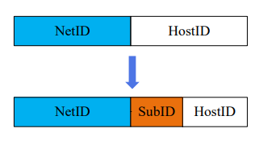

::: tip 子网划分例题

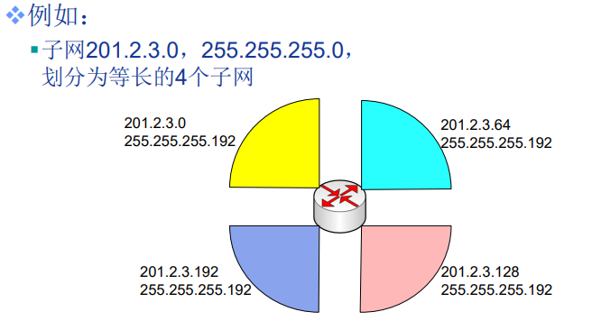

:::

将 IP 分组的目的IP地址与子网掩码按位与运算， 便可以提取子网地址。

::: tip 例题

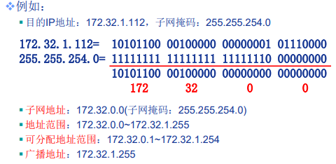

:::

### 3.4 DHCP：动态主机配置协议

主机的地址可以手动配置，但更多是通过 DHCP。DHCP 允许主机自动获取（被分配）一个 IP 地址。

DHCP：

+ 从服务器动态获取： • IP地址 • 子网掩码 • 默认网关地址 • DNS服务器名称与IP地址
+ “即插即用”
+ 允许地址重用
+ 支持在用地址续租
+ 支持移动用户加入网络

DHCP 是一个客户-服务器协议，客户通常是新到达的主机，它要获得包括自身使用的 IP 地址在内的网络配置信息。在最简单的场合下，每个子网将具有一台 DHCP 服务器，如果没有，则需要一个 DHCP 中继代理（常为一台路由器），这个代理知道用于该网络的 DHCP 服务器的地址。

DHCP 是一个 4 个步骤的过程：（yiaddr：your ip address）

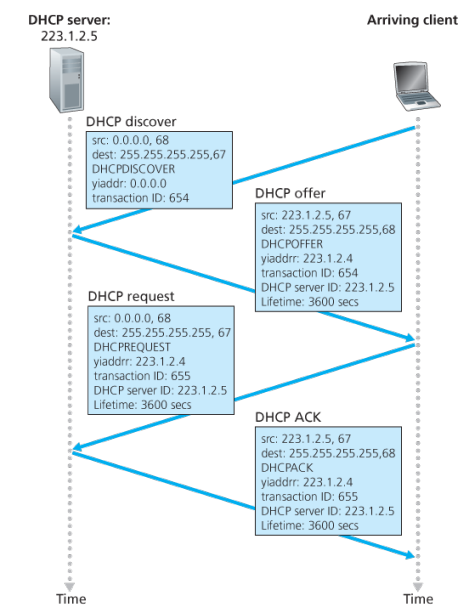

1. **DHCP 服务器发现**：<u>主机广播**DHCP 发现报文**发现一个要与其交互的 DHCP 服务器</u>。客户使用 UDP 向端口 67 发送广播报文，目的 IP 为广播地址 255.255.255.255，源 IP 使用“本主机” 0.0.0.0。
2. **DHCP 服务器提供**：<u>DHCP 服务器收到发现报文，用 **DHCP 提供报文** 响应</u>。该报文向子网所有节点广播。可能有多台 DHCP 服务器，每台提供的响应报文含有事务 ID、向客户推荐的 IP、子网掩码以及 IP 地址租用期等信息。
3. **DHCP 请求**：<u>客户从多个服务器提供中选择一个，并向选中的服务器提供用**DHCP 请求报文**响应</u>，回显配置的参数。
4. **DHCP ACK**：<u>服务器用 **DHCP ACK 报文**对请求报文进行响应</u>， 证实所要求的参数。

一旦客户收到 DHCP ACK 后，交互便完成了，客户可以在租用期内使用该 IP 地址。<Badge text="易错"/>DHCP 协议是在<u>应用层</u>实现，将请求报文封装到 UDP 中实现的。

缺陷：当一个移动节点在子网之间移动时，就不能维持与远程应用之间的 TCP 连接。

### 3.5 网络地址转换：NAT

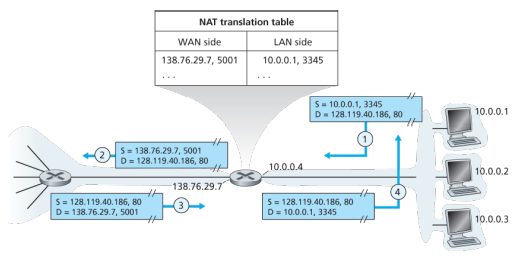

+ 所有离开本地网络去往 Internet 的数据报的源 IP 地址需替换为相同的 NAT IP地址 138.76.29.7，以及不同的端口号；
+ 本地网络内通信的 IP 数据报的源与目的 IP 地址均在子网 10.0.0/24（被保留的IP地址空间）内。

NAT 后面的地址是**专用网络地址**，仅对该网络中的设备有意义。从本质上讲，NAT 使能路由器对外界隐藏了家庭网络的细节。

NAT 的实现：替换 —> 记录 —> 替换。NAT 路由器上有一张 NAT 转换表，并且在该表项中包含了端口号及其 IP 地址：

1. **替换**：利用（NAT IP地址，新端口号）替换每个外出 IP 数据报 的（源IP地址，源端口号）；
2. **记录**：将每对（NAT IP地址，新端口号）与（源IP地址，源端口号）的替换信息存储到 NAT 转换表中；
3. **替换**：根据 NAT 转换表，利用（源IP地址，源端口号）替换每个进入内网 IP 数据报的（目的IP地址，目的端口号），即（NAT IP地址，新端口号）。

16 bit 端口号字段：可以同时支持60,000多并行连接！

NAT主要**争议**: 

+ 路由器应该只处理第3层功能
+ 违背端到端通信原则：应用开发者必须考虑到NAT的存在，e.g., P2P应用
+ 地址短缺问题应该由 IPv6 来解决

### 3.6 IPv6

#### **3.6.1 动机**

+ 最初动机：32位 IPv4 地址空间已分配殆尽 
+ 其他动机：改进首部格式（快速处理/转发数据报；支持QoS）

#### **3.6.2 IPv6 数据报格式**

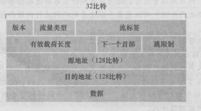

**最重要的变化**：

+ *扩大的地址容量*：将 IP 地址长度从 32 bit 增加到 128 bit。还引入了**任播地址**，这种地址可以使数据报交付给一组主机中的任意一个（如可用于向一组包含给定文档的镜像站点中的最近一个发送 HTTP GET 报文）；
+ *简化高效的固定 40 字节首部*
+ *流标签*：难以捉摸，可用于给属于特殊流的分组加上标签，如音频传输就可能当作一个流，而文件传输就不可能被当作流。

**IPv6 字段说明**：

+ **版本**：4 bit，用于标识 IP 版本号，IPv6 将其设为 6。（注：设为 4 并不能创建一个合法的 IPv4 数据报）
+ **流量类型**：8 bit，与 IPv4 的 TOS 字段含义相似
+ **流标签**：20 bit，用于标识一条数据报的流，能够对一条流中的某些数据报给出优先权
+ **有效载荷长度**：16 bit，作为无符号数指出跟在首部后面数据的长度
+ **下一个首部**：标识下一个选项首部或这个数据报中的内容需要交付给哪个协议（如 TCP）
+ **跳限制**：转发数据报的每台路由器将对该字段 -1，如果达到0就丢弃

**其他改变 vs. IPv4**：

+ *分片/重新组装*：IPv6 不允许在中间路由器上进行分片与重新组装，这种操作只能在源与目的地执行。如果路由器因 IPv6 太大而无法转发则丢弃并回复一个“分组太大”的 ICMP 差错报文。
+ *首部检验和*：IPv6 移除了 checksum，因为传输层和数据链路层协议执行了检验操作。
+ *选项*：允许，但是从基本首部移出，定义多个选项首部，通过“下一个首部”字段指示。

#### **3.6.3 IPv6 地址表示形式**

+ 一般形式: 1080:0:FF:0:8:800:200C:417A
+ 压缩形式: FF01:0:0:0:0:0:0:43 
  + 压缩→FF01::43 

+ IPv4-嵌入形式: 0:0:0:0:0:FFFF:13.1.68.3 或 ::FFFF:13.1.68.3
+ 地址前缀: 2002:43c:476b::/48 (注: IPv6不再使用掩码!)
+ URLs: http://[3FFE::1:800:200C:417A]:8000

#### **3.6.4 IPv6 基本地址类型**

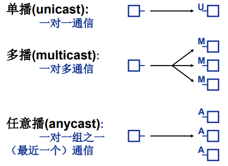

#### **3.6.5 从 IPv4 到 IPv6 迁移**

已部署的具有 IPv4 能力的系统不能够处理 IPv6 数据报。在实践中广泛采用的方法是**建隧道**。

**建隧道**基本思想：假设两个 IPv6 节点要使用 IPv6 交互，但他们是经由中间 IPv4 路由器互联的。我们将两台 IPv6 路由器之间的中间 IPv4 路由器的集合称为一个**隧道**，借助于隧道，在隧道发送端将整个 IPv6 数据报放到一个 IPv4 数据报的数据字段中，接收端再从中取出 IPv6 数据报。

+ 接收端通过观察到 IPv4 数据报中的协议号字段为 41 来得知该 IPv4 数据报中放着一个 IPv6 数据报。

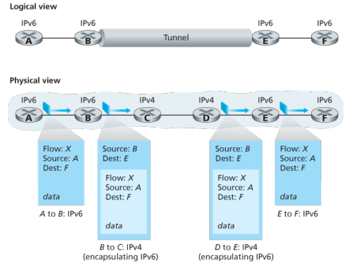