[[toc]]

::: tip 考试大纲

1. 路由算法（距离向量路由算法、链路状态路由算法、层次路由） 
2. 路由协议（RIP、OSPF、BGP） 
3. 路由器的组成与功能、路由表与路由转发
4. ICMP 协议

:::

控制平面作为一种*网络范围*的逻辑，不仅控制沿着从源主机到目的主机的端到端路径间的路由器如何转发数据报，而且控制网络层组件和服务如何配置和管理。

## 1. 概述

转发表（在基于目的地转发的场景中）和流表（在通用转发的场景中）定义了一台路由器的本地数据平面转发行为。两种方法来计算、维护和安装这些转发表和流表：

+ **每路由器控制**：每台路由器有一个路由选择组件，用于与其他路由器中的路由选择组件通信，以计算其转发表的值。将要学习的 OSPF 和 BGP 协议都是基于这种每路由器的方法进行控制。

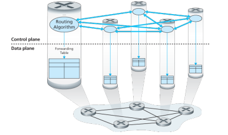

+ **逻辑集中式控制**：逻辑集中式控制器计算并分发转发表以供每台路由器使用。

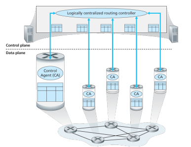

## 2. 路由选择算法

路由选择算法的目的：从发送方到接收方的过程中确定一条通过路由器网络的好的路径。

一个计算机网络的抽象**图**模型：

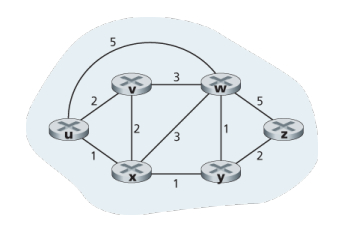

+ 图: G = (N, E) 
+ N = 路由器集合 = { u, v, w, x, y, z } 
+ E = 链路集合 = { (u,v), (u,x), (v,x), (v,w), (x,w), (x,y), (w,y), (w,z), (y,z) }

关键问题：源到目的（如u到z）的最小费用路径是什么？ 

路由算法：寻找最小费用路径的算法。

路由算法分类：

+ 按算法是集中式还是分布式分类：
  + 集中式路由选择算法：用完整的、全局性的网络知识计算出从源到目的地之间的最低开销路径。具有全局状态信息的算法常被称作**链路状态（LS）算法**。
  + 分散式路由选择算法：路由器以迭代、分布式的方式计算出最低开销路径。没有节点拥有全局信息，相反，每个节点仅有与其直接相连链路的开销知识即可开始工作，然后通过迭代计算以及与相邻节点信息交换从而计算出转结果。
+ 按算法是静态还是动态进行分类：
  + 静态路由选择算法：路由随时间变化非常慢，通常是人工进行调整
  + 动态路由选择算法：随着网络流量负载或拓扑发生变化而改变路由选择路径
+ 按算法是负载敏感还是负载迟钝进行分类：
  + 负载敏感算法：链路开销会动态变化以反映出底层链路的当前拥塞水平；
  + 负载迟钝算法：因为某条链路的开销不明确地反映其当前（或最近）的拥塞水平。

### 2.1 链路状态路由选择算法（LS 算法）

LS 算法是一种使用全局信息的算法，其输入是网络拓扑和所有的链路开销。实践中这是通过由链路状态广播算法完成，其结果是所有节点都具有该网络的统一、完整的视图。

我们下面给出的 LS 算法叫作<mark>Dijkstra 算法</mark>，它计算从某节点 u（源节点）到网络中所有其他节点的最低开销路路径。Dijkstra 算法是迭代算法，经算法的 k 次迭代后，可知道到 k 个目的节点的最低开销路径，具有 k 个最低开销。

记号：

+ $D(v)$：到算法的本次迭代，从源节点到目的节点 $v$ 的最低开销路径的开销；
+ $p(v)$：从源 $v$ 沿着当前最低开销路径的前一节点（$v$ 的邻居）；
+ $N'$：节点子集，如果从源到 $v$ 的最低开销路径已知，则 $v$ 在 $N'$ 中。

该算法由<u>一个初始化步骤</u>和<u>其后的循环</u>组成。循环次数与节点个数相同。

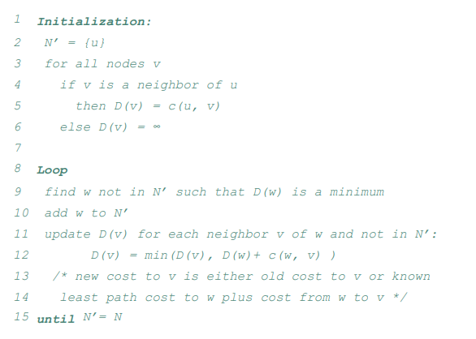

::: note 助记：Dijkstra 算法

$\color{blue}{初始化}$：对 u 的所有邻居 v，D(v) 等于 uv 之间的距离；对 u 的所有非邻居，D(v) 等于无穷大。

$\color{blue}{每轮循环}$：找出本轮具有最低开销（D(w)最小）的节点 w，<u>将 w 加入 N' 中</u>，更新所有不在 N' 的 w 的邻居节点 v：<u>若中转经由 w 到达 v 的距离 D(w) + c(w, v) 更小，则用此值更新它</u>。

:::

::: tip 例题

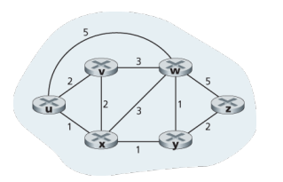

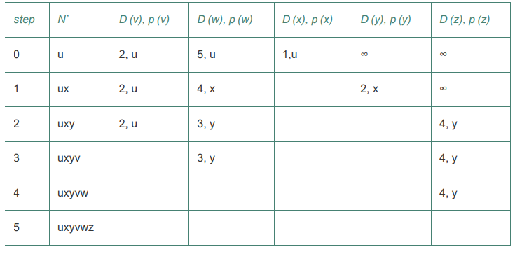

:::

**算法复杂性**： n个结点，每次迭代需要检测所有不在集合N’中的结点 w，共 n(n+1)/2 次比较: $O(n^2)$

+ 使用堆数据解结构可以有更高效的实现: $O(n\cdot \log n)$

存在**振荡**的可能：如下图，B -> A 和 D -> A 两个发送任务，都有顺逆时针两种路线选择。一开始同时顺时针，使得逆时针开销变小，下一时刻两者同时检测到逆时针更顺畅，于是又同时逆时针，以此反复振荡。

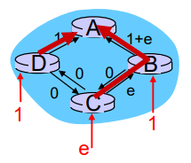

### 2.2 距离向量路由选择算法（DV 算法）

距离向量（DV）算法是一种迭代的、异步的和分布式的算法。

#### **2.2.1 Bellman-Ford 方程**（动态规划思想）

$d_x(y) = min_v\{c(x, v) + d_v(y)\}$

+ $d_x(y)$：从节点 x 到节点 y 的最低开销路径的开销。
+ $min_v$ 是对于 x 的所有邻居 v 的。

#### 2.2.2 DV 算法思想

使用 DV 算法，每个节点 x 维护下列数据：

+ 到每个直接相连的邻居 v 的开销 $c(x, v)$
+ 节点 x 自身的距离向量 $\vec{D_x} = [D_x(y) | y \in N]$，包含了 x 到 N 中所有目的地 y 的开销**估计值**
+ 它的每个邻居 v 的距离向量 $\vec{D_v}$

**核心思想**：每个节点不时地向它的每个邻居发送它的距离向量副本。当节点 x 从它的任何一个邻居 v 接收到一个新的距离向量时，保存这个向量并使用 Bellman-Ford 方程来更新它自己的距离向量：$D_x(y) = min_v\{c(x, y) + D_v(y)\}$。如果 x 的距离向量有所更新，则向它的每个邻居发送一份自己的新距离向量，继而让邻居更新它们自己的距离向量。

最终，每个开销估计 $D_x(y)$ 会收敛到 $d_x(y)$。

> 注意区分 $D_x(y)$、$d_x(y)$ 和 $\vec{D_x}$

#### 2.2.3 DV 算法

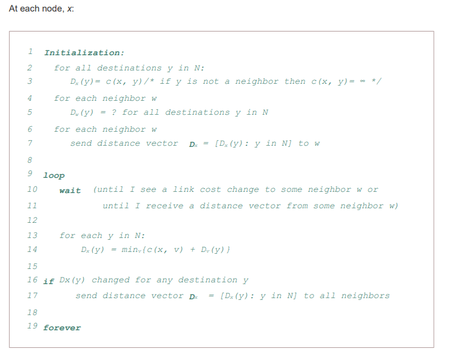

::: note 助记：DV 算法

对 x 节点：

$\color{blue}{初始化}$：**初始自身的距离向量** $\vec{D_x} = [D_x(y) | y \in N]$，其中对所有 y 的估计值 $D_x(y)$，若为邻居则等于 c(x, y)，若不是邻居则为无穷。并**向邻居发送自己的距离向量**。

$\color{blue}{每轮重新计算}$：对 N 中的所有目的地 y，若 y 经由 x 邻居中转再到 x 的开销更低，则将这个中转的开销作为新的到 y 的估计值。如果本轮更新有任何改动，则将自己的距离向量发送给邻居。

:::

::: tip 例题

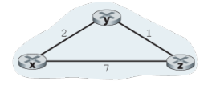

初始化后，每个节点向它的邻居发送其距离向量。x 在接收到 y、z 的距离向量后进行如下计算：

+ $D_x(x)=0$
+ $D_x(y)=min\{ c(x, y)+D_y(y), c(x, z)+D_z(y) \}=min\{2+0, 7+1\}=2$
+ $D_x(z)=min\{ c(x, y)+D_y(z), c(x, z)+Dz(z) \}=min\{2+1,7+0\}=3$

类似的，可以得到下表：

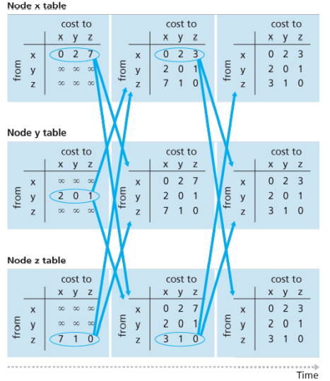

:::

每个节点的状态时：**等待**，直到本地局部链路费用变 化或者收到邻居的 DV 更新，然后**重新计算** DV，如果有变化则**通告**所有邻居，之后就再次进入等待。

#### 2.2.4 无穷计数问题

某条链路的开销变低这样的“好消息”能很快传播开，但如果发送某条链路的开销变高这样的“坏消息”，将传播很慢。

比如下图：

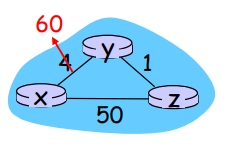

本来 $D_y(x) = 4，D_z(x) = 5$。当 y->x 的链路开销由 4 变为 60 时，原本 y 直接到 x 最快（为 4），z 经由 y 到 x 最快（为 5），但 y 只知道 z 传给 x 的最短路径是 5，不知道是要经过自己，于是链路开销变化时，y 就计算出它经由 z 中转给 x 更快，但实际上 z 交付给 x 却是本来要由 y 中转的，于是便产生了**路由选择回路**。只能是 y 首先估计自己到 x 的距离变为 $D_y(x) = c(y,z) + D_z(x) = 6$，通告给 z，z 然后再估计自己到 x 的距离变为 $D_z(x) = c(z,y) + D_y(x) = 7$，于是 z 又通告给 y，y 再变化通告 z，直至平衡。所以说链路开销增加的坏消息传播的很慢。

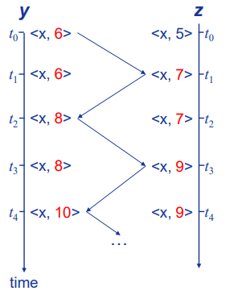

#### 2.2.5 增加毒性逆转

针对刚刚的场景，可以使用**毒性逆转**的技术：如果一个结点 z 到达目的地 x 的最小费用路径是经由邻居 y 中转，则向邻居 y 欺骗说自己到该目的地的距离为 $\infty$。

毒性逆转并没有解决一般的无穷计数问题，当涉及到 3 个或更多节点的环路将无法用毒性逆转技术检测出来。

