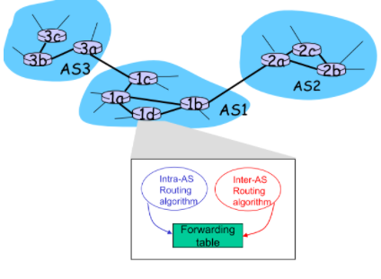
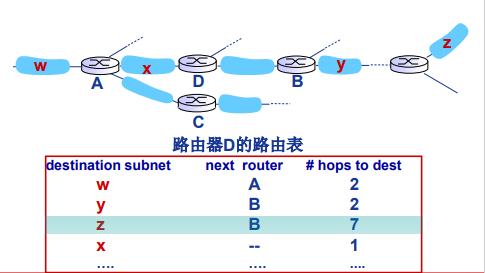
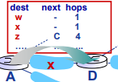
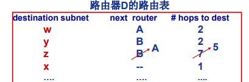
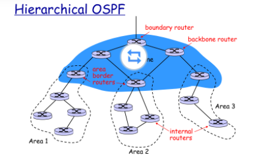
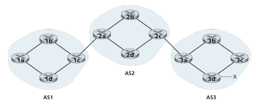
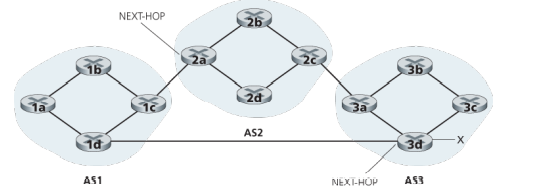
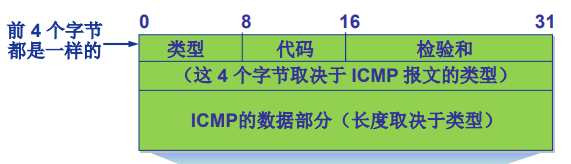
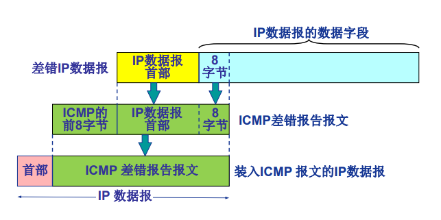
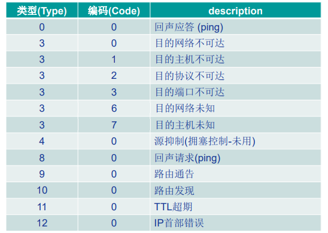

[[toc]]

::: tip 考试大纲

1. 路由算法（距离向量路由算法、链路状态路由算法、层次路由） 
2. 路由协议（RIP、OSPF、BGP） 
3. 路由器的组成与功能、路由表与路由转发
4. ICMP 协议

:::

控制平面作为一种*网络范围*的逻辑，不仅控制沿着从源主机到目的主机的端到端路径间的路由器如何转发数据报，而且控制网络层组件和服务如何配置和管理。

## 1. 概述

转发表（在基于目的地转发的场景中）和流表（在通用转发的场景中）定义了一台路由器的本地数据平面转发行为。两种方法来计算、维护和安装这些转发表和流表：

+ **每路由器控制**：每台路由器有一个路由选择组件，用于与其他路由器中的路由选择组件通信，以计算其转发表的值。将要学习的 OSPF 和 BGP 协议都是基于这种每路由器的方法进行控制。

+ **逻辑集中式控制**：逻辑集中式控制器计算并分发转发表以供每台路由器使用。

## 2. 路由选择算法

路由选择算法的目的：从发送方到接收方的过程中确定一条通过路由器网络的好的路径。

一个计算机网络的抽象**图**模型：

+ 图: G = (N, E) 
+ N = 路由器集合 = { u, v, w, x, y, z } 
+ E = 链路集合 = { (u,v), (u,x), (v,x), (v,w), (x,w), (x,y), (w,y), (w,z), (y,z) }

关键问题：源到目的（如u到z）的最小费用路径是什么？ 

路由算法：寻找最小费用路径的算法。

路由算法分类：

+ 按算法是集中式还是分布式分类：
  + 集中式路由选择算法：用完整的、全局性的网络知识计算出从源到目的地之间的最低开销路径。具有全局状态信息的算法常被称作**链路状态（LS）算法**。
  + 分散式路由选择算法：路由器以迭代、分布式的方式计算出最低开销路径。没有节点拥有全局信息，相反，每个节点仅有与其直接相连链路的开销知识即可开始工作，然后通过迭代计算以及与相邻节点信息交换从而计算出转结果。
+ 按算法是静态还是动态进行分类：
  + 静态路由选择算法：路由随时间变化非常慢，通常是人工进行调整
  + 动态路由选择算法：随着网络流量负载或拓扑发生变化而改变路由选择路径
+ 按算法是负载敏感还是负载迟钝进行分类：
  + 负载敏感算法：链路开销会动态变化以反映出底层链路的当前拥塞水平；
  + 负载迟钝算法：因为某条链路的开销不明确地反映其当前（或最近）的拥塞水平。

### 2.1 链路状态路由选择算法（LS 算法）

LS 算法是一种使用全局信息的算法，其输入是网络拓扑和所有的链路开销。实践中这是通过由链路状态广播算法完成，其结果是所有节点都具有该网络的统一、完整的视图。

我们下面给出的 LS 算法叫作<mark>Dijkstra 算法</mark>，它计算从某节点 u（源节点）到网络中所有其他节点的最低开销路路径。Dijkstra 算法是迭代算法，经算法的 k 次迭代后，可知道到 k 个目的节点的最低开销路径，具有 k 个最低开销。

记号：

+ $D(v)$：到算法的本次迭代，从源节点到目的节点 $v$ 的最低开销路径的开销；
+ $p(v)$：从源 $v$ 沿着当前最低开销路径的前一节点（$v$ 的邻居）；
+ $N'$：节点子集，如果从源到 $v$ 的最低开销路径已知，则 $v$ 在 $N'$ 中。

该算法由<u>一个初始化步骤</u>和<u>其后的循环</u>组成。循环次数与节点个数相同。

::: note 助记：Dijkstra 算法

$\color{blue}{初始化}$：对 u 的所有邻居 v，D(v) 等于 uv 之间的距离；对 u 的所有非邻居，D(v) 等于无穷大。

$\color{blue}{每轮循环}$：找出本轮具有最低开销（D(w)最小）的节点 w，<u>将 w 加入 N' 中</u>，更新所有不在 N' 的 w 的邻居节点 v：<u>若中转经由 w 到达 v 的距离 D(w) + c(w, v) 更小，则用此值更新它</u>。

:::

::: tip 例题

:::

**算法复杂性**： n个结点，每次迭代需要检测所有不在集合N’中的结点 w，共 n(n+1)/2 次比较: $O(n^2)$

+ 使用堆数据解结构可以有更高效的实现: $O(n\cdot \log n)$

存在**振荡**的可能：如下图，B -> A 和 D -> A 两个发送任务，都有顺逆时针两种路线选择。一开始同时顺时针，使得逆时针开销变小，下一时刻两者同时检测到逆时针更顺畅，于是又同时逆时针，以此反复振荡。

### 2.2 距离向量路由选择算法（DV 算法）

距离向量（DV）算法是一种迭代的、异步的和分布式的算法。

#### **2.2.1 Bellman-Ford 方程**（动态规划思想）

$d_x(y) = min_v\{c(x, v) + d_v(y)\}$

+ $d_x(y)$：从节点 x 到节点 y 的最低开销路径的开销。
+ $min_v$ 是对于 x 的所有邻居 v 的。

#### 2.2.2 DV 算法思想

使用 DV 算法，每个节点 x 维护下列数据：

+ 到每个直接相连的邻居 v 的开销 $c(x, v)$
+ 节点 x 自身的距离向量 $\vec{D_x} = [D_x(y) | y \in N]$，包含了 x 到 N 中所有目的地 y 的开销**估计值**
+ 它的每个邻居 v 的距离向量 $\vec{D_v}$

**核心思想**：每个节点不时地向它的每个邻居发送它的距离向量副本。当节点 x 从它的任何一个邻居 v 接收到一个新的距离向量时，保存这个向量并使用 Bellman-Ford 方程来更新它自己的距离向量：$D_x(y) = min_v\{c(x, y) + D_v(y)\}$。如果 x 的距离向量有所更新，则向它的每个邻居发送一份自己的新距离向量，继而让邻居更新它们自己的距离向量。

最终，每个开销估计 $D_x(y)$ 会收敛到 $d_x(y)$。

> 注意区分 $D_x(y)$、$d_x(y)$ 和 $\vec{D_x}$

#### 2.2.3 DV 算法

::: note 助记：DV 算法

对 x 节点：

$\color{blue}{初始化}$：**初始自身的距离向量** $\vec{D_x} = [D_x(y) | y \in N]$，其中对所有 y 的估计值 $D_x(y)$，若为邻居则等于 c(x, y)，若不是邻居则为无穷。并**向邻居发送自己的距离向量**。

$\color{blue}{每轮重新计算}$：对 N 中的所有目的地 y，若 y 经由 x 邻居中转再到 x 的开销更低，则将这个中转的开销作为新的到 y 的估计值。如果本轮更新有任何改动，则将自己的距离向量发送给邻居。

:::

::: tip 例题

初始化后，每个节点向它的邻居发送其距离向量。x 在接收到 y、z 的距离向量后进行如下计算：

+ $D_x(x)=0$
+ $D_x(y)=min\{ c(x, y)+D_y(y), c(x, z)+D_z(y) \}=min\{2+0, 7+1\}=2$
+ $D_x(z)=min\{ c(x, y)+D_y(z), c(x, z)+Dz(z) \}=min\{2+1,7+0\}=3$

类似的，可以得到下表：

:::

每个节点的状态时：**等待**，直到本地局部链路费用变 化或者收到邻居的 DV 更新，然后**重新计算** DV，如果有变化则**通告**所有邻居，之后就再次进入等待。

#### 2.2.4 无穷计数问题

某条链路的开销变低这样的“好消息”能很快传播开，但如果发送某条链路的开销变高这样的“坏消息”，将传播很慢。

比如下图：

本来 $D_y(x) = 4，D_z(x) = 5$。当 y->x 的链路开销由 4 变为 60 时，原本 y 直接到 x 最快（为 4），z 经由 y 到 x 最快（为 5），但 y 只知道 z 传给 x 的最短路径是 5，不知道是要经过自己，于是链路开销变化时，y 就计算出它经由 z 中转给 x 更快，但实际上 z 交付给 x 却是本来要由 y 中转的，于是便产生了**路由选择回路**。只能是 y 首先估计自己到 x 的距离变为 $D_y(x) = c(y,z) + D_z(x) = 6$，通告给 z，z 然后再估计自己到 x 的距离变为 $D_z(x) = c(z,y) + D_y(x) = 7$，于是 z 又通告给 y，y 再变化通告 z，直至平衡。所以说链路开销增加的坏消息传播的很慢。

#### 2.2.5 增加毒性逆转

针对刚刚的场景，可以使用**毒性逆转**的技术：如果一个结点 z 到达目的地 x 的最小费用路径是经由邻居 y 中转，则向邻居 y 欺骗说自己到该目的地的距离为 $\infty$。

毒性逆转并没有解决一般的无穷计数问题，当涉及到 3 个或更多节点的环路将无法用毒性逆转技术检测出来。

## 3. Internet 路由

### 3.1 层次路由

将任意规模网络抽象为一个“扁平”的网络图来计算路由过于理想化，原因有：

1. *规模*：大量的路由器使得路由表无法存储、迭代的 DV 算法永远无法收敛；
2. *管理自治*：一个组织应当能够按自己的愿望运行和管理其网络，还要能与外部网络连接起来。

解决方案：将路由器组织进**自治系统（AS）**来解决：

+ 每个 AS 由一组通常处在相同管理控制下的路由器组成；
+ 一个 AS 由其全局唯一的 AS 号（ASN）所标识；
+ 同一 AS 内的路由器运行相同的路由选择算法并且有彼此的信息，这个算法叫作**自治系统内部路由选择协议；**
+ 不同自治系统的路由器可以运行不同的 AS 内部路由协议。

**网关路由器**：位于AS“边缘” ，通过链路连接其他 AS 的路由器。

转发表通过 intra-AS (自治系统内部路由选择协议) 和 inter-AS (自治系统路由选择协议)路由算法解决 AS 内以及AS 间的路由选择问题。无论是否为网关路由器都会同时运行 intra/inter 协议。

### 3.2 AS 内：RIP 算法

最常见的AS内部路由协议:

+ 路由信息协议：RIP(Routing Information Protocol)
+ 开放最短路径优先：OSPF(Open Shortest Path First)
+ 内部网关路由协议：IGRP(Interior Gateway Routing  Protocol) 
  + Cisco 私有协议

#### 3.2.1 RIP 算法介绍

略作修改的距离向量路由算法：

+ 距离的开销：跳步数，每条链路算 1 个跳步，最大 15 个跳步；
+ 触发交换向量的条件：每隔 30 秒，邻居之间交换一次 DV，称为**通告**；
+ 每次通告：最多25个目的子网（IP地址形式）

#### 3.2.2 RIP 举例

初始时，一个网络的路由器 D 有自己的路由表：（小写字母是子网，大写是路由器）

表示 D 到子网 z 的跳步数是 7，下一跳是 B。在经过 A 向 D 发出如下通告后：

这时 D 计算出它到达 z 可以经由 A 有更少的跳步数，为 1（D到A） + 4（D到z）= 5，小于原来的 7，因此 D 修改自己的路由表：

#### 3.2.3 对 RIP 的讨论

链路失效和恢复问题：

+ 如果180秒没有收到通告 → 邻居/链路失效
  + 经过该邻居的路由不可用，重新计算路由
  + 向邻居发送新的通告，邻居再依次向外发送通告
  + 链路失效信息能否快速传播到全网？不一定，DV 算法可能会产生无穷计数问题，但 RIP 由于对最大跳数的限制已经抑制了这个问题的产生
  + 毒性逆转技术用于预防乒乓(ping-pong)环路

RIP路由表是利用一个称作 route-d（daemon）的**应用层**进程进行管理，通告报文周期性地通过UDP数据报发送。

> 我们在为协议划分层次时，不是根据它的实现形式划分的，而是根据它的功能划分。不会因为它是用物理层实现就划分为物理层，而是看它所实现的功能是哪一层的。

### 3.2 AS 内：OSPF

OSPF 是一种链路状态协议，它是用**洪泛**链路状态信息和 Dijkstra 算法，大致过程：

1. LS分组扩散（通告）
2. 每个路由器构造完整的网络（AS）拓扑图
3. 利用 Dijkstra 算法计算路由

**特点**：

+ OSPF通告在整个 AS 范围*泛洪*
  + OSPF报文直接封装到 IP 数据报中
+ 各条链路开销由网络管理员配置

**优点**：

+ *安全*: 所有OSPF报文可以被认证。使用鉴别也可以仅使受信任的路由器参与一个 AS 内的 OSPF 协议；
+ *多条相同开销的路径*：允许使用多条相同费用的路径 （RIP只能选一条）；
+ *对单播与多播路由选择的综合支持*：多播 OSPF 协议(MOSPF) 与 OSPF 利用相同的网络拓扑数据。
+ *支持在单个 AS 中的层次结构*：一个 OSPF 自治系统能够层次化地配置多个区域。

在每个区域内，一台或多台区域边界路由器负责为流向该区域以外的分组提供路由选择。最后，在 AS 中只有一个 OSPF 区域配置成主干区域：

### 3.3 AS 间：BGP

当分组跨越多个 AS 进行路由时，我们需要**自治系统间路由选择协议**。在因特网中，所有的 AS 运行相同的 AS 间路由选择协议 —— **边界网关协议（BGP）**。

#### **3.3.2 BGP 作用**

BGP 不是将分组路由到一个特定地址，而是路由到 CIDR 化的前缀，表示一个子网或子网集合，故其转发表的表项为（x, I），其中 x 是一个前缀（如 138.16.68/22），I 是该路由器的接口之一的借口号。

BGP为每台路由器提供了一种手段以完成下列任务: 

+ eBGP: 从邻居 AS 获取子网可达性信息. 
+ iBGP: 向所有 AS 内部路由器传播子网可达性信息. 
+ 基于可达性信息与策略，确定到达其他网络的 “好” 路径.

#### **3.3.2 通告 BGP 路由信息**

对于每个 AS，每台路由器要么是一个**网关路由器**（如 1c），要么是一个**内部路由器**（如 1d）。在 BGP 中，每对路由器通过使用 179 端口的半永久 TCP 来交换报文（所以说 BGP 会话是在应用层实现的）。跨越两个 AS 的 BGP 连接称为**外部 BGP（eBGP）**，而在相同 AS 内的两台路由器之间的 BGP 会话称为**内部 BGP（iBGP）**。

以下面的网络为例（有三个 AS，AS3 包括一个具有前缀 x 的子网）：

::: note 通过使用 iBGP 和 eBGP 会话来实现通告前缀 x 的可达性信息：

3a 先向 2c 发送一个 eBGP 报文`AS3 x`向其告知 x 存在并且位于 AS3 中，2c 再向 AS2 内的所有路由器发送 iBGP 报文`AS3 x`。接着 2a 向 1c 发送 eBGP 报文`AS2 AS3 x`告知其 x 存在并且可以通过 AS2 再然后进入 AS3 到达 x。最后 1c 使用 iBGP 向 AS1 中的所有路由器发送报文`AS2 AS3 x`。通过这种方式，<u>每个自治系统不仅知道了 x 的存在，而且知道了通向 x 的自治系统的完整路径</u>。

:::

>  BGP 报文有如下类型：
>
> + OPEN: 与peer建立TCP连接，并认证发送方
> + UPDATE: 通告新路径 (或撤销原路径) 
> + KEEPALIVE: 在无UPDATE时，保活连接；也用于对 OPEN请求的确认 
> + NOTIFICATION: 报告先前报文的差错；也被用于关闭连接

BGP 使得每个 AS 知道经过其相邻 AS 可达哪些目的地。在 BGP 中，目的地不是主机而是 CDIR 化的前缀，每个前缀表示一个子网或一个子网的集合，假设当有 4 个子网与 AS2 相连时，AS2 则会尽可能地为这 4 个子网**聚合**这些路由。

#### **3.3.3 确定最好的路由**

如下图的路由器 1d 所示，从一个路由器到一个目的子网可能有多条路径，一台路由器如何在多个路径中选择并配置它们的转发表呢？

BGP 连接通告前缀时，前缀中还包括一些 **BGP 属性**，前缀 + 属性 = **BGP 路由**。两个较为重要的属性是：

+ **AS-PATH**：是通告已经通过 AS 的列表。比如上面例子中，AS1 到达 x 的路由中有 AS-PATH `AS2 AS3`.
  + 路由器还使用 AS-PATH 来检测和防止通告环路，如果在路径列表中看到包含自己，就拒绝该通告。
+ **NEXT-HOP**：是 AS-PATH 起始的路由器接口的 IP 地址。比如上面例子中，从 AS1 通过 AS2 到 x 的路由 `AS2 AS3 x`的 NEXT-HOP 值是路由器 2a 左边接口的 IP 地址。

所有这里的每条 BGP 路由包含 3 个组件：NEXT-HOP、AS-PATH 和目的前缀。

::: warning 注意

AS1 中的 BGP 路由的 NEXT-HOP 属性是不属于 AS1 的某路由器的 IP 地址，而是包含该 IP 地址的子网直接连接到 AS1。

:::

##### **3.3.3.1 热土豆路由选择**

这是一个最简单的路由选择算法。如下图为例：

考虑路由器 1b，它到达前缀 x 有两条 BGP 路由。使用**热土豆路由选择**，从所有可能的路由中选择一个到开始该路由的 NEXT-HOP 路由器具有最小开销的路径。

热土豆路由选择的思想是：对于 1b，尽可能快地将分组送出其 AS，而不担心其 AS 外部到达目的地的余下部分的开销。

##### **3.3.3.2 路由器选择算法**

在实践中，BGP 使用了一种比热土豆路由选择更为复杂但却结合了其特点的算法。

到给定的目的地前缀，如果只有一条路由，则选择该路由。如果到相同的前缀有多条路由，则顺序地调用下列消除规则直到余下一条路由：

1. 路由器被指派一个**本地偏好值**作为属性之一，它是一种策略决定，完全取决于网络管理员。具有最高本地偏好值的路由将被选择；
2. 最短 AS-PATH 的路由；
3. 最近 NEXT-HOP 路由器（热土豆路由）；
4. 附加准则。

> 为什么采用不同的AS内与AS间路由协议？
>
> + 策略(policy): 
>   + inter-AS: 期望能够管理控制流量如何被路由，谁路由经过其网络等.  
>   + intra-AS: 单一管理，无需策略决策
> + 规模(scale): 
>   + 层次路由节省路由表大小，减少路由更新流量
>   + 适应大规模互联网 
> + 性能(performance):  
>   + intra-AS: 侧重性能
>   + inter-AS: 策略主导

### 4. ICMP：因特网控制报文协议

**因特网控制报文协议（ICMP）**被主机和路由器用来彼此沟通网络层信息，用来：

+ 差错报告
+ 网络探询

两类ICMP 报文:

+ 差错报告报文(5种)：• 目的不可达 • 源抑制(Source Quench)  • 超时/超期 • 参数问题 • 重定向 (Redirect)
+ 网络探询报文(2组) • 回声（Echo）请求与应答报文（Reply） • 时间戳请求与应答报文

> 比如当运行一个 HTTP 会话时，也行会遇到“目的网络不可达”之类的错误报文，这种错误报文就来源于 ICMP。

#### 4.1 ICMP 报文结构

ICMP 报文是作为 IP 有效载荷来承载的，有一个类型字段和一个编码字段，并且包含引起该 ICMP 报文首次生成的 IP 数据报的首部和前 8 个字节（以便发送方能确定引发该差错的数据报）。

ICMP 报文类型：

众所周知的 ping 程序就是发送一个 ICMP 类型 8 编码 0 的报文到指定主机。

#### 4.2 ICMP的应用举例：Traceroute

Traceroute 是用 ICMP 报文来实现的。

源主机向目的主机发送一系列 UDP数据报：

+ 第1组IP数据报TTL =1
+ 第2组IP数据报TTL=2, etc
+ 目的端口号为不可能使用的端口号

当第 n 组数据报(TTL=n)到达第 n 个路由器时：

+ 路由器丢弃数据报
+ 向源主机发送ICMP报文 (type=11, code=0) 
+ ICMP报文携带路由器名称和IP地址信息

当 ICMP 报文返回到源主机时，记录RTT

**停止准则：**

+ UDP数据报最终到达目的主机
+ 目的主机返回“目的端口不可 达”ICMP报文 (type=3,  code=3)
+ 源主机停止